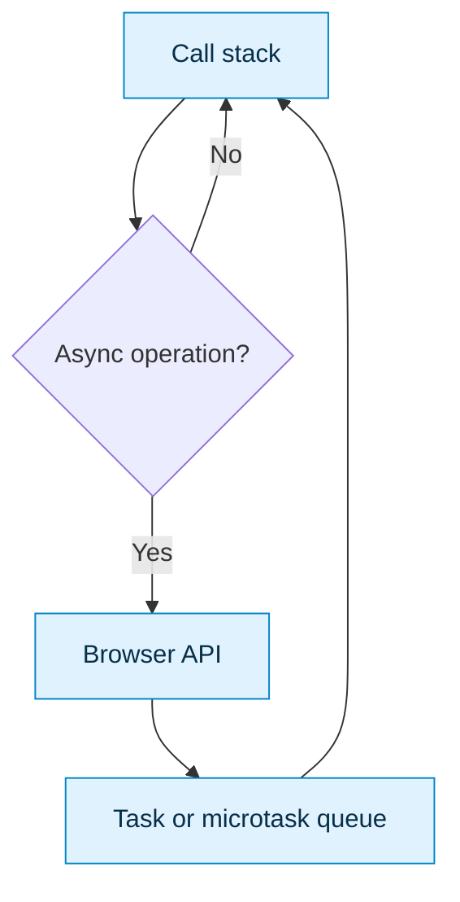

# 1. JavaScript and TypeScript Foundations

## JavaScript essentials

Know lexical scope, closures, hoisting, objects, arrays, destructuring, modules, promises and the event loop. Prefer `const`; use `let` only for reassignment. Avoid mutation where it makes React state unpredictable.

```ts
type Question = { id: string; title: string; tags: string[] };

const javaQuestions = questions
  .filter(q => q.tags.includes("java"))
  .map(({ id, title }) => ({ id, title }));
```

A closure retains access to its lexical environment. It powers callbacks and hooks, but stale closures can read old React state.

## Event loop



Promise callbacks are microtasks and normally run before timer tasks after the current stack completes. CPU-heavy work still blocks rendering; use a worker or backend.

## TypeScript

Use inference, unions, generics, narrowing and `unknown`. Avoid `any`.

```ts
type ApiResult<T> =
  | { status: "success"; data: T }
  | { status: "error"; message: string };

function render<T>(result: ApiResult<T>) {
  if (result.status === "success") return result.data;
  throw new Error(result.message);
}
```

Interfaces describe extensible object shapes; type aliases are convenient for unions. Runtime API data still needs validation with a schema library.

## Interview checks

- Explain `==` versus `===`, closure, event bubbling and promise scheduling.
- Why does TypeScript not protect runtime API responses?
- When would shallow copying still cause accidental mutation?
