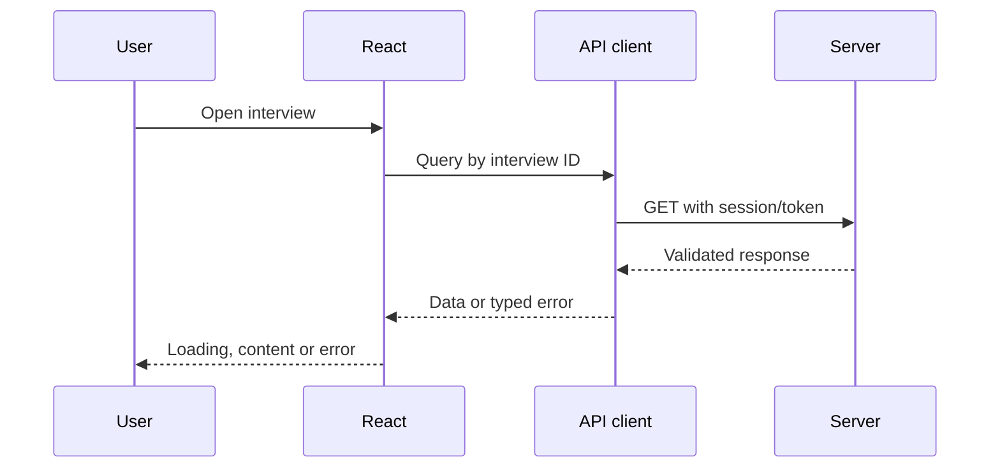

# 4. Routing, Forms and API Integration

Routes reflect user journeys: login, dashboard, interview, results and administration. Protecting a route in the browser improves UX but never replaces backend authorization.

## Request flow



Centralize base URL, headers, timeout, credentials and error mapping. Represent loading, empty, error and success states explicitly. Cancel obsolete requests and prevent double submissions.

Forms require field validation, form validation and server-error mapping. React Hook Form plus a runtime schema is a common scalable approach.

```ts
const submit = handleSubmit(async values => {
  try {
    await mutation.mutateAsync(values);
    navigate("/dashboard");
  } catch (error) {
    setError("root", { message: toUserMessage(error) });
  }
});
```

Autosave should debounce, show status, handle conflicts and never lose the final answer when the timer expires.

## Interview checks

- PUT versus PATCH; 401 versus 403.
- How do you avoid race conditions when route parameters change?
- How do you show field-specific backend validation errors?
