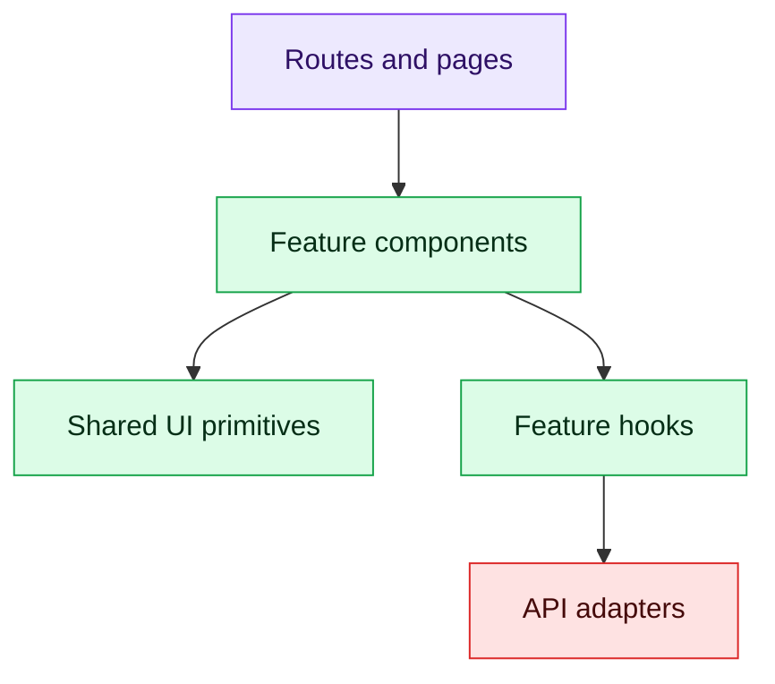

# 6. Architecture and Reusable Components

Organize by business feature, keeping components, hooks, API adapters, schemas and tests close.

```text
src/
  app/             routing, providers, global boundaries
  features/
    interview/     UI, hooks, API, schemas, tests
    results/
  shared/
    ui/            accessible primitives
    api/           HTTP client
    utils/
```

## Component layers



Use design tokens and accessible primitives rather than copy-pasted styled controls. Keep transport DTOs at the API boundary; map them into UI-friendly models. Error boundaries handle unexpected render failures, while ordinary request errors belong in the feature UI.

Lazy-load meaningful route bundles. Avoid premature micro-frontends: they add independent deployment benefits only when team and domain boundaries justify runtime complexity.

## Interview checks

Discuss feature folders, container/presentation separation, composition, design systems, error boundaries and micro-frontend trade-offs.
