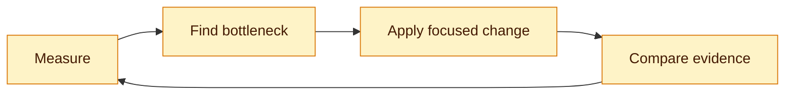

# 8. Security, Accessibility and Performance

## Security

Treat browser input and API output as untrusted. React escapes text by default; `dangerouslySetInnerHTML` needs sanitization. Prevent XSS, CSRF, insecure token storage, open redirects and accidental secret exposure.

The server must validate issuer, audience, signature, expiry and authorization. Browser role checks only control presentation. Prefer authorization-code flow with PKCE for public clients, or a BFF with secure, HttpOnly, SameSite cookies.

## Accessibility

Use semantic HTML, labels, keyboard navigation, visible focus, appropriate headings, error summaries and sufficient contrast. Test with keyboard and automated tools, then perform a screen-reader spot check.

## Performance

Measure with React Profiler, browser Performance tools, Web Vitals and bundle analysis.

Useful techniques include route splitting, image optimization, list virtualization, request caching and reducing unnecessary renders. Memoization is not a substitute for measurement.

## Interview checks

Explain XSS versus CSRF, HttpOnly limitations, semantic HTML, Core Web Vitals and diagnosing a slow list.
