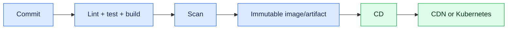

# 9. Production, Deployment and Debugging

A frontend build converts source into versioned static assets. Runtime configuration must be intentionally designed because build-time environment variables are embedded in the bundle and are not secrets.

Production basics:

- Cache hashed assets aggressively; do not over-cache the HTML shell.
- Serve HTTPS with security headers and compression.
- Generate source maps carefully and restrict their public exposure if needed.
- Add error tracking, release version, structured client events and Web Vitals.
- Use health checks for the web server/container, not for every static file.

## Debugging sequence

1. Reproduce and record route, user action, browser and release.
2. Inspect console, Network panel, request correlation ID and server response.
3. Separate UI, network, authentication, data-contract and deployment failures.
4. Form a hypothesis, change one variable and verify.
5. Add a regression test and document the incident.

Know common symptoms: blank page after deploy, stale chunk errors, CORS failures, infinite effects, memory leaks and 401 refresh loops.

## Interview checks

Explain Vite builds, CDN caching, environment configuration, CORS and your production incident process.
