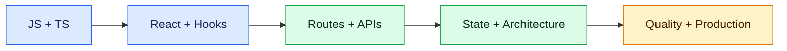

# ReactJS: Zero to Job-Ready (0–3 Years)

A progressive React and TypeScript curriculum for frontend engineers with up to three years of experience. The goal is not memorising hooks; it is building accessible, secure, testable applications and explaining engineering choices clearly.

## Learning path

1. [JavaScript and TypeScript foundations](01-javascript-typescript-foundations.md)
2. [React fundamentals and component thinking](02-react-fundamentals.md)
3. [Hooks, state and lifecycle](03-hooks-state-lifecycle.md)
4. [Routing, forms and API integration](04-routing-forms-api.md)
5. [State management and server state](05-state-management.md)
6. [Architecture and reusable components](06-architecture-components.md)
7. [Testing and code quality](07-testing-quality.md)
8. [Security, accessibility and performance](08-security-accessibility-performance.md)
9. [Production, deployment and debugging](09-production-deployment-debugging.md)
10. [Portfolio project and interview preparation](10-project-interview.md)

## Experience expectations

| Experience | Credible capability |
|---|---|
| 0–1 year | Components, props, state, events, basic TypeScript, REST calls and unit tests |
| 1–2 years | Forms, routing, reusable hooks, server-state caching, integration tests and accessibility |
| 2–3 years | Feature architecture, performance diagnosis, authentication flows, CI/CD and incident debugging |

Use one **Online Interview Portal** throughout: login, interview list, timed questions, answer autosave, submission, results and administrator views.
