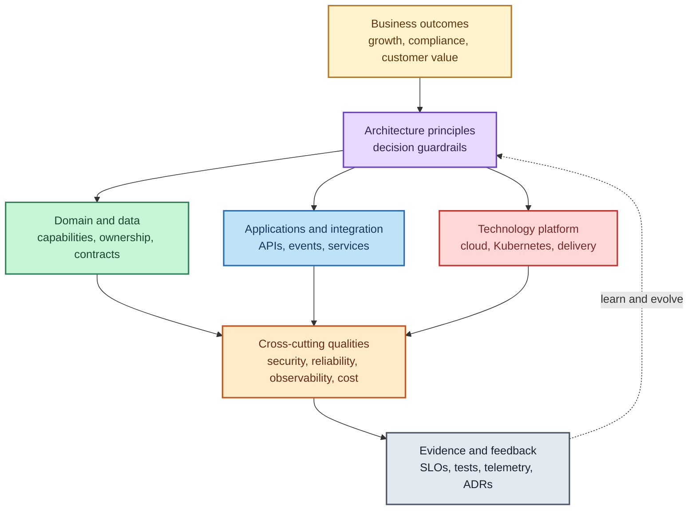
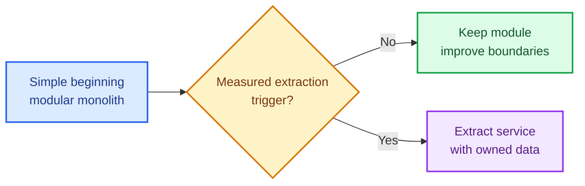
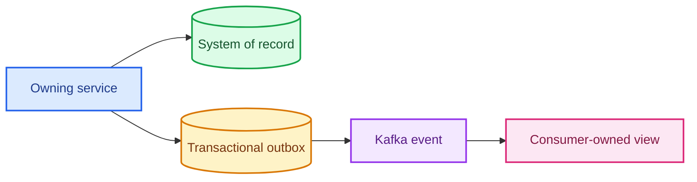
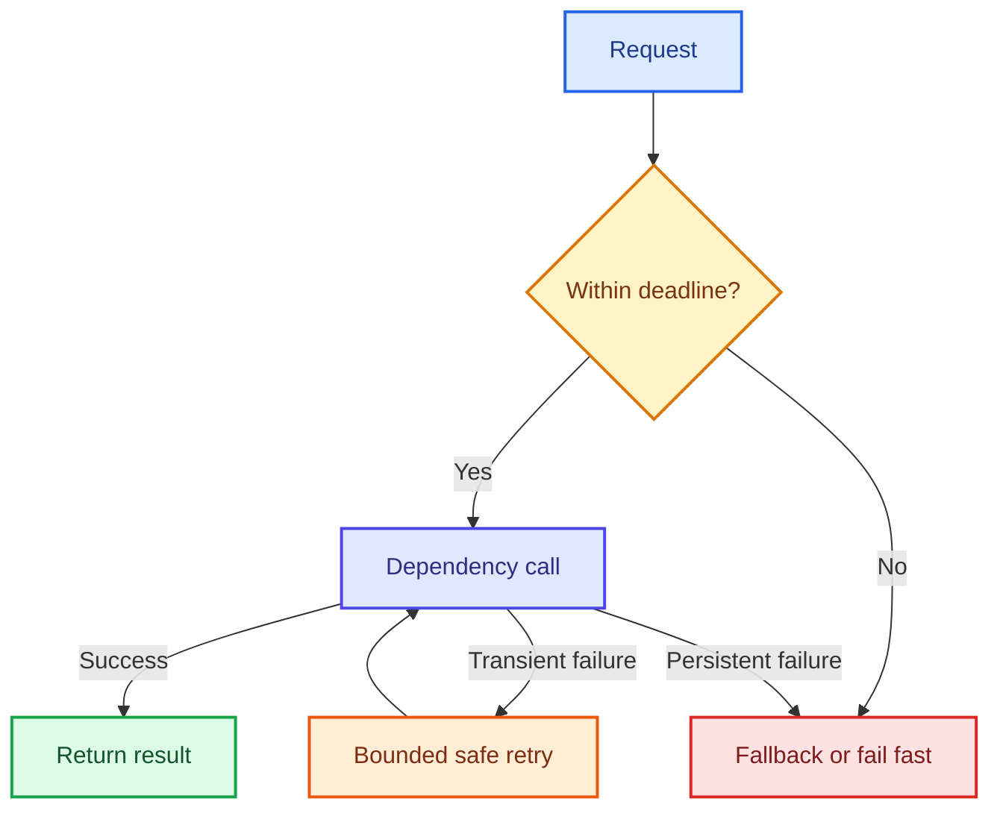
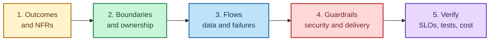

# Enterprise Architecture Principles

Enterprise architecture principles are durable decision rules. They align business strategy, applications, data, security, infrastructure, and delivery so that teams can make consistent choices without an architect approving every detail.

> **Core idea:** architecture is not a collection of technologies. It is the set of decisions and boundaries that help an enterprise achieve measurable business outcomes while controlling risk, cost, and complexity.

## Why principles matter

A principle should:

- guide a real decision;
- apply across multiple systems or teams;
- state the intended outcome;
- expose trade-offs rather than pretend they do not exist;
- be testable through evidence, metrics, or architecture reviews;
- allow documented exceptions when context justifies them.

A slogan such as “always use microservices” is not a sound principle. “Prefer the simplest deployable architecture that satisfies current quality attributes” is a principle because it directs a decision while leaving room for evidence.

## Enterprise architecture at a glance

The business outcome sits above the technology. Security, resilience, observability, and cost are not final-stage additions; they cut across every architecture layer. Evidence feeds learning back into future decisions.

---

## 1. Start with business outcomes and quality attributes

Begin with the business capability, user journey, constraints, and expected result. Translate vague expectations into measurable quality attributes before selecting technology.

Examples:

| Concern | Weak statement | Measurable statement |
|---|---|---|
| Availability | “Highly available” | 99.95% monthly availability for interview submission |
| Performance | “Fast response” | p95 API latency below 300 ms at 500 requests/second |
| Recovery | “Recover quickly” | RTO 30 minutes and RPO 5 minutes |
| Security | “Secure access” | Every protected action validates identity, tenant and resource permission |
| AI quality | “Good answers” | At least 90% grounded-answer accuracy on the approved evaluation set |
| Cost | “Cost effective” | Inference cost below ₹X per completed interview |

**Architect’s test:** Can the team demonstrate that the proposed architecture satisfies the agreed quality attributes?

## 2. Prefer simplicity and evolve deliberately

Choose the simplest architecture that meets current needs and preserves reasonable change paths. Complexity must earn its place through a measurable requirement.

A modular monolith is often appropriate when one team owns a new domain. Microservices become justified when clear domain boundaries, independent deployment, scaling, ownership, fault isolation, or regulatory separation outweigh their distributed-systems cost.

Valid extraction triggers include sustained independent scaling, release contention, different availability requirements, a stable bounded context, or a separate accountable team. Fashion is not a trigger.

## 3. Align architecture with business capabilities

Organize systems around cohesive business capabilities rather than technical layers alone. Define bounded contexts, ubiquitous language, responsibilities, and dependencies.

For an online interview platform, examples of business capabilities are identity, interview definition, assignment, interview session, evaluation, notification, and audit. Each capability needs a clear boundary even if several initially live in one deployable application.

**Architect’s test:** Can two teams explain who owns a business rule without both claiming—or neither claiming—it?

## 4. Make ownership explicit

Every service, module, API, event, dataset, dashboard, alert, runbook, and SLO needs an accountable owner. Ownership includes design, security, operational support, lifecycle, and retirement.

“You build it, you run it” is useful only when the team also receives the permissions, platform support, skills, and capacity needed to operate it.

**Evidence:** service catalogue, CODEOWNERS, on-call mapping, data owners, SLO owners, runbooks, and escalation paths.

## 5. Treat data as a governed product and contract

Define:

- the authoritative system of record;
- ownership and allowed writers;
- classification and sensitivity;
- consistency and transaction requirements;
- schema and event compatibility;
- retention, residency, lineage, archival, and deletion;
- backup, restore, reconciliation, and audit requirements.

Do not let multiple services directly update the same tables. Share information through explicit APIs, events, or governed analytical products. Use transactional outbox and idempotent consumers when a database state change must reliably produce an event.

The event is a contract, not permission for consumers to reach into the producer’s database.

## 6. Design for failure and graceful degradation

Distributed calls fail, dependencies slow down, messages arrive more than once, nodes restart, and regions become unavailable. Define failure behaviour before production.

Use where appropriate:

- deadlines and timeouts;
- bounded retries with exponential backoff and jitter;
- idempotency keys and deduplication;
- circuit breakers and bulkheads;
- backpressure, load shedding, and rate limits;
- queues and asynchronous recovery;
- fallbacks and degraded modes;
- reconciliation jobs;
- tested backup and disaster recovery.

Retries are not automatically safe. A payment, submission, notification, or tool action must be idempotent before it is retried.

## 7. Secure every trust boundary

Apply Zero Trust: never trust a request merely because it originated inside the network.

- authenticate human and workload identities;
- authorize tenant, resource, and action—not only roles;
- use least privilege and short-lived credentials;
- validate token issuer, audience, signature, expiry, and required claims;
- encrypt in transit and at rest;
- centralize secret management and rotation;
- validate and sanitize all inputs;
- maintain tamper-resistant audit trails;
- perform threat modelling and dependency scanning;
- minimize collected and retained sensitive data.

A Spring Boot resource server trusts only keys obtained from its configured Keycloak issuer/JWKS endpoint. It must never accept a public key supplied by the caller.

## 8. Build observability around user outcomes

Logs, metrics, and traces are telemetry; observability is the ability to explain system behaviour using that evidence.

Correlate technical signals with business flows using trace IDs, request IDs, tenant IDs, and safe business identifiers. Define SLIs and SLOs around user outcomes such as successful logins, interview starts, answer saves, submissions, and evaluation completion.

Alert on actionable symptoms and SLO burn rate, not every temporary CPU spike. Protect personal data and tokens from logs.

## 9. Automate secure, repeatable delivery

Every deployable change should pass through a traceable pipeline:

1. compile, unit test, and perform static analysis;
2. run integration and contract tests;
3. scan dependencies, source, images, IaC, and secrets;
4. create one immutable, signed artifact;
5. promote the same artifact across environments;
6. reconcile declarative deployment state through GitOps;
7. verify health, SLOs, and migrations;
8. roll forward or roll back safely.

Database changes should be backward-compatible with both old and new application versions during rolling deployment. CI builds the artifact; Argo CD continuously reconciles the approved Kubernetes state.

## 10. Standardize where valuable, allow governed exceptions

Create paved roads for common concerns: service templates, authentication, telemetry, CI/CD, secrets, Kubernetes policies, and data access. Standards reduce cognitive load and operational risk.

Standards must not become permanent obstacles. An exception should record its reason, owner, risk, controls, expiry/review date, and exit plan.

## 11. Treat cost and sustainability as quality attributes

Architecture cost includes infrastructure, network egress, storage, licences, observability, model inference, engineering effort, operational toil, outages, and opportunity cost.

Use workload measurements, unit economics, budgets, tagging, autoscaling, retention policies, and capacity forecasts. Optimize only with evidence; the cheapest component can create the most expensive operational system.

Useful unit metrics include cost per interview, cost per thousand events, cost per tenant, and AI cost per evaluated answer.

## 12. Keep decisions traceable and reversible

Use Architecture Decision Records for consequential choices. Record context, quality attributes, options, decision, consequences, risks, and the signal that would trigger reconsideration.

Prefer reversible decisions when uncertainty is high. For difficult-to-reverse decisions—identity provider, data ownership, public contracts, regional strategy—invest more in evidence, prototypes, and review.

An architecture diagram shows structure. An ADR explains why that structure was chosen.

---

## AI-specific enterprise principles

AI adds probabilistic behaviour and new security boundaries; it does not remove normal engineering responsibilities.

1. **Treat model output as untrusted.** Validate structured output and never execute generated commands blindly.
2. **Keep deterministic rules outside prompts.** Authorization, pricing, pass/fail thresholds, and compliance rules belong in controlled code or policy.
3. **Authorize before retrieval and tool execution.** RAG must not retrieve documents a user cannot access; an agent must use scoped tools and credentials.
4. **Minimize sensitive data.** Redact or tokenize data and enforce retention, residency, and provider policies.
5. **Use an AI gateway.** Centralize provider routing, policy, rate limits, model allow-lists, observability, and cost controls.
6. **Version the whole AI system.** Track models, prompts, tools, retrieval configuration, embeddings, datasets, and policies.
7. **Evaluate continuously.** Measure groundedness, correctness, safety, latency, availability, and cost with representative datasets.
8. **Design human control.** Require approval for high-impact actions and provide explanation, correction, escalation, and fallback paths.
9. **Defend against AI-specific threats.** Address prompt injection, data exfiltration, poisoned content, excessive agency, and insecure output handling.
10. **Plan for provider failure and change.** Use timeouts, budgets, fallbacks, portability boundaries, and graceful non-AI modes where feasible.

## Principle-to-evidence checklist

| Principle | Evidence an architect should request |
|---|---|
| Business first | Business capability map, NFRs, SLOs, capacity assumptions |
| Simplicity | Options analysis and measurable evolution triggers |
| Ownership | Service/data catalogue, owners, on-call and runbooks |
| Data contract | System-of-record decision, schema policy, lineage, retention |
| Resilience | Failure-mode analysis, load tests, chaos tests, RTO/RPO exercise |
| Security | Threat model, access matrix, audit evidence, secret rotation |
| Observability | SLIs/SLOs, traces, dashboards, actionable alerts |
| Delivery | Reproducible pipeline, immutable artifact, deployment verification |
| Cost | Unit economics, budget alerts, capacity and inference reports |
| Traceability | ADRs, exception register, review dates and decision triggers |

## Common anti-patterns

- selecting products before requirements;
- “microservices by default”;
- a shared database with unclear writers;
- synchronous dependency chains across many services;
- unbounded retries without idempotency;
- role checks without tenant or resource authorization;
- dashboards without SLOs or accountable responders;
- rebuilding artifacts separately for UAT and production;
- diagrams with no failure, data, or trust boundaries;
- AI agents with broad credentials and unrestricted tools;
- undocumented architecture decisions known only to individuals.

## A practical architecture review sequence

Ask in order:

1. What business outcome and measurable qualities are required?
2. What are the domain, data, team, and trust boundaries?
3. What are the critical synchronous, asynchronous, and recovery flows?
4. Which controls and platform standards reduce risk?
5. What evidence proves the architecture works, and what signals require change?

## 90-second interview answer

> Enterprise architecture principles are durable guardrails that connect business strategy to system decisions. I start with business capabilities and measurable quality attributes, then choose the simplest architecture that meets them. I establish explicit domain, data, team, and trust boundaries; define ownership and the system of record; and design for failure, security, observability, delivery, and cost from the beginning. I use standards as paved roads but allow documented exceptions. Important choices are recorded in ADRs and validated through SLOs, tests, telemetry, recovery exercises, and cost evidence. For AI systems, I additionally treat outputs as untrusted, authorize retrieval and tool use, minimize sensitive data, version the AI configuration, evaluate continuously, and retain human approval for high-impact actions. The principles keep teams autonomous while their decisions remain aligned, explainable, and governable.

## Related guides

- [Java Modular Monolith vs Microservices](../02-java-enterprise/modular-monolith-vs-microservices.md)
- [Saga and Transactional Outbox](../03-data-and-transactions/saga-and-transactional-outbox.md)
- [Kafka Production Architecture](../04-event-driven-architecture/kafka-production-architecture.md)
- [Keycloak, OAuth 2.0, OIDC, JWT and JWKS](../05-security/keycloak-oauth2-oidc-jwt-jwks-security-architecture.md)
- [Complete CI/CD Pipeline](../06-cloud-native/ci-cd-pipeline/complete-ci-cd-pipeline.md)
