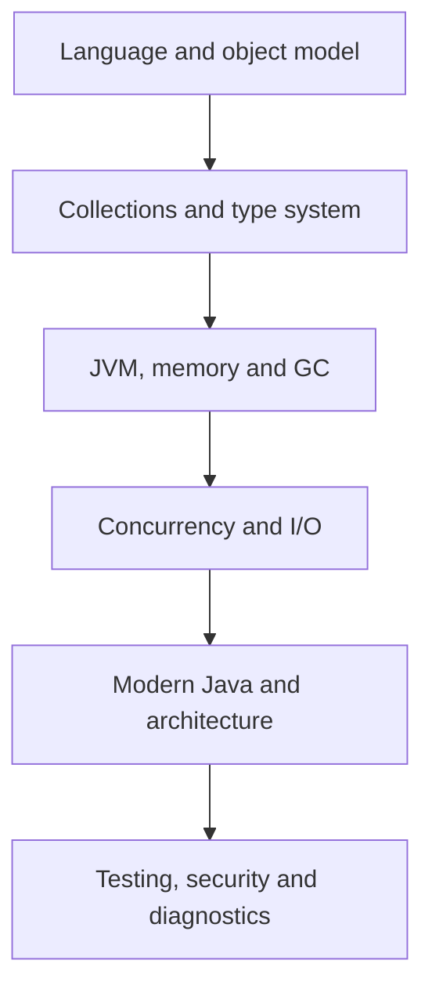

# Core Java — Zero to Architect

Senior-level study material for engineers who already know Java syntax and need to demonstrate production judgment expected from an 18-year engineer or architect.

## How to study

For every topic, be able to explain: the contract, JVM/runtime behavior, trade-offs, failure modes, diagnostics, and the decision you would record in an ADR. Do not answer senior interviews with definitions alone.

## Curriculum

1. [Language, object model, OOP and SOLID](zero-to-architect/01-language-oop-solid.md)
2. [Collections, generics, equality and immutability](zero-to-architect/02-collections-generics.md)
3. [JVM internals, memory model, class loading and GC](zero-to-architect/03-jvm-memory-gc.md)
4. [Concurrency, Java Memory Model and virtual threads](zero-to-architect/04-concurrency-virtual-threads.md)
5. [Exceptions, I/O, NIO and serialization](zero-to-architect/05-exceptions-io-serialization.md)
6. [Lambdas, streams and functional design](zero-to-architect/06-lambdas-streams-functional.md)
7. [Reflection, annotations, modules and class loading](zero-to-architect/07-reflection-modules.md)
8. [Modern Java evolution: Java 8 through 25](zero-to-architect/08-modern-java-evolution.md)
9. [Testing, security and production-quality engineering](zero-to-architect/09-testing-security.md)
10. [Performance, profiling and production debugging](zero-to-architect/10-performance-debugging.md)
11. [Design patterns and architecture decisions](zero-to-architect/11-design-patterns-architecture.md)
12. [Senior interview scenarios and readiness checklist](zero-to-architect/12-senior-interview-scenarios.md)

Existing architecture material:

- [Enterprise Architecture Principles](fundamentals/architecture-principles.md)
- [Modular Monolith vs Microservices](modular-monolith-vs-microservices.md)
- [Kafka Fundamentals](event-driven/kafka-fundamentals-zero-to-hero.md)
- [Kafka Production Architecture](event-driven/kafka-production-architecture.md)
- [Keycloak/OAuth2/OIDC/JWT/JWKS](security/keycloak-oauth2-oidc-jwt-jwks-security-architecture.md)

## Credible senior positioning

Say: “I use Core Java knowledge to select safe abstractions, review concurrency and memory behavior, diagnose JVM incidents, and make architecture trade-offs.” Avoid claiming that long experience means memorizing every API or administering every JVM collector.