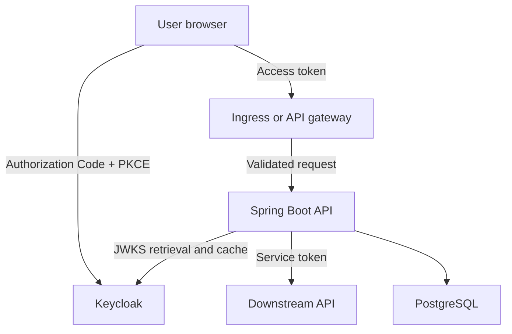
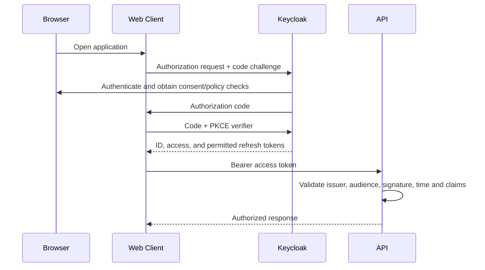

# Keycloak, OAuth 2.0, OIDC, JWT and JWKS Security Architecture

Enterprise identity architecture is not simply “add a bearer token.” It must establish who authenticates users, which clients may request tokens, which issuer is trusted, how APIs authorize operations, how keys rotate, and how compromise is contained.

The central principle is:

> A resource server accepts a token only when its issuer, audience, signature, time claims, and authorization claims satisfy locally configured policy. It never trusts a key, algorithm, role, or issuer supplied merely because the caller included it.

## 1. Responsibilities of each standard and component

| Component | Responsibility | It does not guarantee |
|---|---|---|
| OAuth 2.0 | Delegated authorization and access-token issuance | User identity by itself |
| OpenID Connect (OIDC) | Authentication and standardized identity claims on top of OAuth 2.0 | Permission to every API |
| Keycloak | Identity provider and authorization server | Correct authorization inside each application |
| Access token | Carries authorization claims for a resource server | Browser session storage safety |
| ID token | Tells the client about the authenticated user | API authorization |
| Refresh token | Lets an authorized client obtain new tokens | Unlimited or risk-free sessions |
| JWT | A compact signed claims format | Confidentiality; JWT payloads are normally readable |
| JWKS | Publishes an issuer's public verification keys | Trust in arbitrary public keys |
| Spring Security resource server | Validates tokens and enforces API policy | Business-level ownership checks automatically |

Authentication answers **who is acting**. Authorization answers **what that identity may do to this specific resource**.

## 2. Recommended trust architecture



Trust boundaries:

- The browser and all inbound data are untrusted.
- TLS terminates only at an approved edge; internal traffic still needs authenticated service identity.
- Keycloak is the configured token issuer.
- Each API is a resource server with its own audience and authorization policy.
- PostgreSQL is not exposed to end users and is accessed through least-privilege service credentials.
- Gateway validation can reject obvious invalid traffic, but every resource server still validates tokens and authorization.

The gateway is not a substitute for service-level enforcement. Requests can arrive through another route, configurations can drift, and authorization depends on domain data known only to the service.

## 3. Human login: Authorization Code with PKCE

Browser-based applications should use Authorization Code flow with Proof Key for Code Exchange (PKCE).



PKCE binds the authorization code to the client instance that initiated the flow. An intercepted code is not enough without the verifier.

Avoid the legacy implicit flow. Do not use the resource-owner password grant to collect user passwords in your application. Those approaches weaken isolation between the application and identity provider.

## 4. Token roles

### Access token

Send the access token to the API:

```http
GET /api/v1/interviews/123
Authorization: Bearer eyJ...
```

The client is **sending** the bearer token. The API extracts and validates it.

An access token should contain only claims needed for authorization and routing, such as:

- issuer (`iss`);
- subject (`sub`);
- audience (`aud`);
- expiry and issued-at time;
- authorized party or client identifier;
- scopes;
- realm or client roles when required;
- tenant or organization identifier when governed.

Do not put passwords, secrets, full profiles, interview answers, or sensitive business records in a JWT. Signing prevents undetected modification; it does not encrypt the payload.

### ID token

The ID token is for the OIDC client to confirm the authentication result and obtain identity attributes. Do not send an ID token to a business API as a replacement for an access token.

### Refresh token

A refresh token belongs at the token endpoint, not at a resource API. Treat it as a high-value credential. Use rotation and reuse detection where supported, constrain session lifetime, and revoke sessions after significant security events.

## 5. How JWT signature verification works

Keycloak signs a JWT with a private key held by the realm's signing-key infrastructure. The private key stays inside the identity system and must never be distributed to resource servers.

Keycloak publishes the corresponding public keys through its issuer metadata and JWKS endpoint. A Spring Boot resource server configured with the trusted issuer:

1. reads the token header, including key ID (`kid`);
2. obtains or uses a cached JWKS from the **configured issuer**;
3. selects the issuer key matching the `kid`;
4. verifies the cryptographic signature;
5. validates `iss`, `aud`, expiry, not-before, and other policy;
6. maps approved claims to application authorities;
7. applies endpoint and domain authorization.

The public key verifies that the signature was produced by the matching private key without revealing that private key.

### Why an attacker's key is rejected

An attacker can create a private key, public key, and correctly signed token. That token still fails because the API does not ask the caller, “Which public key should I use?”

The API uses keys only from the JWKS discovered for its preconfigured trusted issuer. The attacker's key is not in that trusted key set. The attacker also cannot change `iss` to gain trust: issuer validation and signature verification are both required.

Never:

- accept a `jwk` or `jku` header from an untrusted token without a strict allowlist;
- dynamically trust the token's `iss` value;
- allow the token to choose an unsafe algorithm;
- disable signature validation for “internal” traffic;
- use token decoding as if it were token validation.

## 6. JWKS retrieval, caching, and key rotation

Resource servers should use issuer discovery or a pinned JWKS URI over TLS. They cache public keys and refresh when an unknown `kid` appears or according to library policy.

A safe Keycloak rotation sequence is:

1. generate and publish a new signing key;
2. make the new key active for signing;
3. retain the old public key while tokens signed by it can remain valid;
4. allow caches and outstanding tokens to expire;
5. remove the retired key after the overlap window.

Deleting the old key immediately causes valid tokens to fail. Keeping compromised keys trusted for too long extends exposure. Rotation procedures therefore need token-lifetime awareness, monitoring, and an emergency-compromise runbook.

Monitor:

- JWKS fetch failures and latency;
- unknown `kid` errors;
- signature-validation failures;
- issuer and audience failures;
- sudden authentication-error changes after rotation.

## 7. Mandatory resource-server validation

| Check | Purpose |
|---|---|
| Signature | Detects modification and proves possession of a trusted issuer key |
| Allowed algorithm | Prevents algorithm downgrade or confusion |
| Issuer | Confirms which authorization server minted the token |
| Audience | Confirms the token was intended for this API |
| Expiration | Rejects tokens after their lifetime |
| Not-before | Rejects prematurely used tokens |
| Authorized party/client | Constrains which client obtained the token when relevant |
| Scope/roles | Provides coarse operation permissions |
| Tenant/context claims | Establishes governed security context |
| Revocation/session policy | Handles risk that cannot wait for natural expiry |

Allow only a small, justified clock skew. A valid signature alone is insufficient.

## 8. Audience design

Do not issue one universal token accepted by every service. Define audiences around protected resource boundaries, for example:

- `interview-api`;
- `evaluation-api`;
- `admin-api`.

A token issued for `interview-api` should not automatically authorize calls to `admin-api`. Audience validation limits lateral movement after token leakage.

When one service calls another on behalf of a user, choose deliberately between:

- propagating the original user token when the downstream API is an intended audience;
- token exchange or on-behalf-of semantics to obtain a narrower downstream token;
- a service token when the action represents the service rather than the user.

Blindly forwarding the same bearer token across the service graph increases exposure and often breaks audience isolation.

## 9. Roles, scopes, and domain authorization

Use scopes and roles for coarse permissions, then enforce resource ownership and business state in the domain service.

Example policy:

| Operation | Coarse permission | Domain checks |
|---|---|---|
| View own assignment | `interview:read` | Token subject owns the assignment |
| Submit attempt | `interview:submit` | Owner, active window, valid state |
| Review answer | `review:write` | Reviewer assigned to interview; no conflict |
| Publish result | `result:publish` | Authorized role and workflow ready |
| Administer realm mapping | Administrative role | Privileged workflow and audit |

Do not trust a user-supplied candidate ID, tenant ID, or role from the request body. Derive identity context from the validated token and compare it with authoritative database state.

Prefer stable, namespaced permissions over scattering raw realm roles across code. Map external claims into application authorities at the security boundary.

## 10. Spring Boot resource-server configuration

A representative configuration is:

```yaml
spring:
  security:
    oauth2:
      resourceserver:
        jwt:
          issuer-uri: ${OIDC_ISSUER_URI}
```

The issuer URI should be an environment-specific, controlled configuration value. It is not chosen from the incoming token.

Illustrative authorization:

```java
@Bean
SecurityFilterChain apiSecurity(HttpSecurity http) throws Exception {
    return http
        .csrf(csrf -> csrf.disable())
        .authorizeHttpRequests(auth -> auth
            .requestMatchers("/actuator/health").permitAll()
            .requestMatchers(HttpMethod.POST, "/api/v1/interviews/*/submit")
                .hasAuthority("SCOPE_interview:submit")
            .requestMatchers("/api/v1/admin/**")
                .hasAuthority("ROLE_PLATFORM_ADMIN")
            .anyRequest().authenticated())
        .oauth2ResourceServer(oauth -> oauth.jwt(Customizer.withDefaults()))
        .build();
}
```

This endpoint policy must be complemented by method or domain checks:

```java
@PreAuthorize("hasAuthority('SCOPE_interview:submit')")
@Transactional
public Submission submit(UUID attemptId, AuthenticatedActor actor) {
    InterviewAttempt attempt = attempts.getForUpdate(attemptId);
    attempt.assertOwnedBy(actor.subject());
    attempt.assertSubmissionWindow(clock.instant());
    return attempt.submit();
}
```

For cookie-based browser sessions, do not blindly disable CSRF. The example assumes a stateless API receiving bearer tokens in the `Authorization` header.

## 11. Browser token handling

The safest pattern for sensitive enterprise applications is often a Backend for Frontend (BFF):

- the BFF performs OIDC;
- browser session state is held in a `Secure`, `HttpOnly`, appropriate `SameSite` cookie;
- OAuth tokens remain server-side;
- CSRF defenses protect cookie-authenticated state-changing requests.

If a pure SPA holds tokens, keep access tokens short-lived and prefer in-memory storage. Avoid business data and long-lived tokens in `localStorage`: XSS can read them, and they persist beyond the current runtime.

Browser protections still include:

- strict Content Security Policy;
- output encoding and input handling;
- dependency and supply-chain controls;
- no tokens in URLs, logs, analytics, or error reports;
- CORS allowlists based on exact trusted origins;
- secure logout and session termination.

## 12. Service-to-service authentication

Use OAuth client credentials for machine identities when no user delegation is required. Give every workload its own confidential client or workload identity; do not share one client secret across all services.

Controls:

- minimal audience and scopes;
- short-lived access tokens;
- secret rotation or asymmetric client authentication;
- TLS and, where justified, mTLS;
- Kubernetes secrets integrated with an approved secret manager;
- egress restrictions;
- separate identities for runtime, migration, and operational jobs.

A service token proves the calling workload identity. It does not automatically authorize access to every user's record.

## 13. Multi-tenancy

A tenant claim is useful only when its lifecycle and authority are governed.

- Map users to tenants in an authoritative system.
- Validate that the client and requested operation support that tenant.
- Include tenant context only through controlled mappers.
- Apply tenant predicates to every data access path.
- Prevent administrators from accidentally crossing tenant boundaries.
- Audit privileged cross-tenant operations.
- Consider database row-level security as defense in depth, not the sole check.

Never accept `X-Tenant-Id` or a request-body tenant value without binding it to validated identity and authorization.

## 14. Logout, revocation, and compromised tokens

JWT validation is normally local, so logout does not make every already-issued access token disappear instantly.

Contain risk with:

- short access-token lifetimes;
- refresh-token rotation and session revocation;
- Keycloak logout and back-channel logout where clients support it;
- not-before or emergency revocation policy;
- denylisting only for exceptional high-risk cases;
- rapid signing-key rotation when a signing key is compromised;
- token introspection when real-time centralized status is worth the latency and availability cost.

Design the required revocation time explicitly. “Stateless JWT” is not a security objective if the business requires immediate access termination.

## 15. Keycloak realm and client design

Prefer separation that reflects environment and blast radius:

- never share production realms, clients, keys, or users with development;
- use separate client registrations for web, BFF, APIs, automation, and administrative tools;
- configure exact redirect URIs and web origins;
- disable unused flows;
- keep default roles minimal;
- require MFA for privileged users;
- protect administrative APIs and console access;
- export configuration safely without exporting secrets;
- promote reviewed configuration through automation rather than manual drift.

Avoid turning realm roles into an unbounded enterprise permission catalogue. Keep domain authorization close to the owning application.

## 16. Threats and controls

| Threat | Primary controls |
|---|---|
| Forged token with attacker key | Pinned issuer, trusted JWKS, algorithm allowlist |
| Stolen access token | TLS, short lifetime, audience restriction, no logging |
| Stolen refresh token | Server-side storage/BFF, rotation, reuse detection, revocation |
| XSS token theft | CSP, encoding, HttpOnly BFF cookie, dependency controls |
| CSRF | SameSite policy, CSRF token, origin checks |
| Redirect URI abuse | Exact registered URIs; no broad wildcards |
| Privilege escalation | Minimal claims, server-side mapping, domain checks |
| Cross-tenant access | Validated tenant binding and mandatory data predicates |
| Replay | TLS, short lifetime, idempotency for business commands, DPoP/mTLS where justified |
| Key compromise | HSM/managed keys where appropriate, rotation and incident runbook |
| SSRF through discovery/JWKS | Static trusted issuer allowlist and controlled outbound access |

## 17. Observability and audit

Track without exposing credentials:

- authentication success/failure by safe category;
- token-validation failure reason, never the token value;
- authorization denials by policy;
- refresh and session anomalies;
- administrative changes;
- client-secret and signing-key age;
- Keycloak availability and latency;
- JWKS cache/refresh health;
- privileged and cross-tenant actions.

Correlate application trace IDs with identity events, but do not use the access token as a correlation identifier. Security logs need access controls, tamper resistance, retention policy, and privacy review.

## 18. Availability and failure behaviour

Identity is a critical dependency, but not every request must call Keycloak.

- Existing JWT access tokens can be validated locally while cached signing keys remain usable.
- New login, refresh, logout, introspection, and administration require Keycloak availability.
- Cache JWKS according to library behavior and retain known keys through short outages.
- Run multiple Keycloak instances with a supported shared database and tested load-balancer behavior.
- Back up realm configuration and database state.
- Define RTO/RPO and test restoration.
- Never fail open when issuer, signature, or authorization validation fails.

If JWKS refresh fails for an unknown `kid`, reject the token and alert. Do not accept it without verification to preserve availability.

## 19. Common anti-patterns

Avoid:

- using an ID token to call APIs;
- accepting any token that can be Base64-decoded;
- checking only the signature and ignoring issuer or audience;
- letting the token select its issuer or verification URL;
- exposing client secrets in an SPA;
- storing long-lived tokens in browser local storage;
- forwarding one broad token to every downstream service;
- trusting roles, user IDs, or tenant IDs from request data;
- depending only on gateway authentication;
- putting private signing keys in resource servers;
- logging tokens or personal claims;
- assuming logout instantly invalidates all JWTs;
- using production identity configuration in lower environments.

## 20. Validation plan

Automate these tests:

1. valid token for the correct issuer and audience succeeds;
2. expired and not-yet-valid tokens fail;
3. valid token for another audience fails;
4. token signed by an attacker key fails;
5. token claiming another issuer fails;
6. disallowed algorithm fails;
7. unknown `kid` triggers controlled refresh and then rejection if unresolved;
8. old and new issuer keys both validate during rotation overlap;
9. removed key fails after the planned expiry window;
10. candidate cannot access another candidate's attempt;
11. reviewer cannot publish without the required assignment and state;
12. tenant context cannot be overridden through headers or request bodies;
13. revoked refresh session cannot mint another token;
14. tokens never appear in logs, URLs, traces, or error payloads;
15. Keycloak and JWKS outages follow the documented failure policy.

Security architecture is complete only when negative authorization and failure tests demonstrate the trust boundaries.

## 21. Recommended use in Java_AI_MCP

For the online interview platform:

- Keycloak authenticates candidates, interviewers, reviewers, and administrators.
- The React application uses Authorization Code with PKCE; a BFF is preferred for stronger token isolation.
- Spring Boot validates the configured Keycloak issuer, API audience, signature, lifetime, scopes, and mapped roles.
- Candidate ownership and assignment windows are checked against PostgreSQL.
- FastAPI and other downstream APIs validate their own intended audience.
- Service-to-service jobs use distinct machine identities with minimal scopes.
- No access token or business record is stored in browser `localStorage`.
- AI prompts receive only the minimum authorized data and never receive bearer tokens.
- Administrative, review, and recovery operations are audited.
- Key rotation, realm backup, identity outage, and cross-tenant denial are included in production testing.

This architecture makes Keycloak the trusted issuer while keeping authorization ownership, data access, and business invariants inside the services that understand them.
