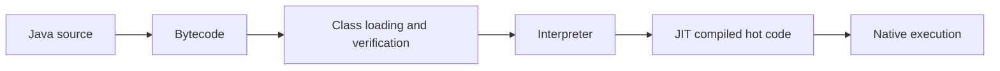

# 3. JVM Internals, Memory, Class Loading and GC

## Runtime model

The JVM loads, links and initializes classes. It verifies bytecode, interprets initially, profiles execution, and JIT-compiles hot paths. Optimizations include inlining, escape analysis, scalar replacement and dead-code elimination; deoptimization preserves correctness when assumptions fail.

## Memory areas

- Heap: objects and arrays; collector-managed.
- Thread stacks: frames, locals, operand stacks and return state.
- Metaspace: class metadata, backed by native memory.
- Code cache: JIT-compiled native code.
- Direct/native memory: NIO buffers, threads, libraries and JVM structures.

An `OutOfMemoryError` is not always “heap full.” Diagnose the exact message: Java heap space, Metaspace, direct buffer memory, unable to create native thread, or GC overhead.

## Java Memory Model

The JMM defines visibility and ordering. A happens-before relationship is created by monitor unlock/lock, volatile write/read, thread start/join, safe publication and concurrent utilities. Atomicity alone does not guarantee visibility or compound-operation correctness.

## Garbage collection

| Collector | Positioning |
|---|---|
| Serial | Small heaps/simple workloads |
| Parallel | Throughput-oriented batch |
| G1 | Balanced default for many server workloads |
| ZGC | Very low pause goals on large heaps |
| Shenandoah | Concurrent low-pause collection where available |

Collectors trade throughput, latency, CPU, memory headroom and operational maturity. Never choose by fashion. Establish SLOs, representative load and heap sizes, then measure allocation rate, promotion, pause distribution and concurrent-cycle behavior.

## Diagnosis workflow

1. Confirm symptom and time window.
2. Correlate latency, CPU, allocation, GC and traffic.
3. Capture GC logs and JFR.
4. For suspected leaks, obtain a heap dump safely and inspect dominators/retained size.
5. Check native memory, thread count, class loading and direct buffers.
6. Reproduce under representative load.
7. Change one variable and verify.

Useful tools: JDK Flight Recorder, Java Mission Control, `jcmd`, `jstack`, `jmap` (with production caution), async-profiler, GC log analyzers and Native Memory Tracking.

## Architecture judgment

Heap sizing must respect container limits and native headroom. A large heap may reduce collection frequency but increase recovery time and cost. Memory leaks are usually unintended reachability—unbounded caches, listeners, ThreadLocals, class loaders—not missing manual deallocation.