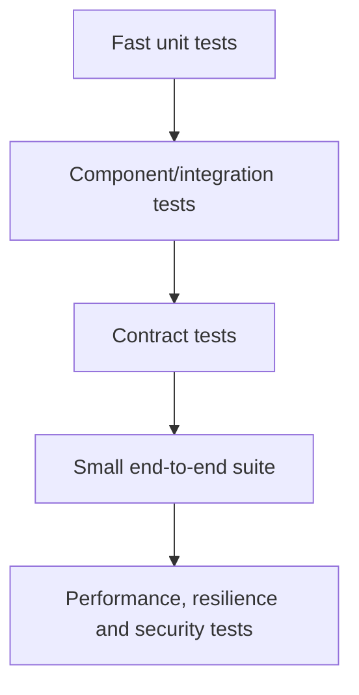

# 9. Testing, Security and Production-Quality Engineering

## Test portfolio

Unit tests protect decision logic. Integration tests validate databases, brokers and frameworks—prefer realistic ephemeral dependencies such as Testcontainers where valuable. Contract tests protect service boundaries. End-to-end tests cover critical journeys but should not become the entire regression strategy.

Test behavior, not implementation details. Avoid excessive mocking, random sleeps and brittle assertion of incidental calls. Make time, randomness and external effects injectable.

## JUnit and quality

Use JUnit 5 parameterized tests, extensions and clear fixtures. Assert observable outcomes and failure contracts. Coverage is a signal, not a target that proves quality. Mutation testing can reveal assertions that execute code without detecting faults.

## Security baseline

- Validate at trust boundaries and encode output for its destination.
- Use parameterized SQL and safe serializers.
- Apply least privilege to processes, files, databases and service identities.
- Keep secrets outside source/config artifacts; rotate and audit access.
- Pin trusted issuers/keys; never trust a key supplied by a request.
- Bound payloads, collection sizes, regex complexity and decompression.
- Patch JDK, base images and dependencies through a governed SLA.
- Generate SBOMs, sign artifacts and scan source/dependencies/images.
- Redact tokens, personal data and credentials from logs.

Java deserialization, expression-language injection, SSRF, path traversal, XXE, insecure randomness and unsafe reflection are recurring risks.

## Resilience tests

Inject latency, timeouts, dependency errors, pod termination, broker unavailability and database failover. Verify idempotency, retry budgets, circuit breakers, bulkheads, backpressure and reconciliation.

## Testability as architecture

Hard-to-test code often signals mixed responsibilities or implicit dependencies. Ports/adapters, explicit clocks, immutable messages and deterministic domain functions improve both design and tests.

## Senior evidence

Describe a defect prevented, an incident reproduced, a flaky suite stabilized, or a security control verified. Explain the risk model and why a test belongs at a particular layer.