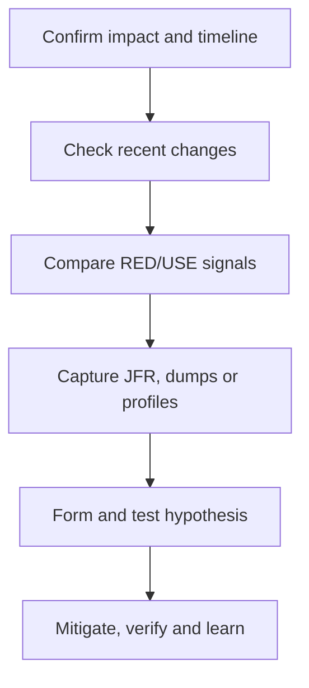

# 10. Performance, Profiling and Production Debugging

## Measurement principles

Start with an SLO and workload model. Measure percentiles, throughput, error rate, saturation and resource cost. Averages hide tail latency. Use warmups and steady-state measurement; distinguish microbenchmarks from end-to-end system performance.

JMH handles JVM warmup, dead-code elimination and benchmark structure, but a correct JMH result can still be irrelevant to production.

## USE and RED

- USE for resources: utilization, saturation, errors.
- RED for services: rate, errors, duration.

Correlate application telemetry with JVM, host/container, database, broker and downstream metrics. Distributed tracing locates latency across boundaries; profiling explains CPU/allocation inside a process.

## Incident workflow

Common patterns:

- High CPU: hot loop, excessive serialization, regex, GC, contention.
- Low CPU + high latency: I/O wait, pool/queue saturation, locks.
- Rising heap after GC: retained objects/leak or increased live set.
- Thread explosion: unbounded creation or stuck I/O.
- Connection-pool exhaustion: slow queries, leaks, oversized upstream concurrency.
- Kafka lag: insufficient partitions/consumers, slow processing, rebalance or downstream bottleneck.

## Tools

JFR/JMC, `jcmd`, thread dumps, heap dumps, async-profiler, GC logs, OpenTelemetry, Prometheus, database explain plans and container metrics. Capture artifacts carefully: dumps can pause systems and contain sensitive data.

## Optimization order

1. Remove unnecessary work and network calls.
2. Fix algorithms/data access.
3. Bound concurrency and queues.
4. Batch/cache with invalidation and memory controls.
5. Reduce allocation/serialization.
6. Tune JVM/GC only with evidence.

Performance changes require before/after evidence and regression protection. A faster method that breaks correctness, worsens p99, or overloads a dependency is not an optimization.

## Interview response

Use a real narrative: symptom, telemetry, hypothesis, diagnostic artifact, root cause, mitigation, durable fix and measured result.