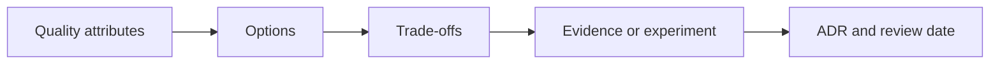

# 11. Design Patterns and Architecture Decisions

Patterns are shared vocabulary for recurring forces; they are not goals.

## Core patterns

| Category | Patterns | Use with caution |
|---|---|---|
| Creational | Factory, Builder, Abstract Factory | Hide construction only when it varies/has invariants |
| Structural | Adapter, Decorator, Facade, Proxy | Avoid invisible call/network cost |
| Behavioral | Strategy, Template Method, Observer, Command, State | Make ordering and failure semantics explicit |
| Enterprise | Repository, Unit of Work, Specification | Frameworks may already implement parts |
| Distributed | Circuit breaker, bulkhead, retry, saga, outbox | Require idempotency and observability |

Strategy often replaces branching policy; Adapter protects a domain from vendor APIs; Decorator adds cross-cutting behavior; State makes lifecycle transitions explicit. Singleton usually means lifecycle scope, not a globally mutable object.

## Architecture patterns

- Layered architecture: simple separation, risk of anemic domain and horizontal coupling.
- Hexagonal/ports-and-adapters: protects domain policy from infrastructure.
- Modular monolith: independent business modules in one deployable.
- Microservices: independent deployment and ownership with distributed cost.
- CQRS: separate read/write models only where their pressures differ.
- Event-driven: temporal decoupling with ordering, schema and recovery obligations.

## Decision method

An ADR records context, decision, alternatives, consequences, evidence and revisit triggers. “Industry best practice” is not evidence.

## Anti-patterns

Pattern soup, premature microservices, generic repositories hiding useful database capabilities, retry everywhere, shared “common” libraries coupling domains, and abstractions with one implementation and no volatility.

## Senior-level answer

State the force that created the pattern, its operational consequences and the exit criteria. Example: choose transactional outbox because database state and event intent require one local commit; accept at-least-once publication; require idempotent consumers, monitoring and cleanup.