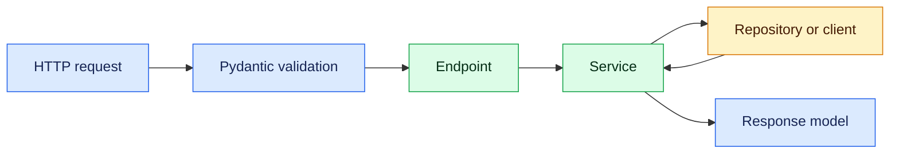

# 5. FastAPI and REST APIs

## Request flow



```python
from fastapi import APIRouter, Depends, status
from pydantic import BaseModel, Field

router = APIRouter(prefix="/questions", tags=["questions"])

class QuestionCreate(BaseModel):
    topic: str = Field(min_length=2, max_length=80)
    text: str = Field(min_length=10, max_length=2000)

class QuestionView(QuestionCreate):
    id: int

@router.post("", response_model=QuestionView, status_code=status.HTTP_201_CREATED)
def create_question(command: QuestionCreate, service=Depends(get_question_service)):
    return service.create(command)
```

## REST fundamentals

- use nouns in paths and HTTP methods for actions;
- return correct status codes and consistent error bodies;
- use request/response DTOs rather than exposing ORM objects;
- validate pagination limits, sorting and filters;
- make `PUT` and `DELETE` semantics intentionally idempotent;
- version APIs only when compatibility needs it;
- generate OpenAPI but review the contract deliberately.

## Layer boundaries

Endpoints handle HTTP concerns, services enforce business rules, repositories own persistence, and client adapters call external systems. Dependency injection improves testability but should not hide control flow.

Add authentication dependencies, correlation IDs, timeouts, body-size limits and centralized exception handlers. Never return stack traces or secrets.

## Practice API

Implement create, fetch, list and delete operations; duplicate detection; pagination; validation errors; a health endpoint; and tests for success plus failure paths.

