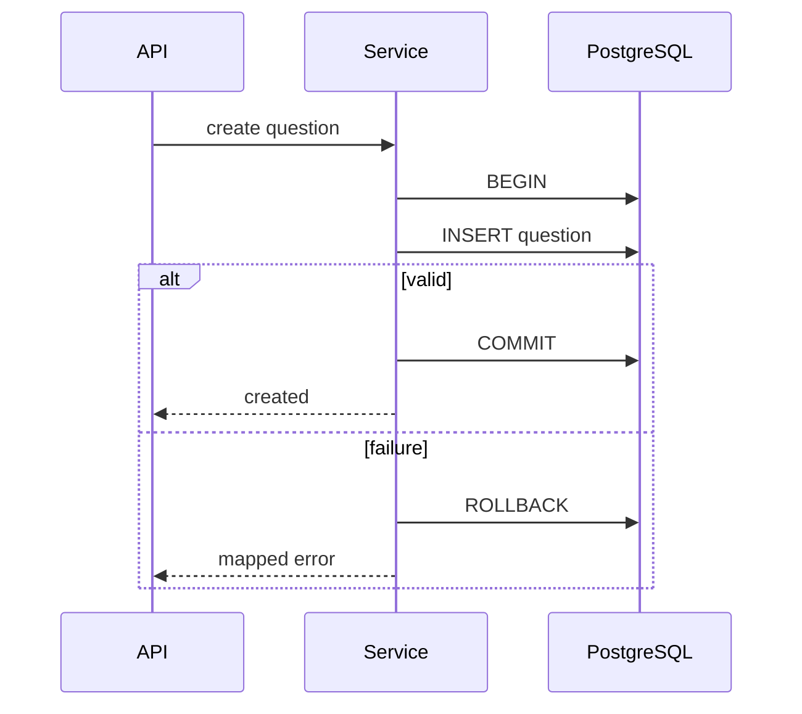

# 6. SQL, SQLAlchemy and Migrations

An ORM does not remove the need to understand SQL, indexes, joins, transactions and query plans.

## Core SQL

Know `SELECT`, `INSERT`, `UPDATE`, `DELETE`, joins, aggregates, subqueries, constraints and indexes. Use parameterized queries; never build SQL from string concatenation.

## Transaction boundary

Keep a transaction short and centered on one business operation. Do not hold it open during a slow network call. Understand atomicity, isolation, consistency and durability; be able to explain lost updates and the role of optimistic locking.

## SQLAlchemy practices

- create one session per request/unit of work;
- commit at the service/unit-of-work boundary;
- roll back on failure and always close the session;
- avoid accidental N+1 queries with deliberate loading strategies;
- return domain or response objects instead of leaking sessions;
- inspect generated SQL and use `EXPLAIN` for slow queries.

Use Alembic migrations. Review generated scripts, make compatible expand/contract changes for zero-downtime deployments, back up before risky migrations, and test both upgrade and rollback strategy.

## Interview checks

Explain primary/foreign keys, indexes and their write cost, transactions, connection pools, lazy loading, N+1 queries, migration safety, and why application validation cannot replace database constraints.

