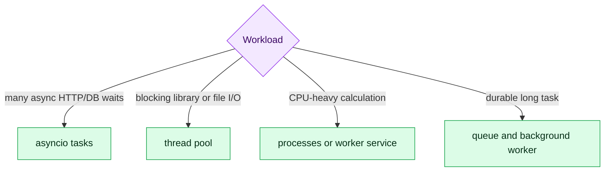

# 7. Async, Concurrency and Background Work

Concurrency improves throughput when work waits; parallelism executes work simultaneously. Async is not automatically faster.



## `asyncio` basics

An event loop runs coroutines cooperatively. `await` yields control while waiting. Calling blocking code inside an async endpoint blocks the event-loop worker and hurts all requests handled by it.

```python
async def load_pair(client, first_id: int, second_id: int):
    first, second = await asyncio.gather(
        client.fetch(first_id), client.fetch(second_id)
    )
    return first, second
```

Always set external-call timeouts. Bound concurrency with a semaphore or pool; unlimited task creation can exhaust sockets, memory and downstream services. Handle cancellation and partial failure deliberately.

## GIL and execution choices

In standard CPython, the GIL limits simultaneous Python bytecode execution by threads. Threads remain useful for blocking I/O; processes can provide CPU parallelism but add serialization and coordination costs.

FastAPI `BackgroundTasks` is suitable for small in-process work, not durable jobs. Use Celery, Kafka or another queue when work must survive restarts, retry independently or scale separately. Make retried jobs idempotent.

