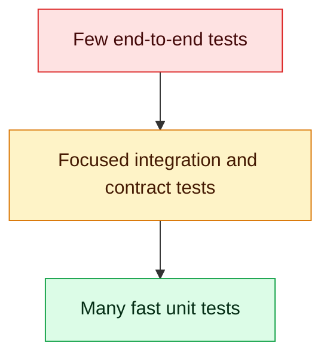

# 8. Testing, Debugging and Code Quality

## Test pyramid



Use pytest fixtures for setup, parameterization for equivalent cases, and `pytest.raises` for expected failures. Tests should verify externally meaningful behavior, not private implementation steps.

```python
import pytest

@pytest.mark.parametrize(("correct", "total", "expected"), [(8, 10, 80), (1, 4, 25)])
def test_score(correct, total, expected):
    assert calculate_score(correct, total) == expected

def test_rejects_zero_total():
    with pytest.raises(ValueError):
        calculate_score(1, 0)
```

Mock external boundaries such as clocks and HTTP clients, not every internal function. Use a real temporary database or container for persistence integration tests. Test validation, authentication, transaction rollback, timeouts and duplicate requests.

## Quality toolchain

- formatter/linter: Ruff (and project-standard formatter settings);
- type checker: mypy or Pyright;
- security/dependency checks: Bandit, pip-audit or approved equivalents;
- tests and coverage: pytest and coverage.py;
- pre-commit and CI to make rules repeatable.

## Debugging method

Reproduce, narrow scope, read the complete traceback, correlate logs by request ID, inspect inputs and recent changes, form one hypothesis, collect evidence, fix the cause, add a regression test, and verify in a production-like environment.

