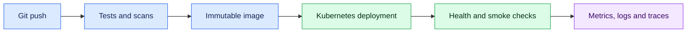

# 9. Security, Observability and Deployment

## Security baseline

- validate all external input and constrain payload sizes;
- use OAuth 2.0/OIDC tokens from a configured trusted issuer;
- verify signature, issuer, audience, expiry and authorization claims;
- store secrets in a secret manager, not source or images;
- parameterize SQL and encode output for its context;
- restrict CORS to required origins;
- use least-privilege service/database accounts;
- scan, patch and pin dependencies;
- avoid logging tokens, passwords, personal data or request bodies by default.

Authentication identifies the caller; authorization decides whether that caller may perform this business action.

## Observability

Emit structured logs with timestamp, level, service, environment, correlation ID and safe business identifiers. Measure request rate, error rate, duration, saturation, connection-pool use and downstream latency. Trace calls across services. Alert on user-impacting symptoms and SLOs rather than every internal event.

## Container and runtime

Use a small supported Python base image, install locked dependencies before copying frequently changing source, run as a non-root user, exclude secrets and caches with `.dockerignore`, and expose health/readiness endpoints. Configure worker count from workload tests, CPU limits and memory—not a copied formula.

Understand configuration through environment variables, graceful shutdown, readiness versus liveness, rolling deployment, rollback, timeouts, retries with jitter, and idempotency. Retry only transient failures and avoid multiplying retries across layers.

## Production incident answer

Describe the symptom and impact, evidence used, root cause, safe mitigation, permanent correction, regression test and prevention. Never claim you solved an incident from intuition alone.

