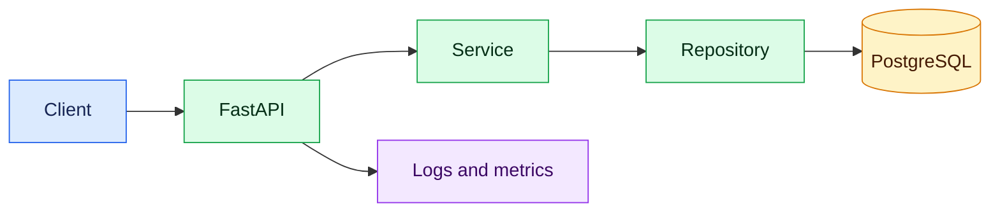

# Python Backend: Zero to Job-Ready (0–3 Years)

This curriculum develops the knowledge expected from a Python backend engineer with up to three years of experience. It begins with language fundamentals and ends with a tested, secure, containerized FastAPI service.

## Learning outcomes

You should be able to write readable Python, model data, build REST APIs, use SQL safely, test code, explain asynchronous I/O, diagnose common failures, and participate confidently in code reviews and deployments.

## Study order

| Stage | Chapter | Outcome |
|---|---|---|
| Foundation | [1. Language fundamentals](01-language-fundamentals.md) | Syntax, types, control flow and functions |
| Foundation | [2. Collections and Pythonic coding](02-collections-pythonic-coding.md) | Data structures, comprehensions and iteration |
| Design | [3. OOP, dataclasses and clean code](03-oop-clean-code.md) | Maintainable domain code and SOLID basics |
| Runtime | [4. Errors, files, packages and environments](04-errors-files-packaging.md) | Reliable modules, resources and dependencies |
| Backend | [5. FastAPI and REST APIs](05-fastapi-rest-api.md) | Validated, layered HTTP services |
| Data | [6. SQL, SQLAlchemy and migrations](06-database-sqlalchemy.md) | Transactions, persistence and query discipline |
| Execution | [7. Async, concurrency and background work](07-async-concurrency.md) | Choose correct execution models |
| Quality | [8. Testing, debugging and code quality](08-testing-debugging.md) | pytest, mocks, logs and static checks |
| Production | [9. Security, observability and deployment](09-production-readiness.md) | Secure and operate a containerized API |
| Interview | [10. Projects and interview preparation](10-project-interview-preparation.md) | Demonstrate practical experience credibly |

## Progressive project

Build a small Interview Question API throughout the chapters:

## Experience calibration

- **0–1 year:** language basics, Git, HTTP, CRUD, SQL and unit tests.
- **1–2 years:** layering, validation, transactions, API integration, Docker and debugging.
- **2–3 years:** async trade-offs, performance basics, security, observability, CI/CD participation and production incident support.

Do not memorize answers. Build the project, write tests, deliberately break it, inspect the error, and explain the fix.

