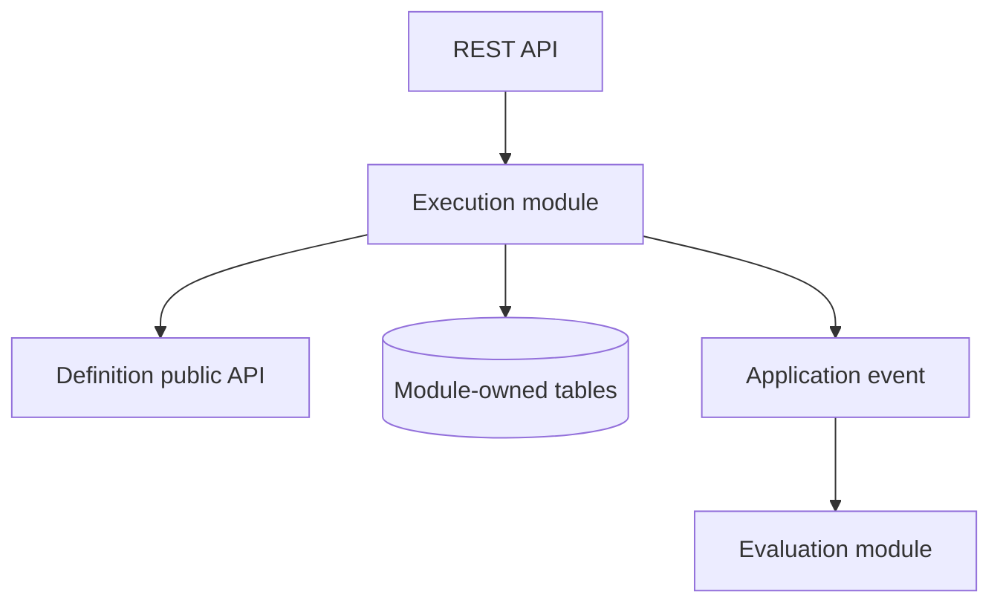

# Java Modular Monolith vs Microservices

## 1. Executive decision

For a new Java enterprise product, begin with a **modular monolith** unless independent deployment, ownership, scaling, availability, security isolation, or regulatory boundaries already justify microservices.

A modular monolith is one deployable application containing strongly separated business modules. It is not an unstructured "big ball of mud." Microservices move those boundaries across network and process boundaries, gaining independent operation while adding distributed-systems cost.

The decision is not permanent. Design module boundaries so justified capabilities can later be extracted using an incremental strangler approach.

## 2. Definitions

### Modular monolith

- One application process and normally one release unit
- Business capabilities separated into explicit modules
- Internal APIs control cross-module access
- No direct access to another module's implementation
- Data ownership is defined even when modules share one database server
- Local calls and database transactions remain available

In Spring Boot, Spring Modulith can help verify module boundaries, document modules, and test module interactions. The architecture does not depend on that library; boundaries must remain visible in packages, APIs, data ownership, and team practices.

### Microservices

- Independently deployable services aligned to business capabilities
- Each service owns its logic and authoritative data
- Communication occurs through versioned synchronous APIs or asynchronous events
- Cross-service workflows accept partial failure and usually eventual consistency
- Teams own build, deployment, telemetry, incidents, security, and data lifecycle

A collection of services sharing tables, release cadence, and coordinated deployments is a distributed monolith.

## 3. Comparison

| Concern | Modular monolith | Microservices |
|---|---|---|
| Deployment | One coordinated unit | Independent per service |
| Calls | In-process, low latency | Network calls can fail or time out |
| Transactions | Local ACID transactions | Saga, outbox, compensation, reconciliation |
| Data | Module-owned schemas/tables can share an instance | Database ownership per service |
| Scaling | Scale the application together | Scale hot capabilities independently |
| Availability | One failure domain unless isolated internally | Better isolation only when dependencies and fallbacks are designed |
| Development | Simple local setup and refactoring | More repositories/pipelines/contracts/environments |
| Testing | Strong integration testing is straightforward | Contract, component, and end-to-end testing required |
| Observability | Simpler traces and logs | Correlation and distributed tracing essential |
| Release | Lower operational overhead | Greater autonomy with platform maturity |
| Security | Fewer network surfaces | More identities, secrets, policies, and attack surfaces |
| Cost | Usually lower initially | Higher infrastructure and operational cost |

## 4. Recommended modular structure

Use business capabilities, not technical layers, as top-level boundaries.

```text
com.example.interview
├── definition/
│   ├── api/
│   ├── application/
│   ├── domain/
│   └── infrastructure/
├── execution/
├── evaluation/
├── notification/
└── sharedkernel/
```

Keep the shared kernel small: identifiers, genuinely universal value objects, and stable platform abstractions. A large shared package silently couples every module.

Boundary rules:

1. A module exposes a narrow public API.
2. Other modules do not import its internal packages.
3. A module owns its tables and migrations; cross-module table writes are forbidden.
4. Cross-module reads use the owning API, a published view, or a deliberate reporting model.
5. Domain events communicate meaningful completed facts.
6. Boundary tests run in CI.
7. Every module has an owner and an operational profile.

## 5. Reference flow inside a modular monolith



For reliability, do not assume an in-memory event is durable. If work must survive a crash, write business state and an outbox record in the same transaction, then publish asynchronously.

## 6. When a modular monolith is the better choice

Prefer it when:

- the product and domain boundaries are still evolving;
- one or a few teams own the system;
- independent releases are not a business requirement;
- most scaling requirements are similar;
- strong transactions simplify critical workflows;
- low latency is important;
- operational maturity is still developing;
- rapid refactoring and time to market matter more than deployment autonomy.

## 7. Evidence that may justify extraction

Extract a module only when evidence shows one or more persistent needs:

| Signal | Evidence to collect |
|---|---|
| Independent scaling | A capability has a distinct, sustained resource profile |
| Release autonomy | Coordinated releases repeatedly delay teams or customers |
| Failure isolation | Its failures breach another capability's SLO |
| Security/isolation | Separate credentials, network boundary, audit, or compliance scope is required |
| Technology fit | A different runtime/storage technology creates measurable value |
| Team ownership | A stable team can own the service end to end |
| Geographic placement | Data residency or latency requires separate placement |
| Change coupling | Module-boundary metrics show independent change, not merely organizational preference |

Repository count, class count, and fashionable architecture are not extraction signals.

## 8. Extraction readiness checklist

Before extraction, verify:

- the business boundary and owner are stable;
- consumers use a module API rather than internal classes or tables;
- authoritative data ownership is unambiguous;
- API/event contracts are versioned and tested;
- distributed consistency requirements are documented;
- idempotency, retries, timeout budgets, and reconciliation exist;
- service identity and authorization are designed;
- dashboards, alerts, runbooks, on-call ownership, and SLOs exist;
- deployment and rollback are independent;
- load tests and failure experiments validate the claimed benefit.

## 9. Safe migration path

1. Measure coupling, latency, deployment friction, load, and failure impact.
2. Strengthen the in-process module boundary.
3. Stop cross-module database writes.
4. Add an anti-corruption interface at the future service boundary.
5. Introduce outbox events where durable asynchronous integration is needed.
6. Copy or backfill service-owned data with reconciliation.
7. Route selected traffic to the extracted service.
8. Compare results, telemetry, and business invariants.
9. Remove the old path only after rollback and recovery are proven.

Do not combine business redesign, database split, protocol change, and full traffic cutover into one irreversible release.

## 10. Anti-patterns

- Package-by-layer structure with every module importing every repository
- Shared database tables written by multiple services
- A shared domain library that requires synchronized releases
- Long synchronous call chains
- Chatty service APIs replacing local method calls
- Distributed transactions used to recreate monolithic coupling
- Kafka used to hide unclear ownership
- One team provisioning and operating every "independent" service
- Nano-services with no independent business capability

## 11. Application to the interview platform

Recommended initial deployables:

1. A modular Spring Boot orchestrator containing definition, assignment, execution, review, and result-publication modules.
2. A separate FastAPI AI service because its runtime, dependencies, scaling, failure characteristics, and provider controls differ.
3. Keycloak as the identity platform.
4. PostgreSQL as the authoritative application store.
5. Kafka only for durable asynchronous workflows that need decoupling or replay.

Possible later extractions include evaluation, notifications, and analytics. Extract them when measured scaling, ownership, isolation, or release needs justify it—not merely because they have different names.

## 12. Interview answer

> I do not choose microservices by default. I begin with quality attributes and team topology. For a new Java product, I prefer a modular monolith with enforced capability boundaries and explicit data ownership. It preserves local transactions, fast refactoring, and operational simplicity. I introduce microservices when a boundary needs independent deployment, scaling, ownership, failure isolation, security, or geography. Before extraction, I establish contracts, outbox/idempotency, observability, service identity, and reconciliation so I gain autonomy without creating a distributed monolith.
