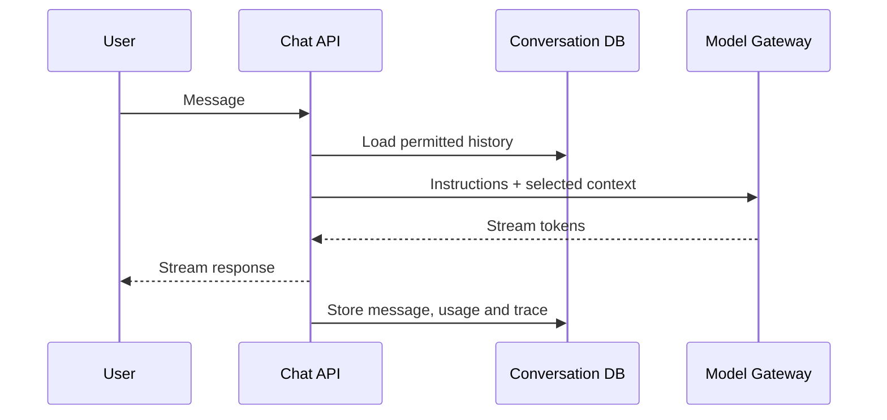

# 4. Build a Reliable Chatbot

A chatbot is more than a UI connected to an LLM. It needs conversation persistence, context selection, streaming, cancellation, safety, cost control, authentication and failure handling.

## Conversation memory

Do not send unlimited history. Use a recent-message window, durable summary and separately retrieved facts. Store authoritative state in databases, not only in conversation text. Isolate conversations by tenant and user.

## API behaviour

- Accept an idempotency key for message submission.
- Stream with SSE or WebSocket when bidirectional communication is needed.
- Handle client disconnect and cancel downstream work.
- Apply rate limits, token budgets and concurrency limits.
- Return safe errors without leaking provider details.

## Lab

Build a streamed chatbot with FastAPI, PostgreSQL, a model adapter, conversation history, cancellation, feedback buttons and tests using a fake model. Add a fallback message for provider timeout.

## Common failures

Duplicate messages after retries, cross-user history leakage, token-limit errors, excessive history cost, markdown XSS and a UI that hides partial failures.

## Interview checks

Explain stateless API versus durable conversation state, SSE versus WebSocket, memory strategies, token budgeting and how you prevent one user's context reaching another.
