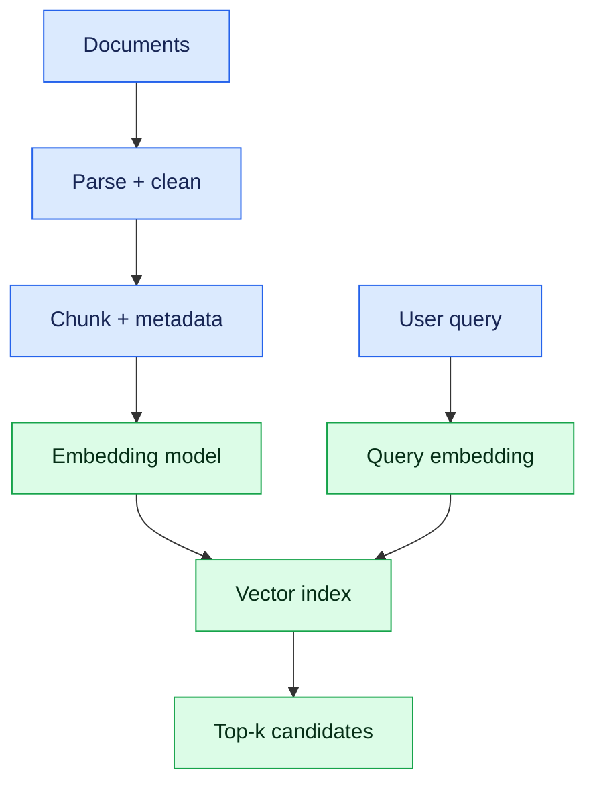

# 5. Embeddings, Vector Databases and Semantic Search

An embedding maps content to a numeric vector so semantically related items can be found even without matching keywords. Similarity search is approximate retrieval, not proof that an answer is correct.

## Indexing flow

## Design choices

- Chunk by semantic boundaries; preserve headings and source IDs.
- Add metadata for tenant, permissions, version, language and effective date.
- Use cosine, dot product or Euclidean distance consistently with the embedding model.
- Combine keyword and vector retrieval for names, codes and semantic meaning.
- Re-rank candidates when precision matters.
- Version embeddings and re-index when model or chunking changes.

PostgreSQL with pgvector is often enough when application data, transactions and filters matter. Dedicated vector databases help at specialised scale or operational requirements; benchmark your workload.

## Lab

Ingest 50 policy documents, create chunks, store vectors and metadata, implement filtered top-k search, then test ten queries. Inspect false positives and missed results rather than only celebrating a demo.

## Interview checks

Explain embeddings, chunk size/overlap, similarity metrics, hybrid search, metadata filters, re-ranking and the difference between a vector database and an LLM.
