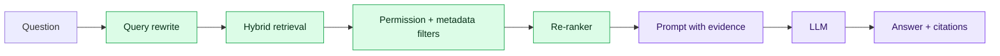

# 6. RAG from Prototype to Production

Retrieval-Augmented Generation retrieves authorised evidence at request time and asks the model to answer from it. RAG does not automatically eliminate hallucination; retrieval and generation both require evaluation.

## Production pipeline

Ingestion needs parsing, deduplication, chunking, metadata, embedding, indexing, lineage and deletion propagation. Query time needs intent handling, retrieval, permission filters, re-ranking, context assembly, generation, citations and abstention.

Security filters must be applied during retrieval, not after the model has seen forbidden text. Citations should point to the actual chunk and document version used.

## Evaluation

Measure retrieval recall/precision, context relevance, groundedness, answer correctness, citation accuracy, refusal quality, latency and cost. Maintain a versioned golden dataset including unanswerable, adversarial and permission tests.

## Lab

Extend the chatbot into a policy RAG assistant. Add hybrid retrieval, tenant filters, citations, “I don't know” behaviour, an ingestion job and automated evaluation. Compare chunking and top-k variants.

## Failure diagnosis

A wrong answer may come from missing source data, parsing, chunking, embedding, filters, ranking, prompt or model. Trace each stage so the team can identify the failing component.

## Interview checks

Explain RAG versus fine-tuning, ingestion versus query path, permission-aware retrieval, citations, evaluation and how you diagnose poor answers.
