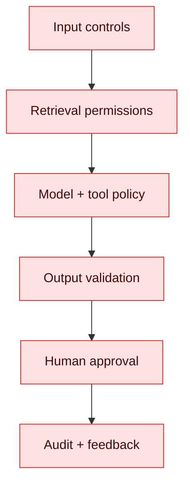

# 7. Evaluation, Guardrails and Responsible AI

AI tests are statistical as well as deterministic. Unit tests validate code contracts; evaluation datasets measure model behaviour. Run both.

## Evaluation layers

| Layer | Examples |
|---|---|
| Deterministic | schema validity, citation exists, tool arguments valid |
| Retrieval | recall@k, precision@k, ranking quality |
| Generation | groundedness, correctness, relevance, refusal |
| System | latency, cost, availability, security, user outcome |
| Human | expert rubric, pairwise preference, harm review |

LLM-as-judge can scale review but may be biased or inconsistent. Calibrate it against human-labelled examples and keep the rubric explicit.

## Guardrails

Use input size limits, malware/file checks, PII detection, prompt-injection defences, content policies, structured outputs, allow-listed tools, least privilege, confirmation before consequential actions and output encoding. Guardrails are layered controls, not a single library.

## Lab

Create 100 evaluation cases: normal, edge, unanswerable, injection, sensitive data and unauthorised access. Define thresholds in CI and a shadow evaluation before model/prompt changes reach production.

## Interview checks

Explain offline versus online evaluation, golden datasets, groundedness, LLM-as-judge limitations, red teaming, human-in-the-loop and why “the prompt looks good” is not acceptance evidence.
