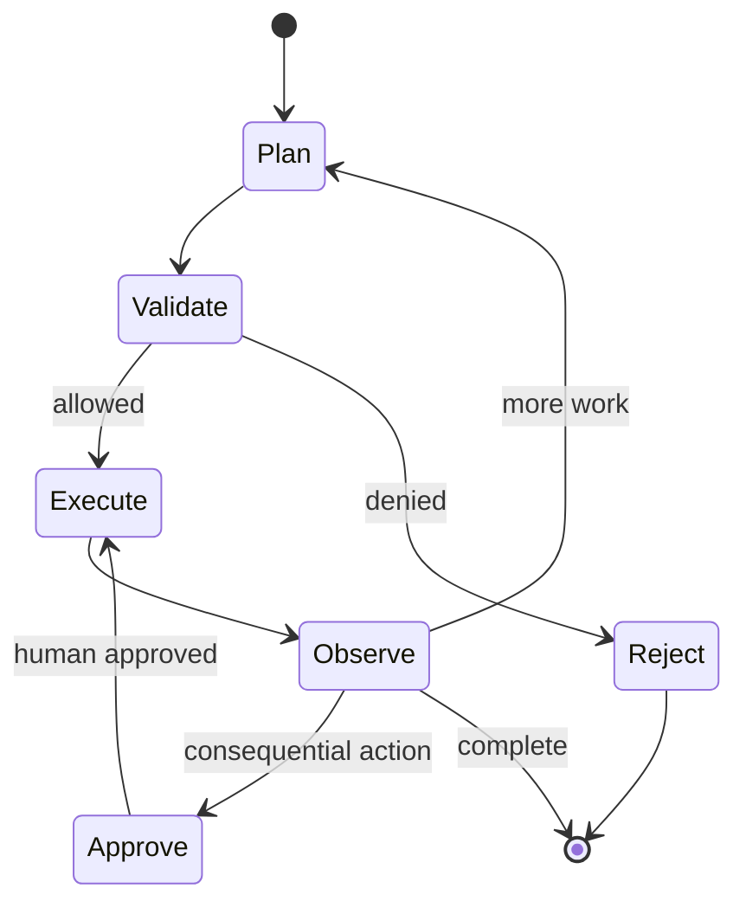

# 8. Tool Calling, Workflows and Agentic AI

A tool-calling application lets the model propose a typed function call. An agent repeatedly decides what to do, invokes tools and observes results until it reaches a stop condition. Use a deterministic workflow when the steps are already known.

| Pattern | Best fit |
|---|---|
| Single model call | transformation or generation |
| RAG | answer from knowledge |
| Tool call | one bounded external operation |
| Workflow/state machine | known multi-step business process |
| Agent | open-ended planning where adaptability is worth the risk |

## Safe agent loop

Set maximum steps, time and cost. Validate tool name and arguments. Enforce user permissions in the tool service. Make writes idempotent. Sandbox code execution. Require human approval for money movement, deletion, messages or privileged changes. Store an audit trail.

Multi-agent systems add coordination, latency and debugging complexity. Start with one bounded agent and only split roles when evaluation shows a clear gain.

## Lab

Add tools to the interview assistant: search policy, fetch candidate schedule and draft an interview slot. Let it read safely, but require confirmation before creating an invitation. Test tool injection and retry behaviour.

## Interview checks

Explain agent versus workflow, tool calling, planning loops, memory, idempotency, human approval, least privilege and why more agents do not automatically improve quality.
