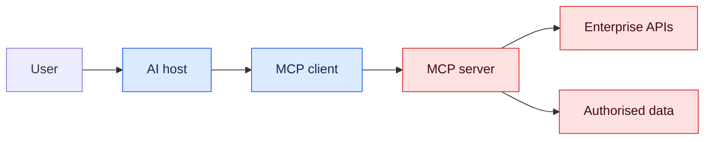

# 9. MCP and Enterprise Integration

Model Context Protocol standardises how AI hosts connect to servers exposing tools, resources and prompts. It improves interoperability; it does not replace authentication, authorisation, validation or business APIs.

## Roles

- **Host**: the AI application controlling user experience and policy.
- **Client**: connection maintained by the host to an MCP server.
- **Server**: exposes bounded capabilities.
- **Tool**: an action callable with validated arguments.
- **Resource**: contextual data readable by URI.
- **Prompt**: reusable prompt template.

## Enterprise controls

Propagate verified identity intentionally; do not blindly forward tokens. Each server should enforce scopes and tenant boundaries, allow-list capabilities, validate schemas, limit output size, apply timeouts/rate limits and emit audit events. Treat tool descriptions and returned content as untrusted.

MCP is suitable at the AI integration boundary. Keep domain rules and transactions in authoritative services. Version tool contracts and test compatibility.

## Lab

Expose read-only interview definitions and a draft-question tool from an MCP server. Connect it to the assistant, add OAuth/scoped identity, traces and approval for publishing a question.

## Interview checks

Explain host/client/server, tools versus resources, MCP versus REST, trust boundaries, identity propagation, prompt injection through tool output and how to secure write tools.
