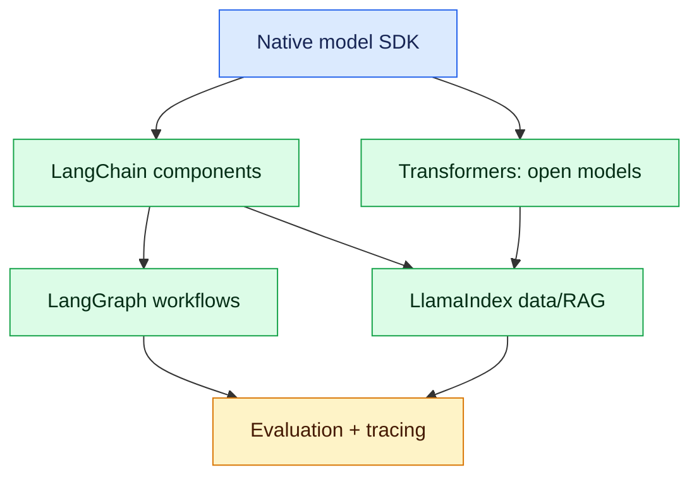

# AI Frameworks and Tools: What to Learn, When to Use Them

Framework knowledge matters, but production engineers must first understand the underlying model, retrieval and workflow contracts. This guide maps the ecosystem and prevents tool-driven architecture.

## Learning order

1. Use a model provider SDK directly: messages, streaming, structured output and tool calls.
2. Learn embeddings, chunking, retrieval and evaluation with plain Python.
3. Use **LangChain** for reusable model, prompt, retriever and tool components.
4. Use **LangGraph** for stateful, branching and resumable workflows.
5. Learn **Hugging Face Transformers** when running or adapting open models.
6. Consider **LlamaIndex** when document ingestion and retrieval are the dominant problem.
7. Add evaluation, tracing, security and cost controls before production.

## Tool map

| Need | Start with | Adopt when |
|---|---|---|
| Simple chat or extraction | Provider SDK + Pydantic | Keep it simple if one model call is enough |
| Reusable prompts, tools and retrievers | LangChain | Several integrations need a common abstraction |
| Stateful agent/workflow | LangGraph | Branching, retries, pause/resume or approval is required |
| Open-model inference/fine-tuning | Transformers | Privacy, control, offline use or model adaptation matters |
| Data ingestion and RAG | LlamaIndex or LangChain | Connectors/indexing/retrieval are becoming substantial |
| Local vector proof of concept | FAISS or Chroma | Small local experiment |
| Enterprise relational retrieval | pgvector | PostgreSQL operations and metadata joins are valuable |
| Managed vector scale | Pinecone/Weaviate or cloud service | Operational simplicity or distributed scale is required |
| RAG quality | RAGAS/DeepEval + custom tests | Every RAG release |
| Tracing | LangSmith and/or OpenTelemetry | Multi-step latency, cost and failures need diagnosis |

## Native SDK versus LangChain versus LangGraph

| Option | Best fit | Risk |
|---|---|---|
| Native SDK | Small, explicit services; least abstraction | You own orchestration and integrations |
| LangChain | Composable prompts, parsers, retrievers and tools | Hidden defaults and abstraction churn |
| LangGraph | Durable state machines and human-in-the-loop agents | Unnecessary complexity for a linear chain |
| LlamaIndex | Data-centric ingestion and retrieval | Overlap with existing application/data platform |

An experienced answer is not “we use LangChain because it is popular.” It is: “we measured the complexity of our native implementation and introduced the smallest abstraction that improved testability and operations.”

## Vector databases

A vector database stores embeddings plus identifiers and metadata. It does not replace the system of record.

Selection checks:

- filtering and tenant isolation;
- recall/latency at expected scale;
- hybrid keyword + vector search;
- index build and backup strategy;
- deletion and compliance;
- operational ownership and cost.

Never choose only from benchmark recall. Test with your documents, queries, filters and tenancy model.

## Evaluation and observability

Use three layers:

- deterministic tests for parsers, permissions, tools and citations;
- offline datasets for retrieval recall, faithfulness and answer quality;
- online telemetry for latency, tokens, cost, failures and user feedback.

RAGAS and DeepEval can accelerate metrics, but business-specific assertions remain essential. LangSmith provides framework-aware traces; OpenTelemetry provides vendor-neutral correlation across API, retrieval, model and tool spans. Do not log secrets, full private prompts or unrestricted document content.

## Hands-on milestone

Build the same interview-policy assistant four ways:

1. direct provider SDK;
2. LangChain retriever chain;
3. LangGraph workflow with approval;
4. local Hugging Face model for one bounded task.

Compare code size, latency, cost, testability, trace quality and failure recovery. Record the choice in an ADR.

## Interview questions

**Do I need LangChain for every LLM application?**  
No. Direct SDK code is often clearer for a few calls. Use LangChain when its composition and integrations remove measured complexity.

**When is LangGraph justified?**  
When the workflow has explicit state, branches, retries, cycles, checkpoints, pause/resume or human approval.

**Does a vector database guarantee good RAG?**  
No. Chunking, metadata, query formulation, reranking, permissions, source quality and evaluation usually dominate.

**What should a 3–6 year AI developer demonstrate?**  
Framework trade-offs, reproducible evaluations, tenant-safe retrieval, bounded tools, trace-based debugging, cost ownership and rollback—not only notebook demos.
