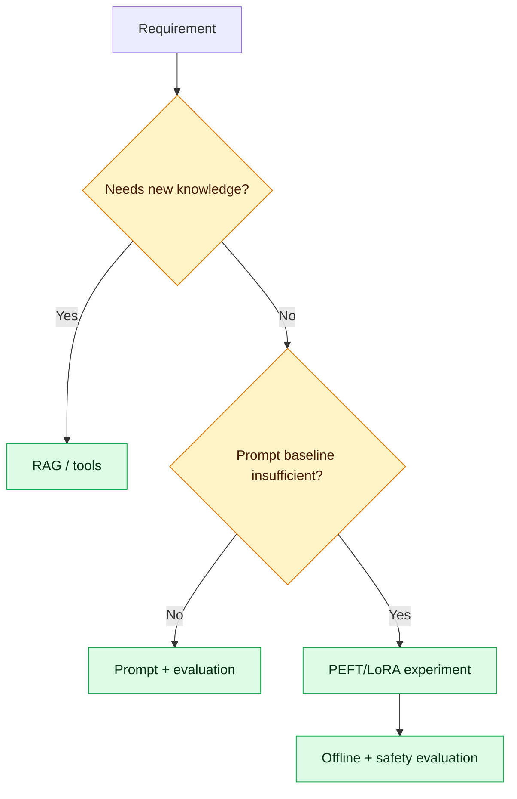

# Hugging Face Transformers: Hands-On from Inference to PEFT

Use Transformers when you need open-model inference, control over deployment, specialised models or fine-tuning. Begin with hosted APIs when speed matters; self-host only after measuring privacy, latency, throughput, hardware and operational costs.

## Core concepts

- **Tokenizer:** converts text into token IDs and attention masks.
- **Model:** neural network weights plus configuration.
- **Pipeline:** convenient task wrapper for early experiments.
- **Inference:** forward pass that produces predictions or tokens.
- **Training:** updates weights using labelled or self-supervised data.
- **Fine-tuning:** adapts a pretrained model to a task or domain.
- **PEFT/LoRA:** trains small adapters instead of every parameter.
- **Quantisation:** reduces numeric precision to lower memory/compute.


## First inference lab

```bash
python -m venv .venv
# activate the environment, then:
pip install transformers torch accelerate
```

```python
from transformers import pipeline

classifier = pipeline(
    task="sentiment-analysis",
    model="distilbert/distilbert-base-uncased-finetuned-sst-2-english",
)
print(classifier("The deployment completed successfully."))
```

Pin dependencies and model revisions in real builds. Review model licences and cards before use.

## Explicit tokenizer and model

```python
from transformers import AutoModelForSequenceClassification, AutoTokenizer
import torch

model_id = "distilbert/distilbert-base-uncased-finetuned-sst-2-english"
tokenizer = AutoTokenizer.from_pretrained(model_id)
model = AutoModelForSequenceClassification.from_pretrained(model_id)
model.eval()

batch = tokenizer(["release succeeded", "service is failing"], padding=True,
                  truncation=True, return_tensors="pt")
with torch.inference_mode():
    logits = model(**batch).logits
predictions = logits.argmax(dim=-1).tolist()
print(predictions)
```

Understand padding, truncation, maximum context, device placement and batching before optimising throughput.

## Text generation controls

Key parameters include `max_new_tokens`, `temperature`, `top_p`, stop tokens and repetition penalties. For deterministic extraction prefer constrained/structured output and low randomness. For creative content allow controlled sampling. Never treat sampling parameters as factuality controls.

## Embeddings

Use a sentence-embedding model designed for retrieval, not arbitrary hidden states. Validate multilingual support, maximum sequence length, embedding dimension, licence and retrieval quality. Version the embedding model because changing it normally requires re-embedding the corpus.

## Fine-tuning decision

Use prompting or RAG for changing knowledge. Fine-tune for stable behaviour, style, classification or domain patterns after establishing a baseline.



PEFT/LoRA reduces trainable parameters and storage, but it does not remove requirements for curated data, leakage checks, evaluation, model/version lineage and rollback.

## Production checklist

- pin model, tokenizer and dependency versions;
- scan model artifacts and review licences;
- benchmark p50/p95 latency, throughput and memory;
- batch within a bounded wait time;
- use quantisation only after quality comparison;
- separate API autoscaling from GPU worker scaling;
- enforce request size, timeout and concurrency limits;
- cache only where privacy and staleness permit;
- record model revision and adapter version in traces;
- use canary release and a known-good rollback.

## Practical exercises

1. Run a sentiment or classification pipeline.
2. Replace the pipeline with explicit tokenizer/model code.
3. Benchmark batch sizes and record p95 latency and memory.
4. Create embeddings and compare semantic-search results.
5. Fine-tune a small classifier or LoRA adapter.
6. Package inference behind FastAPI with health/readiness endpoints.
7. Add evaluation and load tests before container deployment.

## Interview traps

- A larger model is not automatically better for the task.
- Quantisation saves resources but can change quality and hardware behaviour.
- Fine-tuning does not provide current facts; use retrieval or tools.
- GPU utilisation alone is not a service SLO.
- Downloaded models are supply-chain artifacts and require governance.
