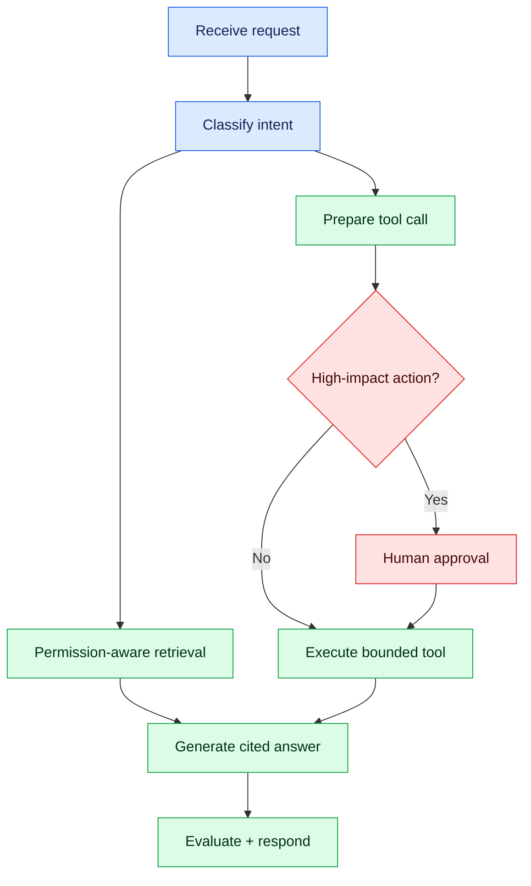

# LangChain and LangGraph: Production Hands-On Lab

This chapter builds a permission-aware interview-policy assistant. LangChain supplies composable model/retrieval/tool integrations; LangGraph makes workflow state, branches, checkpoints and human approval explicit.

## Install and pin

```bash
pip install langchain langchain-openai langgraph pydantic
# choose only the integrations you use, such as:
pip install langchain-postgres psycopg[binary]
```

Pin compatible versions in a lock file. Framework APIs evolve; protect domain code behind your own interfaces and regression tests.

## LangChain building blocks

- chat model;
- prompt template;
- structured output;
- document loaders and splitters;
- embeddings and vector stores;
- retrievers and rerankers;
- tools;
- runnable composition.

```python
from pydantic import BaseModel, Field
from langchain_openai import ChatOpenAI

class InterviewQuestion(BaseModel):
    question: str
    topic: str
    difficulty: str = Field(pattern="^(easy|medium|hard)$")

model = ChatOpenAI(model="YOUR_APPROVED_MODEL", temperature=0)
generator = model.with_structured_output(InterviewQuestion)
result = generator.invoke("Create one medium Java concurrency question.")
print(result)
```

Configuration, model identifiers and secrets belong in environment/configuration management—not source code.

## RAG chain

A reliable RAG request must carry identity and tenant filters into retrieval. Retrieved text is untrusted data, not instructions.

```python
def retrieve_policy(query: str, tenant_id: str, user_roles: set[str]):
    filters = {"tenant_id": tenant_id, "visibility": {"$in": list(user_roles)}}
    return vector_store.similarity_search(query, k=8, filter=filters)

def answer(query: str, context_docs):
    context = "\n\n".join(d.page_content for d in context_docs)
    return grounded_chain.invoke({"question": query, "context": context})
```

Add deduplication, reranking, citation identifiers, context limits and a “not supported by sources” outcome. Test forbidden-document exclusion independently of model quality.

## Why LangGraph

A production agent is better modelled as a controlled workflow than an unlimited loop.



## Minimal LangGraph state machine

```python
from typing import TypedDict
from langgraph.graph import END, StateGraph

class State(TypedDict, total=False):
    question: str
    tenant_id: str
    context: list[str]
    answer: str
    approved: bool
    error: str

def retrieve(state: State) -> State:
    docs = retrieve_policy(state["question"], state["tenant_id"], {"candidate"})
    return {**state, "context": [d.page_content for d in docs]}

def generate(state: State) -> State:
    response = grounded_chain.invoke({
        "question": state["question"],
        "context": "\n\n".join(state["context"]),
    })
    return {**state, "answer": response}

graph = StateGraph(State)
graph.add_node("retrieve", retrieve)
graph.add_node("generate", generate)
graph.set_entry_point("retrieve")
graph.add_edge("retrieve", "generate")
graph.add_edge("generate", END)
app = graph.compile()
```

For real workflows add conditional edges, retry classification, timeouts, checkpoint persistence and idempotency. Keep external side effects in explicit nodes.

## Approval and durable execution

Before sending email, scheduling an interview, changing records or exposing sensitive data:

1. validate tool arguments;
2. re-check caller permissions server-side;
3. show the proposed action to an approver;
4. persist the checkpoint;
5. resume using an idempotency key;
6. record an auditable outcome.

Do not store raw credentials or unrestricted private prompt data in checkpoints.

## LlamaIndex alternative

LlamaIndex is strong when ingestion, parsing, indexing, metadata and retrieval dominate the application. LangChain is often attractive for broad model/tool composition; LangGraph is focused on stateful workflow orchestration. They can coexist, but avoid duplicate abstraction layers. Select with a small benchmark and an ADR.

## Evaluation gates

Create a versioned dataset with questions, allowed sources, forbidden sources, expected citations and acceptable answers.

| Layer | Example checks |
|---|---|
| Retrieval | recall@k, MRR, tenant-filter violations |
| Generation | faithfulness, relevance, citation validity |
| Tools | exact arguments, permission denial, idempotency |
| Agent | path chosen, step limit, approval required |
| Operations | p95 latency, error rate, tokens and cost |

Use RAGAS or DeepEval as accelerators, plus deterministic business assertions. Treat LLM-as-judge results as probabilistic measurements, not ground truth.

## Tracing

Trace each request across API, retriever, reranker, model and tools. LangSmith offers LangChain/LangGraph-aware traces; OpenTelemetry correlates the AI path with the wider service platform.

Capture safe metadata:

- trace/request ID;
- prompt/template version;
- model and embedding versions;
- retrieved document IDs, not unrestricted content;
- workflow node and tool name;
- latency, token usage, cost and outcome;
- policy decisions and approval identity.

## Failure handling

| Failure | Response |
|---|---|
| Model timeout/rate limit | bounded retry with jitter, fallback or graceful failure |
| Empty retrieval | say evidence is unavailable; do not invent |
| Tool timeout | stop safely; avoid ambiguous repeated side effects |
| Invalid structured output | bounded repair/retry, then explicit failure |
| Checkpoint unavailable | reject durable action or use documented degraded mode |
| Evaluation regression | block promotion and retain known-good version |

## End-to-end lab

1. Implement direct-SDK structured generation.
2. Add LangChain retrieval over pgvector.
3. Enforce tenant and role filters.
4. Add citations and an abstention path.
5. Build a LangGraph route for Q&A versus scheduling.
6. Require approval before scheduling.
7. Persist checkpoints and test resume.
8. Add RAGAS/DeepEval plus deterministic permission tests.
9. Trace with LangSmith and/or OpenTelemetry.
10. Load test, deploy canary and document rollback.

## Interview answer

“LangChain gives us reusable model, prompt, retriever and tool components. We use LangGraph only where the workflow needs explicit state, branches, checkpoints or human approval. Retrieval applies tenant permissions before documents reach the model. Tools are allow-listed, schema-validated, time-bounded and idempotent. Releases pass deterministic security tests and an evaluation dataset, while traces capture model, retrieval, tool, latency, token and cost evidence. For a simple one-call feature, I prefer the native SDK.”
