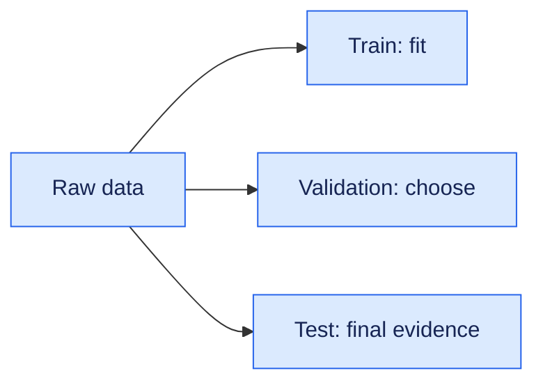

# 15. Machine Learning and Mathematics Foundations

This chapter gives an AI developer the mathematics and ML reasoning needed to choose, train and evaluate models—not merely call an API.

## Mathematics that matters

- **Linear algebra:** vectors, matrices, dot products, norms and cosine similarity. Matrix multiplication powers neural layers; cosine similarity is common in retrieval.
- **Probability:** distributions, expectation, variance, conditional probability and Bayes' rule.
- **Statistics:** sampling, confidence intervals, hypothesis tests and the difference between statistical and business significance.
- **Optimisation:** loss functions, gradients, learning rates and regularisation.

Cosine similarity is $\cos(\theta)=\frac{x \cdot y}{\lVert x\rVert\lVert y\rVert}$.

## ML problem families

| Family | Example | Useful metrics |
|---|---|---|
| Regression | Claim cost | MAE, RMSE, R-squared |
| Classification | Fraud detection | Precision, recall, F1, PR-AUC |
| Clustering | Customer segments | Silhouette plus domain review |
| Ranking | Search results | MRR, NDCG, Recall@k |
| Generation | Answer or summary | Task rubric, groundedness, safety |

Accuracy is misleading on imbalanced data. A predict-all-negative fraud model may be 99% accurate and operationally useless.

## Splitting data without leakage

Use training data to learn, validation data to choose and test data once for final evidence. Split time-dependent systems chronologically. Fit scalers and feature transforms only on training data. Do not let the same customer, document or conversation appear across splits.

## Generalisation

- **Underfitting:** training and validation results are poor.
- **Overfitting:** training is strong but validation degrades.
- **Bias:** systematic error from restrictive assumptions or unrepresentative data.
- **Variance:** sensitivity to the training sample.

Remedies include better data, regularisation, simpler models, cross-validation and early stopping.

## Hands-on lab

Choose a public tabular dataset. Define the target, baseline and cost of each error type. Train logistic regression and a tree model. Report the confusion matrix, precision, recall, F1, PR-AUC and threshold decision. Document limitations in a model card.

## Production questions

1. What business decision consumes the prediction?
2. What is the cost of false positives and false negatives?
3. Can delayed labels hide degradation?
4. Which groups are underrepresented?
5. What drift signal triggers investigation?

## Interview positioning

“I start from the decision and error cost, establish a simple baseline, prevent leakage and select business-aligned metrics. I inspect calibration, segment performance and failure examples rather than approving a model from aggregate accuracy alone.”
