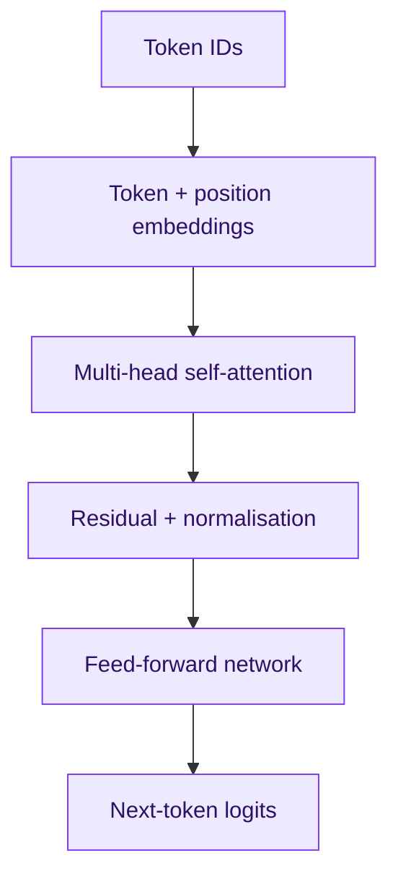

# 17. Deep Learning and Transformer Internals with PyTorch

Framework calls become reliable only when the developer understands tensors, gradients, training loops and the architecture behind modern language models.

## Neural-network foundation

A layer computes a weighted transformation followed by a non-linearity. Backpropagation applies the chain rule to calculate gradients; an optimiser updates weights to reduce loss.

| Concept | Why it matters |
|---|---|
| Activation | Enables nonlinear functions |
| Loss | Defines what training rewards |
| Optimiser | Converts gradients into updates |
| Batch | Balances throughput and gradient noise |
| Regularisation | Reduces overfitting |

```python
model.train()
for features, labels in train_loader:
    optimiser.zero_grad(set_to_none=True)
    logits = model(features)
    loss = loss_fn(logits, labels)
    loss.backward()
    torch.nn.utils.clip_grad_norm_(model.parameters(), 1.0)
    optimiser.step()
```

Use `model.eval()` and `torch.no_grad()` for evaluation. Track validation metrics, not training loss alone.

## Transformer architecture



Scaled dot-product attention is $\operatorname{softmax}(QK^T/\sqrt{d_k})V$. Queries describe what a token seeks, keys what tokens offer and values the information to combine. Multiple heads learn different relationships.

| Architecture | Examples | Typical use |
|---|---|---|
| Encoder-only | BERT | Classification, extraction, embeddings |
| Decoder-only | GPT, Llama | Autoregressive generation |
| Encoder-decoder | T5 | Translation and transformation |

## Training and inference

Pretraining learns broad patterns; supervised fine-tuning teaches tasks; alignment shapes preferred behaviour. At inference, understand temperature, top-p and structured decoding.

- KV cache saves recomputation but consumes accelerator memory.
- Longer context increases memory and compute.
- Quantisation reduces memory with possible quality loss.
- Continuous batching improves throughput.
- Speculative decoding and efficient attention kernels can reduce latency.

## Hands-on labs

1. Train a small PyTorch classifier and plot train/validation curves.
2. Inspect tokenisation, padding and attention masks.
3. Compare BERT classification with decoder-model prompting.
4. Measure latency, throughput, memory and quality at two batch sizes.
5. Diagnose an out-of-memory failure using evidence.

## Interview positioning

“I understand Transformers below the framework layer: embeddings, attention, residual paths, feed-forward blocks, masking and decoding. That lets me reason about context cost, KV-cache memory, batching and quantisation instead of treating the model as a black box.”
