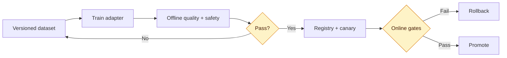

# 18. Fine-Tuning, PEFT, LoRA and Model Evaluation

Fine-tuning changes model behaviour; RAG supplies external knowledge. They solve different problems and can be combined.

## Choose the intervention

| Need | Prefer |
|---|---|
| Current private facts with citations | RAG |
| Stable tone, format or task behaviour | Fine-tuning |
| Frequently changing knowledge | RAG |
| Domain behaviour plus private facts | Fine-tuning plus RAG |
| Deterministic rule | Code or validation |

Start with prompting and retrieval baselines. Fine-tune only when evaluation demonstrates a repeatable behaviour gap.

## Dataset engineering

- Define one target behaviour and acceptance rubric.
- Remove secrets, PII and data without usage rights.
- Deduplicate train and evaluation sets.
- Preserve a locked evaluation set.
- Record provenance, consent, licence and transformations.
- Include refusal and adversarial cases.

## PEFT, LoRA and QLoRA

Full fine-tuning updates all weights. Parameter-efficient fine-tuning freezes the base model and learns small adapters. LoRA learns low-rank updates to selected matrices. QLoRA uses a quantised base model plus LoRA adapters to reduce memory.

```python
from peft import LoraConfig, get_peft_model

config = LoraConfig(
    r=16,
    lora_alpha=32,
    lora_dropout=0.05,
    target_modules=["q_proj", "v_proj"],
    task_type="CAUSAL_LM",
)
model = get_peft_model(base_model, config)
```

Target modules differ by architecture. Pin the base revision and confirm tokenizer, padding, truncation and label masking.

## Evaluation gates



Evaluate offline task success, regressions, calibrated human review, latency, throughput, cost and red-team cases. Then canary with hard rollback thresholds.

## Experiment tracking

Record model and tokenizer revisions, dataset version, code commit, seed, hardware, hyperparameters, adapter configuration, metrics and checksums. Use MLflow or equivalent and a registry for promotion.

## Lab

Fine-tune a small instruction model with LoRA for structured interview-question generation. Compare native prompting, RAG context and the adapter on the same locked set. Publish a model card and deploy only if improvement justifies operational risk.

Common failures include evaluation contamination, sensitive-data memorisation, catastrophic forgetting, average-only metrics, base/adapter mismatch and assuming quantisation has no quality impact.
