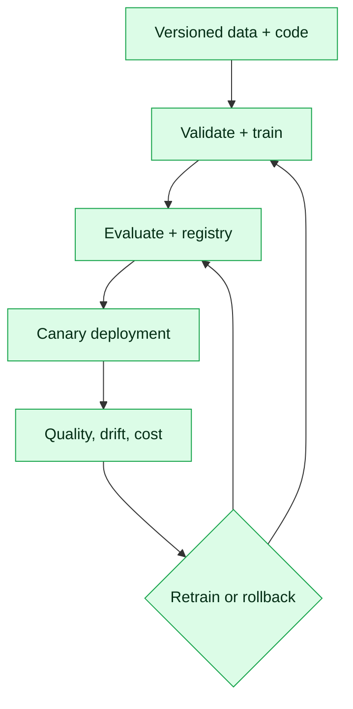

# 19. MLOps, Model Serving and Cloud AI

MLOps makes data, training, evaluation and deployment reproducible. LLMOps extends the discipline to prompts, retrieval, gateways, agent traces and probabilistic evaluation.

## Platform components

- Data versioning and lineage using immutable snapshots or DVC references
- Schema, range, null, skew and label validation
- Airflow, Kubeflow or managed pipeline orchestration
- MLflow experiment tracking and a controlled model registry
- Feature stores when offline/online consistency and reuse justify them
- Service, data-drift, concept-drift, quality and business monitoring
- Policy-controlled retraining; drift triggers investigation, not blind retraining

## Serving choices

| Option | Appropriate use |
|---|---|
| FastAPI | Custom CPU model or gateway |
| ONNX Runtime | Portable optimised inference |
| vLLM | High-throughput decoder-model serving |
| Hugging Face TGI | Production text generation |
| NVIDIA Triton | Multi-framework GPU serving and batching |
| Managed endpoint | Rapid governed cloud operations |

Batch inference optimises throughput; online inference prioritises bounded latency; asynchronous queues suit expensive jobs.

## Serving controls

Validate schema and request size, pin model revisions, warm instances, bound queues, enforce timeouts and load shedding, batch compatible requests and monitor queue delay separately. Cache only with tenant, permission and freshness in the key. Autoscale from concurrency, queue depth or accelerator utilisation—not CPU alone.

## Cloud AI

| Platform | Managed GenAI | Training/MLOps |
|---|---|---|
| AWS | Bedrock | SageMaker |
| Azure | Azure OpenAI / AI Foundry | Azure Machine Learning |
| Google Cloud | Vertex AI APIs | Vertex AI pipelines/registry |

For the AWS track, implement governed Bedrock access and SageMaker or container-based training/serving. Use IAM roles, KMS, private networking, audit logs, regional controls and budget alarms.

## Observe and release

Track errors, p95/p99 latency, queue depth, throughput, accelerator memory, cost per task, input/prediction drift, delayed labels and segment quality. For GenAI add retrieval recall, groundedness, tool success and prompt/model/retriever versions.

Use shadow, canary, blue/green or champion/challenger releases. Rollback must restore coupled model, prompt, retriever and feature versions together.

## Failure exercise

Simulate provider outage, GPU OOM, latency surge, corrupt features, a drift alarm and a bad canary. Prove fallback, bounded retries, queue protection, alert ownership and rollback time.
