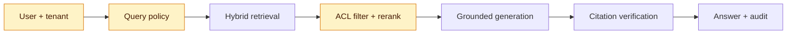
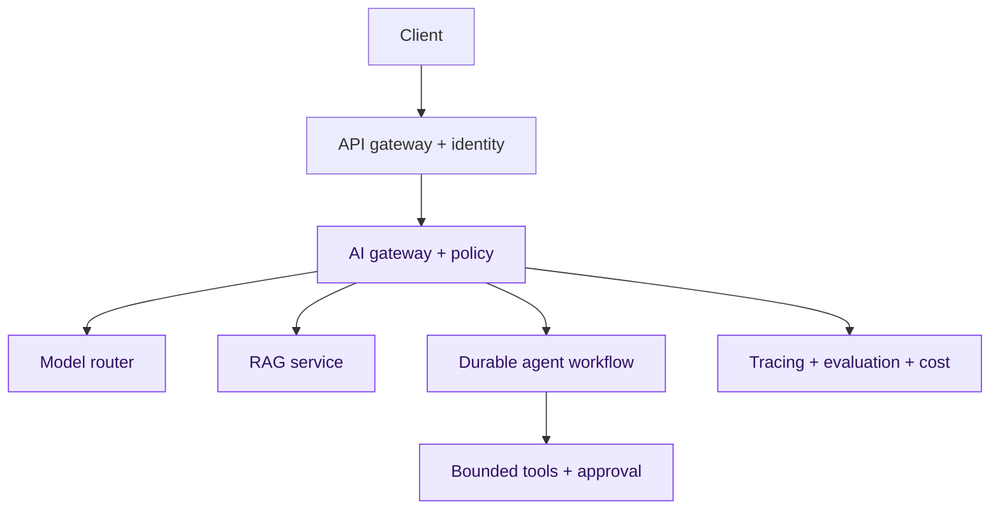

# 20. Multimodal AI, Security and Advanced AI System Design

A production AI engineer must safely combine text, documents, images and speech while designing for provider failure, tenant isolation, human control, cost and auditability.

## Multimodal foundations

- Document AI: OCR, layout, tables, forms and page citations
- Vision-language models: image understanding and visual question answering
- Speech: transcription, diarisation, translation and text-to-speech
- Multimodal RAG: modality-specific evidence with source regions or timestamps
- Evaluation: OCR accuracy, visual grounding, word-error rate and task success

Never assume OCR text is correct. Preserve page coordinates, confidence, original checksum and a path to the source.

## Advanced permission-aware RAG

A mature pipeline may use query rewriting, lexical/vector hybrid search, metadata filtering, cross-encoder reranking, parent-child retrieval, contextual compression, GraphRAG and citation verification. Authorise documents before they reach the model; output filtering cannot undo disclosure.

## Threat model

- Direct and indirect prompt injection
- Sensitive-data and secrets leakage
- Excessive agency and unsafe tool execution
- Insecure output handling
- Data/model poisoning and model extraction
- Denial of service and unbounded consumption
- Model, dataset, adapter and package supply-chain risk
- Cross-tenant cache, index or trace leakage

Treat documents, web content, model output and tool responses as untrusted. Use allowlisted typed tools, least privilege, sandboxing, egress control, confirmation for consequential actions, budgets and immutable audits.

## Reference architecture

## Reliability and governance

Use health-aware model routing, timeouts, jittered bounded retries, circuit breakers, bulkheads, scoped semantic caches, idempotency keys, checkpoints, human approval, token/tool/cost budgets and tested degraded modes. Maintain model cards, dataset provenance, fairness evidence, excluded uses, human escalation and accountable owners.

## Evaluation-driven delivery

Every model, prompt, retriever, tool or policy change runs offline quality, regression, security, latency and cost gates. Promote through shadow or canary traffic and stop automatically on hard safety or reliability thresholds.

## Capstone

Build a multimodal enterprise interview assistant that accepts CV PDFs and audio, extracts structured evidence, performs permission-aware retrieval, generates cited feedback and queues human approval. Include a threat model, evaluation set, cost model, load test, runbook and rollback demonstration.

## Architect questions

1. How do you prevent cross-tenant retrieval?
2. What happens during a provider outage?
3. Which actions require approval?
4. How do you prove safety and fairness did not regress?
5. How do you cap cost during retries or agent loops?
6. Can you reconstruct the evidence and versions behind an answer?
