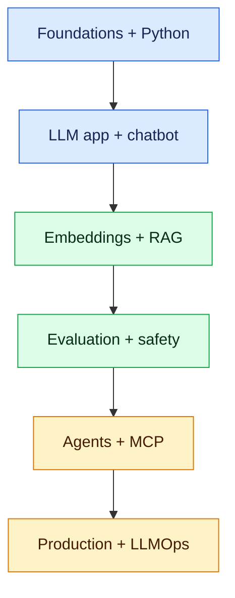

# AI Development: Zero to Job-Ready (0–6 Years)

This curriculum is for a developer who has heard terms such as LLM, chatbot, RAG and agentic AI but is unsure where to begin. It starts with the minimum foundations, then builds production-grade AI applications through hands-on work.

## Learning path

1. [AI, ML and generative-AI foundations](01-ai-ml-generative-ai-foundations.md)
2. [Python, data and API prerequisites](02-python-data-api-prerequisites.md)
3. [LLM APIs, tokens and prompt engineering](03-llm-apis-prompt-engineering.md)
4. [Build a reliable chatbot](04-chatbot-development.md)
5. [Embeddings, vector databases and semantic search](05-embeddings-vector-search.md)
6. [RAG from prototype to production](06-rag-development.md)
7. [Evaluation, guardrails and responsible AI](07-evaluation-guardrails.md)
8. [Tool calling, workflows and agentic AI](08-agentic-ai.md)
9. [MCP and enterprise integration](09-mcp-enterprise-integration.md)
10. [Deployment, observability and LLMOps](10-production-llmops.md)
11. [Portfolio project and interview preparation](11-project-interview.md)

## Capability by experience

| Experience | Credible outcome |
|---|---|
| 0–1 year | Call model APIs safely, engineer prompts, build a streamed chatbot and explain hallucination |
| 1–3 years | Build evaluated RAG, use vector search, add tools, tests, security and deployment |
| 3–6 years | Design multi-model platforms, agent workflows, governance, LLMOps, cost controls and incident response |

## Hands-on project

Build an **Enterprise AI Interview Assistant** throughout: chat, grounded policy Q&A, question generation, tool-assisted scheduling, human approval, evaluation, observability and Kubernetes deployment.

Do not start by memorising frameworks. First understand the pipeline, then implement a thin version with plain Python and model SDKs, and only then adopt an orchestration framework where it removes proven complexity.
