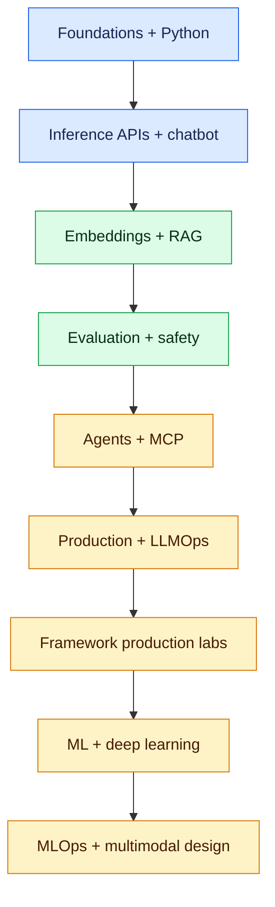

# AI Development: Zero to Job-Ready (0–6 Years)

This curriculum is for a developer who has heard terms such as LLM, chatbot, RAG and agentic AI but is unsure where to begin. It starts with the minimum foundations, then builds production-grade AI applications through hands-on work.

## Fundamentals companion

Experienced Java developers and architects should first use the [Java-to-AI Migration Guide](../fundamentals/java-developer-architect-to-ai-migration-guide.md) to select a target role, map transferable skills and plan portfolio evidence. Before Chapter 3, study [Inference APIs: Zero to Production](../fundamentals/inference-apis.md) to understand the application-to-model boundary, inference contracts, generation controls, streaming, structured output, embeddings, resilience, security, observability and cost. Before or alongside Chapter 18, complete [Fine-Tuning: Fundamentals to Production](../fundamentals/fine-tuning.md) for the full Transformers, TRL, PEFT, LoRA/QLoRA, DPO, experiment tracking, evaluation and deployment lab.

## Learning path

1. [AI, ML and generative-AI foundations](01-ai-ml-generative-ai-foundations.md)
2. [Python, data and API prerequisites](02-python-data-api-prerequisites.md)
3. [LLM APIs, tokens and prompt engineering](03-llm-apis-prompt-engineering.md)
4. [Build a reliable chatbot](04-chatbot-development.md)
5. [Embeddings, vector databases and semantic search](05-embeddings-vector-search.md)
6. [RAG from prototype to production](06-rag-development.md)
7. [Evaluation, guardrails and responsible AI](07-evaluation-guardrails.md)
8. [Tool calling, workflows and agentic AI](08-agentic-ai.md)
9. [MCP and enterprise integration](09-mcp-enterprise-integration.md)
10. [Deployment, observability and LLMOps](10-production-llmops.md)
11. [Portfolio project and interview preparation](11-project-interview.md)

## Framework hands-on track

12. [AI frameworks and tools: what to learn and when](12-ai-frameworks-toolkit.md)
13. [Hugging Face Transformers: inference, embeddings and PEFT/LoRA](13-hugging-face-transformers-hands-on.md)
14. [LangChain and LangGraph production lab](14-langchain-langgraph-production-lab.md)

The framework track explicitly covers **LangChain, LangGraph, Hugging Face Transformers, LlamaIndex, FAISS, Chroma, pgvector, Pinecone, Weaviate, RAGAS, DeepEval, LangSmith and OpenTelemetry**.

## Broader AI/ML engineering track

15. [Machine learning and mathematics foundations](15-ml-mathematics-foundations.md)
16. [NumPy, pandas and scikit-learn hands-on](16-numpy-pandas-scikit-learn-hands-on.md)
17. [Deep learning and Transformer internals with PyTorch](17-deep-learning-transformer-internals.md)
18. [Fine-tuning, PEFT, LoRA and model evaluation](18-fine-tuning-peft-evaluation.md) — then complete the [dedicated fundamentals-to-production lab](../fundamentals/fine-tuning.md)
19. [MLOps, model serving and cloud AI](19-mlops-model-serving-cloud-ai.md)
20. [Multimodal AI, security and advanced AI system design](20-multimodal-security-ai-system-design.md)

This track extends GenAI application development into classical ML, deep learning, training, secure model operations, cloud platforms and senior production architecture.

## Capability by experience

| Experience | Credible outcome |
|---|---|
| 0–1 year | Call model APIs safely, engineer prompts, build a streamed chatbot and explain hallucination |
| 1–3 years | Build evaluated RAG, use vector search, add tools, tests, security and deployment |
| 3–6 years | Design multi-model platforms, agent workflows, governance, LLMOps, cost controls and incident response |

## Hands-on project

Build an **Enterprise AI Interview Assistant** throughout: chat, grounded policy Q&A, question generation, tool-assisted scheduling, human approval, evaluation, observability and Kubernetes deployment. Extend it with a classical ML baseline, LoRA experiment, model registry, canary serving, multimodal CV/audio processing and a documented threat model.

Do not start by memorising frameworks. First understand the pipeline, then implement a thin version with plain Python and model SDKs, and only then adopt an orchestration framework where it removes proven complexity.
