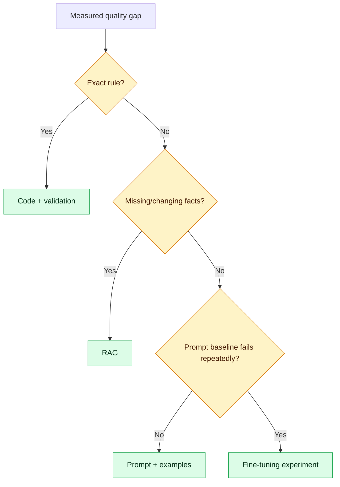
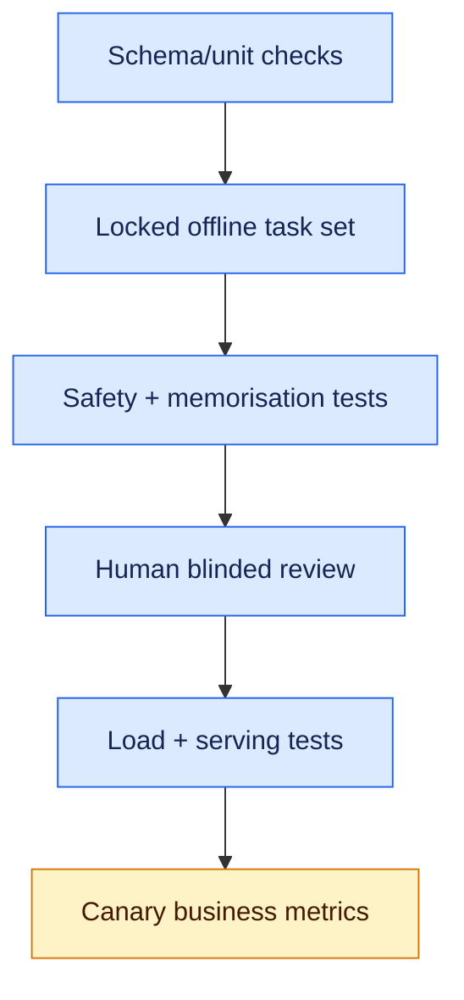
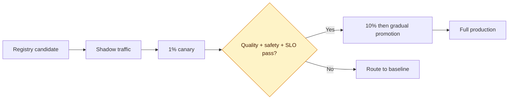

# Fine-Tuning: Fundamentals to Production

Fine-tuning adapts a pretrained model by continuing training on a smaller, purpose-built dataset. It can improve task behaviour, response structure, terminology, style, classification boundaries or tool-selection patterns. It is not the default answer to every AI quality problem: prompting, retrieval-augmented generation (RAG), deterministic code and better data often solve the problem more cheaply and safely.

This guide builds from the decision to fine-tune through dataset engineering, supervised fine-tuning (SFT), LoRA and QLoRA, preference optimisation, evaluation, experiment tracking, distributed training, model packaging and production rollout.

## Learning outcomes

After this guide, you should be able to:

- distinguish pretraining, continued pretraining, SFT and preference tuning;
- decide between prompting, RAG, fine-tuning and deterministic code;
- select a base model using capability, licence, context, hardware and deployment constraints;
- build versioned instruction and conversational datasets without leakage;
- apply the correct tokenizer chat template and label masking;
- fine-tune with Hugging Face Transformers and TRL;
- configure PEFT LoRA and memory-efficient QLoRA;
- explain when full fine-tuning or distributed training is justified;
- track experiments with MLflow or Weights & Biases;
- evaluate quality, safety, memorisation, latency and cost against a baseline;
- package adapters, merge weights where appropriate and deploy through vLLM or TGI;
- canary, monitor and roll back a fine-tuned model safely.

## 1. The model adaptation landscape

| Method | What changes | Typical purpose | Relative cost |
|---|---|---|---:|
| Prompt engineering | Runtime instructions only | Clarify task, format and examples | Low |
| RAG | Runtime context from external sources | Current/private facts and citations | Low–medium |
| Continued pretraining | Weights trained on domain text | Teach domain language/distribution | High |
| Supervised fine-tuning | Weights or adapters trained on input/output pairs | Teach task behaviour and response style | Medium |
| Preference optimisation | Model learns preferred over rejected outputs | Improve alignment with a rubric | Medium–high |
| Full fine-tuning | Most or all weights | Maximum adaptation when data/compute justify it | Very high |

Pretraining predicts tokens across a very large corpus. Continued pretraining exposes an existing model to more unlabelled domain text. SFT trains it to produce target answers for instructions. Preference methods such as DPO use comparisons between preferred and rejected responses. Reinforcement learning from human feedback adds reward modelling and online optimisation; it is operationally more complex and is rarely the first fine-tuning method an application team should adopt.

## 2. Fine-tuning versus prompt, RAG or code

| Requirement | Best starting point | Why |
|---|---|---|
| Current policy facts with citations | RAG | Knowledge changes without retraining |
| Stable JSON or domain response style | Prompt, then SFT if gap persists | Fine-tuning can reinforce behaviour |
| Exact tax or eligibility rule | Code | Probabilistic output is the wrong boundary |
| New proprietary vocabulary | Continued pretraining or SFT | Depends on whether knowledge or behaviour is missing |
| Tenant-specific private documents | Permission-aware RAG | One model should not memorise tenant data |
| Better refusal and escalation behaviour | SFT/preference tuning plus guardrails | Training and runtime controls complement each other |
| One rare edge case | Prompt/example or code | Too little evidence for model training |

Use this decision sequence:



Fine-tuning and RAG can be combined. The adapter can teach the model how to answer from evidence, while RAG supplies the evidence. Fine-tuning should not be used to bake frequently changing business facts into weights.

## 3. Define success before training

Write a fine-tuning contract:

```yaml
task: generate_interview_question
input: role, level, topic, constraints
output_schema: InterviewQuestionV1
baseline_model: pinned-provider-or-open-model-revision
primary_metric: schema_valid_and_rubric_pass_rate
quality_threshold: 0.90
safety_threshold: 0_critical_failures
latency_p95_ms: 1800
cost_per_1000_requests_usd: 4.00
rollback_metric: production_rubric_pass_rate_below_0.86
```

Keep the baseline outputs. A fine-tuned model is successful only when it improves the locked evaluation set enough to justify training, storage, serving, monitoring and rollback complexity.

## 4. Choose a base model

Evaluate:

- task capability and language coverage;
- model and dataset licences, acceptable-use terms and redistribution rights;
- parameter count and required GPU memory;
- context window and tokenizer behaviour;
- chat template and tool/structured-output support;
- quantisation and serving-runtime compatibility;
- supported PEFT target modules;
- safety behaviour and known limitations;
- whether production must run in cloud, VPC, on premises or edge;
- model revision stability and supply-chain provenance.

Pin an immutable model revision rather than a floating name:

```python
BASE_MODEL = "org/model-name"
BASE_REVISION = "immutable-commit-sha"
```

Never assume a smaller fine-tuned model automatically replaces a stronger model. Prove the result on the same evaluation contract.

## 5. Tool map

| Tool | Primary role |
|---|---|
| PyTorch | Tensor operations, autograd and training runtime |
| Transformers | Models, tokenizers, Trainer and generation |
| Datasets | Loading, mapping, splitting and dataset processing |
| TRL | SFT, DPO and other post-training trainers |
| PEFT | LoRA, adapters and parameter-efficient methods |
| bitsandbytes | 8-bit/4-bit loading and optimizers on supported GPUs |
| Accelerate | Device placement and multi-GPU launch |
| DeepSpeed | ZeRO memory optimisation and distributed training |
| FSDP | Sharding parameters/gradients with PyTorch |
| MLflow | Runs, artifacts, metrics and model registry |
| Weights & Biases | Experiment dashboards and artifact lineage |
| Optuna/Ray Tune | Hyperparameter search |
| lm-evaluation-harness | Standard language-model benchmarks |
| vLLM/TGI | High-throughput model inference |
| safetensors | Safer, fast tensor serialization |

Tools are replaceable. The durable skills are dataset quality, objective selection, reproducibility, evaluation and rollout safety.

## 6. Environment setup

Use a separate, reproducible environment and pin versions in the real project:

```bash
python -m venv .venv
source .venv/bin/activate
pip install torch transformers datasets trl peft accelerate bitsandbytes \
  evaluate scikit-learn mlflow safetensors
```

`bitsandbytes` support depends on the platform and accelerator. Verify the current compatibility matrix. For CPU or non-CUDA environments, use an appropriate alternative or run the lab on a supported managed GPU.

Capture runtime evidence:

```python
import platform
import torch
import transformers

print({
    "python": platform.python_version(),
    "torch": torch.__version__,
    "transformers": transformers.__version__,
    "cuda_available": torch.cuda.is_available(),
    "gpu": torch.cuda.get_device_name(0) if torch.cuda.is_available() else None,
})
```

## 7. Dataset contracts

An instruction dataset can be represented as JSON Lines:

```json
{"instruction":"Generate one Java concurrency interview question.","input":"Level: senior; focus: virtual threads","output":{"type":"LONG_TEXT","question":"When can virtual threads reduce throughput?","rubric":["pinning","bounded downstream","measurement"]}}
{"instruction":"Generate one Kafka reliability question.","input":"Level: mid; focus: offsets","output":{"type":"MCQ_SINGLE","question":"When is an offset committed?","options":["A","B","C","D"],"answer":"B"}}
```

For a chat model, preserve roles:

```json
{"messages":[{"role":"system","content":"You generate valid InterviewQuestionV1 JSON."},{"role":"user","content":"Create a senior Java question about HashMap keys."},{"role":"assistant","content":"{\"type\":\"LONG_TEXT\",\"question\":\"...\",\"rubric\":[\"equals/hashCode\",\"mutability\"]}"}]}
```

Use one canonical schema. Validate every row before it enters training.

```python
from pydantic import BaseModel, Field

class TrainingMessage(BaseModel):
    role: str
    content: str = Field(min_length=1, max_length=8_000)

class TrainingExample(BaseModel):
    messages: list[TrainingMessage] = Field(min_length=2)

def validate_row(row: dict) -> dict:
    example = TrainingExample.model_validate(row)
    assert example.messages[-1].role == "assistant"
    return example.model_dump()
```

## 8. Dataset engineering checklist

- Define a narrow target behaviour and annotation rubric.
- Record source, owner, consent, licence and transformation lineage.
- Remove secrets, credentials, PII and unnecessary personal data.
- Remove copyrighted or restricted data you cannot train on.
- Normalize encoding and schema; do not blindly normalize meaningful syntax.
- Deduplicate exact and near-duplicate examples before splitting.
- Detect template artifacts, empty targets and contradictory labels.
- Balance common and safety-critical cases intentionally.
- Include refusals, ambiguity handling and escalation examples.
- Keep train, validation and test sets separated by real-world entity/time boundary.
- Freeze the test set and restrict who can inspect or modify it.
- Version the dataset and publish a dataset card.

Random row splitting can leak nearly identical documents or users across partitions. Prefer group- or time-based splits when production generalisation depends on unseen customers, policies or future periods.

## 9. Load and split with Hugging Face Datasets

```python
from datasets import load_dataset

dataset = load_dataset(
    "json",
    data_files={
        "train": "data/train.jsonl",
        "validation": "data/validation.jsonl",
        "test": "data/test.jsonl",
    },
)

print(dataset)
print(dataset["train"].features)
```

If starting from one file, split only after deduplication and group-aware design. Store dataset checksums with every run.

## 10. Chat templates and tokenization

Chat models were trained with model-specific control tokens. Use the tokenizer's chat template instead of inventing separators:

```python
from transformers import AutoTokenizer

tokenizer = AutoTokenizer.from_pretrained(
    BASE_MODEL,
    revision=BASE_REVISION,
    use_fast=True,
)

def render(example: dict) -> dict:
    return {
        "text": tokenizer.apply_chat_template(
            example["messages"],
            tokenize=False,
            add_generation_prompt=False,
        )
    }

rendered = dataset.map(render)
```

Inspect rendered samples manually. Confirm beginning/end tokens, assistant boundaries, padding token, truncation side and maximum sequence length. A wrong chat template can make a technically successful run produce poor inference behaviour.

## 11. Labels and assistant-only loss

Causal language modelling predicts the next token. In instruction tuning, you often want loss on assistant tokens rather than teaching the model to reproduce user prompts. Tokens excluded from loss typically receive label `-100`.

```python
def mask_prompt_tokens(input_ids: list[int], assistant_start: int) -> list[int]:
    labels = input_ids.copy()
    labels[:assistant_start] = [-100] * assistant_start
    return labels
```

Do not estimate `assistant_start` with fragile string offsets. Use control-token IDs or a data collator designed for the model/template. Verify one decoded batch and its unmasked label positions before launching training.

## 12. Supervised fine-tuning with TRL

The APIs can evolve, so align configuration with the pinned TRL version. A representative workflow is:

```python
from transformers import AutoModelForCausalLM
from trl import SFTConfig, SFTTrainer

model = AutoModelForCausalLM.from_pretrained(
    BASE_MODEL,
    revision=BASE_REVISION,
    torch_dtype="auto",
)

config = SFTConfig(
    output_dir="artifacts/interview-question-sft",
    dataset_text_field="text",
    max_seq_length=2048,
    num_train_epochs=2,
    per_device_train_batch_size=2,
    per_device_eval_batch_size=2,
    gradient_accumulation_steps=8,
    learning_rate=2e-5,
    warmup_ratio=0.03,
    lr_scheduler_type="cosine",
    logging_steps=10,
    eval_strategy="steps",
    eval_steps=100,
    save_steps=100,
    save_total_limit=2,
    load_best_model_at_end=True,
    report_to="mlflow",
    seed=42,
)

trainer = SFTTrainer(
    model=model,
    args=config,
    train_dataset=rendered["train"],
    eval_dataset=rendered["validation"],
    processing_class=tokenizer,
)
trainer.train()
trainer.save_model()
```

Treat this as a template, not a universal recipe. Learning rate, sequence length, batch size and epochs depend on model, method, dataset and hardware.

## 13. Understand the training controls

| Control | Effect | Failure signal |
|---|---|---|
| Learning rate | Size of parameter updates | Divergence, forgetting or no learning |
| Effective batch size | Batch × accumulation × devices | Instability or poor generalisation |
| Epochs | Passes over dataset | Overfitting after validation stops improving |
| Max sequence length | Tokens retained per example | Truncated answer/rubric or memory explosion |
| Warmup | Gradual initial learning rate | Early instability without it |
| Weight decay | Regularisation | Under/over-regularisation |
| Gradient clipping | Bounds large gradients | Exploding gradients |
| Precision | FP32/BF16/FP16/quantised | Memory, speed or numerical instability |

Training loss alone does not measure application quality. A lower loss can coexist with worse factuality, safety or schema compliance.

## 14. LoRA fundamentals

LoRA freezes the base weight matrix and learns a low-rank update. Instead of training a large matrix directly, it learns smaller matrices whose product approximates the update. This reduces trainable parameters and optimizer memory.

Key parameters:

- `r`: adapter rank; higher can add capacity and memory cost;
- `lora_alpha`: scaling applied to the update;
- `lora_dropout`: regularisation;
- `target_modules`: model layers to adapt;
- `modules_to_save`: non-LoRA modules that must remain trainable/saved;
- bias strategy: normally none unless evidence supports another choice.

```python
from peft import LoraConfig, TaskType, get_peft_model

lora_config = LoraConfig(
    task_type=TaskType.CAUSAL_LM,
    r=16,
    lora_alpha=32,
    lora_dropout=0.05,
    target_modules=["q_proj", "k_proj", "v_proj", "o_proj"],
    bias="none",
)

model = get_peft_model(model, lora_config)
model.print_trainable_parameters()
```

Target-module names differ across architectures. Inspect `model.named_modules()` and use the model's documentation. Silent mismatch or adapting the wrong layers can waste the entire run.

## 15. QLoRA fundamentals

QLoRA loads a frozen base model in 4-bit precision and trains LoRA adapters, reducing GPU memory demand. Computation still uses a higher compute dtype.

```python
import torch
from transformers import AutoModelForCausalLM, BitsAndBytesConfig
from peft import prepare_model_for_kbit_training

quant_config = BitsAndBytesConfig(
    load_in_4bit=True,
    bnb_4bit_quant_type="nf4",
    bnb_4bit_use_double_quant=True,
    bnb_4bit_compute_dtype=torch.bfloat16,
)

model = AutoModelForCausalLM.from_pretrained(
    BASE_MODEL,
    revision=BASE_REVISION,
    quantization_config=quant_config,
    device_map="auto",
)
model = prepare_model_for_kbit_training(model)
model = get_peft_model(model, lora_config)
```

Use BF16 only on supported hardware. Quantisation can change quality and kernel compatibility. Measure it; do not assume it is free.

## 16. Full fine-tuning versus PEFT

| Dimension | Full fine-tuning | LoRA/QLoRA |
|---|---|---|
| Trainable weights | Most/all | Small adapters |
| GPU memory | High | Lower |
| Checkpoint size | Large | Small |
| Multi-tenant variants | Expensive | Multiple adapters practical |
| Maximum adaptation capacity | Highest | Often sufficient |
| Serving | One complete model | Base plus adapter or merged model |
| Operational complexity | Heavy training | Adapter compatibility/versioning |

Start with LoRA for a bounded application task. Consider full fine-tuning only when quality evidence, data volume, expertise, hardware and serving economics justify it.

## 17. Preference optimisation with DPO

SFT learns a target answer. Direct Preference Optimization (DPO) learns from a prompt with a chosen and rejected response.

```json
{
  "prompt": "Generate a senior Kafka reliability question.",
  "chosen": "Create a scenario requiring offset, idempotency and retry reasoning...",
  "rejected": "What is Kafka?"
}
```

A representative TRL workflow:

```python
from trl import DPOConfig, DPOTrainer

args = DPOConfig(
    output_dir="artifacts/interview-question-dpo",
    learning_rate=5e-7,
    per_device_train_batch_size=1,
    gradient_accumulation_steps=16,
    beta=0.1,
    eval_strategy="steps",
)

trainer = DPOTrainer(
    model=model,
    ref_model=None,
    args=args,
    train_dataset=preference_data["train"],
    eval_dataset=preference_data["validation"],
    processing_class=tokenizer,
)
trainer.train()
```

Preference data must express a consistent rubric. If annotators disagree or choose based on superficial verbosity, the model learns those inconsistencies. Begin with SFT; add preference tuning only for a measured preference/alignment gap.

## 18. Hyperparameter experiments

Change one coherent dimension at a time and cap the search budget. Useful early comparisons:

- baseline model vs prompt baseline;
- rank 8 vs 16 vs 32;
- attention-only vs attention-plus-MLP target modules;
- one vs two vs three epochs;
- two learning rates on a logarithmic scale;
- max sequence length based on measured percentiles;
- assistant-only vs full-sequence loss;
- full precision LoRA vs QLoRA.

Optuna can automate bounded search:

```python
import optuna

def objective(trial):
    rank = trial.suggest_categorical("rank", [8, 16, 32])
    learning_rate = trial.suggest_float("lr", 1e-5, 2e-4, log=True)
    metrics = run_experiment(rank=rank, learning_rate=learning_rate)
    return metrics["validation_rubric_pass_rate"]

study = optuna.create_study(direction="maximize")
study.optimize(objective, n_trials=8)
```

Do not optimise repeatedly against the locked test set. Hyperparameter selection belongs on train/validation data.

## 19. Experiment tracking with MLflow

```python
import mlflow

mlflow.set_experiment("interview-question-fine-tuning")

with mlflow.start_run():
    mlflow.log_params({
        "base_model": BASE_MODEL,
        "base_revision": BASE_REVISION,
        "dataset_version": "interview-questions-v3",
        "method": "qlora",
        "lora_rank": 16,
        "learning_rate": 2e-4,
        "seed": 42,
    })
    train_result = trainer.train()
    mlflow.log_metrics({
        "train_loss": train_result.training_loss,
        "eval_schema_valid_rate": 0.94,
        "eval_rubric_pass_rate": 0.89,
    })
    mlflow.log_artifact("model-card.md")
```

Every run should capture:

- code commit and uncommitted-diff state;
- base model/tokenizer name and immutable revision;
- dataset name, version, checksum and split logic;
- prompt/chat-template version;
- PEFT and quantisation configuration;
- package/container versions, seed and hardware;
- training curves, application metrics and safety results;
- checkpoint, adapter checksum and model card.

W&B provides similar lineage and rich dashboards. Choose one system of record rather than scattering evidence across notebooks.

## 20. Distributed and memory-efficient training

Memory is consumed by model weights, gradients, optimizer states, activations and temporary buffers. Techniques address different parts:

| Technique | Main benefit |
|---|---|
| Mixed precision | Smaller/faster arithmetic where supported |
| Gradient accumulation | Larger effective batch with small device batch |
| Gradient checkpointing | Recompute activations to save memory |
| LoRA/QLoRA | Fewer trainable parameters/lower base-weight memory |
| FSDP | Shard model states across workers |
| DeepSpeed ZeRO | Shard optimizer, gradients and parameters by stage |
| Sequence packing | Reduce padding waste for short samples |

Launch Accelerate after generating and reviewing its configuration:

```bash
accelerate config
accelerate launch train.py --config configs/qlora.yaml
```

A small dataset does not automatically require multi-GPU training. Distributed execution adds network, checkpoint and reproducibility failure modes. First reduce sequence length, use PEFT, accumulate gradients and measure the bottleneck.

## 21. Evaluation pyramid



Evaluate more than perplexity:

- exact match, F1, accuracy or ranking metrics where appropriate;
- schema-valid rate and business-rule-valid rate;
- rubric score for relevance, difficulty and answerability;
- factuality and citation support when RAG is also used;
- refusal, jailbreak, toxicity, bias and privacy cases;
- memorisation/canary-string leakage;
- regression across languages, topics and user groups;
- p50/p95 latency, throughput, GPU memory and cost;
- output length and failure/retry rate.

Compare candidates blindly against the unchanged baseline. Report confidence intervals when the sample permits; do not promote based on a handful of attractive examples.

## 22. A task-specific evaluator

```python
import json
from jsonschema import validate, ValidationError

def score_question(raw: str, schema: dict) -> dict[str, float]:
    try:
        value = json.loads(raw)
        validate(value, schema)
        schema_valid = 1.0
    except (json.JSONDecodeError, ValidationError):
        return {"schema_valid": 0.0, "has_question": 0.0, "has_rubric": 0.0}

    return {
        "schema_valid": schema_valid,
        "has_question": float(bool(value.get("question"))),
        "has_rubric": float(len(value.get("rubric", [])) >= 2),
    }
```

An LLM-as-judge can supplement deterministic checks, but calibrate it against human labels, randomise candidate order and keep the judge model/version fixed. Never let one model judge replace safety, schema and business validation.

## 23. Data contamination and memorisation

Common leakage paths include:

- the same or near-duplicate example in train and test;
- synthetic training answers generated from the test set;
- annotators copying reference answers into unrelated splits;
- tuning prompts/hyperparameters after repeatedly viewing test failures;
- public benchmark examples already present in the base model;
- IDs, names or boilerplate that let the model infer the split.

Use hashes and similarity checks before splitting, group by source/entity, hold out a future time period where relevant, and maintain a private evaluation set. Add synthetic canary strings to test whether sensitive training text is reproduced under probing.

## 24. Safety, privacy and governance

- Train only on authorised data with documented purpose and retention.
- Minimise personal data; redact before dataset creation where possible.
- Encrypt datasets/checkpoints and restrict artifact access.
- Treat checkpoints as sensitive because weights may memorise data.
- Scan dependencies and verify base model provenance/checksums.
- Maintain dataset cards, model cards and approval records.
- Red-team prompt injection, harmful content and data extraction.
- Apply runtime authorization and output validation even after safety tuning.
- Define deletion/retraining obligations before using regulated data.
- Review bias across meaningful cohorts, not only overall averages.

Fine-tuning does not make a model deterministic or trusted. The application still owns access control, tool permissions, policy enforcement and auditability.

## 25. Save and load a LoRA adapter

```python
adapter_dir = "artifacts/interview-question-lora"
trainer.model.save_pretrained(adapter_dir, safe_serialization=True)
tokenizer.save_pretrained(adapter_dir)
```

Load it with the exact compatible base revision:

```python
from peft import PeftModel
from transformers import AutoModelForCausalLM, AutoTokenizer

base = AutoModelForCausalLM.from_pretrained(
    BASE_MODEL,
    revision=BASE_REVISION,
    torch_dtype="auto",
)
model = PeftModel.from_pretrained(base, adapter_dir)
tokenizer = AutoTokenizer.from_pretrained(adapter_dir)
```

Store adapter config, tokenizer files, template version and base revision together. An adapter without its compatible base is not a reproducible model.

## 26. Merge or keep adapters separate?

```python
merged_model = model.merge_and_unload()
merged_model.save_pretrained(
    "artifacts/interview-question-merged",
    safe_serialization=True,
)
```

| Keep adapter separate | Merge weights |
|---|---|
| Many task/tenant adapters share one base | Runtime expects a standalone model |
| Small artifacts and easy adapter switching | Simpler single-model deployment |
| Easy adapter-specific rollback | Potentially faster/less runtime complexity |
| Requires runtime adapter support | Larger artifact and duplicate base storage |

Test merged and unmerged outputs; numerical/quantisation choices can affect behaviour. Preserve the original adapter and lineage even when serving a merged artifact.

## 27. Model card

A production model card should state:

```markdown
# Interview Question Adapter v1

- Base model and immutable revision:
- Adaptation method and PEFT config:
- Intended users and approved tasks:
- Prohibited/out-of-scope uses:
- Training-data sources, date range and licence:
- Dataset version, split policy and known gaps:
- Evaluation sets, metrics and baseline comparison:
- Safety, privacy and bias findings:
- Hardware, precision and serving runtime:
- Known limitations and failure modes:
- Owner, approval, rollback and retirement process:
```

The model card is an operational contract, not marketing copy.

## 28. Serve the model

For an offline smoke test:

```python
import torch

messages = [
    {"role": "system", "content": "Return InterviewQuestionV1 JSON."},
    {"role": "user", "content": "Create a senior question about Kafka offsets."},
]
prompt = tokenizer.apply_chat_template(
    messages,
    tokenize=False,
    add_generation_prompt=True,
)
inputs = tokenizer(prompt, return_tensors="pt").to(model.device)

with torch.inference_mode():
    output = model.generate(
        **inputs,
        max_new_tokens=300,
        do_sample=False,
    )

generated = output[0, inputs["input_ids"].shape[1]:]
print(tokenizer.decode(generated, skip_special_tokens=True))
```

For production, use a compatible server such as vLLM or Hugging Face TGI and validate support for the model architecture, quantisation and LoRA adapters. Keep an application gateway in front for authentication, authorization, budgets, schema validation, tracing, rate limits and fallback policy.

## 29. Deployment contract

Version all coupled assets:

```json
{
  "deployment": "interview-question-v1",
  "base_model_revision": "immutable-sha",
  "adapter_sha256": "...",
  "tokenizer_revision": "...",
  "chat_template_version": "v2",
  "prompt_policy_version": "v5",
  "evaluation_report": "eval-2026-08-03",
  "runtime_image": "registry/model-server@sha256:..."
}
```

Do not deploy an adapter by a floating `latest` tag. Promote immutable artifacts through development, UAT/canary and production.

## 30. Canary and rollback



Define rollback before release:

- critical safety event: immediate stop;
- schema-valid rate below threshold for a sustained window;
- p95 latency or error rate exceeds SLO;
- business rubric or user escalation rate regresses;
- GPU saturation threatens other workloads;
- unexplained output-distribution drift.

Rollback means traffic routing to a known baseline, not retraining during an incident.

## 31. Monitoring after release

Track:

- request/error/timeout/rate-limit counts;
- time to first token and total latency;
- input/output tokens, batch size and GPU utilisation;
- schema/business validation failures;
- sampled human rubric and user feedback;
- refusal, safety and escalation rates;
- drift in topics, languages, length and input distribution;
- adapter/base/runtime version per trace;
- cost per successful task, not only per token.

Avoid logging raw prompts and outputs by default. Use redaction, access controls, retention limits and sampled secure review stores.

## 32. End-to-end hands-on lab

### Goal

Fine-tune a small instruction model to produce structured interview questions, then prove whether it beats a prompt-only baseline.

### Milestone 1 — contract and baseline

1. Define `InterviewQuestionV1` JSON Schema.
2. Build 100–300 locked evaluation prompts across Java, Python, React, databases, Kafka and AI.
3. Add difficulty, correctness, clarity, uniqueness and safety rubrics.
4. Run the unmodified base model with a versioned prompt.
5. Record schema validity, rubric pass rate, latency and GPU/cost estimates.

### Milestone 2 — data

1. Gather authorised examples with provenance.
2. Review synthetic examples with domain experts rather than accepting them automatically.
3. Deduplicate using normalized hashes and embedding similarity.
4. Split by topic/source so near-identical examples do not cross boundaries.
5. validate every record against Pydantic and JSON Schema.
6. Publish dataset version `interview-questions-v1` and a dataset card.

### Milestone 3 — LoRA baseline

1. Pin base model and tokenizer revisions.
2. Apply the official chat template.
3. Inspect assistant-only label masking.
4. Train LoRA with one small, documented configuration.
5. Track run, hardware, seed, config, curves and artifacts in MLflow.
6. Stop if validation degrades or output collapses.

### Milestone 4 — QLoRA comparison

1. Load the same base in supported 4-bit mode.
2. Train the same adapter targets and data.
3. Compare GPU memory, runtime, quality and final artifact behaviour.
4. Do not compare runs that silently changed multiple variables.

### Milestone 5 — evaluation

1. Run baseline, LoRA and QLoRA on the untouched test set.
2. Apply deterministic schema/business checks.
3. Perform blinded human pairwise review on a stratified sample.
4. Run malicious, PII-extraction, refusal and memorisation probes.
5. Test vLLM/TGI serving latency and concurrency.
6. Write a promotion decision including rejected alternatives.

### Milestone 6 — deployment

1. Register immutable adapter and evaluation report.
2. Deploy behind the inference gateway.
3. Shadow against real traffic without returning candidate output.
4. Canary with hard safety and SLO gates.
5. Prove one-command or routing-rule rollback.
6. Monitor for at least one agreed observation window before full promotion.

## 33. Suggested project structure

```text
fine-tuning-lab/
├── configs/
│   ├── lora.yaml
│   └── qlora.yaml
├── data/
│   ├── dataset-card.md
│   └── manifests/
├── evaluation/
│   ├── schema.json
│   ├── rubric.py
│   └── safety_cases.jsonl
├── src/
│   ├── prepare_data.py
│   ├── train_sft.py
│   ├── train_dpo.py
│   ├── evaluate.py
│   └── smoke_test.py
├── deployment/
│   ├── model-card.md
│   └── serving-config.yaml
├── tests/
└── requirements.lock
```

## 34. Common production failures

| Failure | Likely cause | Corrective action |
|---|---|---|
| Loss falls but task quality does not | Objective/data mismatch | Revisit rubric and dataset, not only epochs |
| Model echoes prompt/control tokens | Wrong template or label masking | Inspect rendered tokens and labels |
| OOM during training | Sequence/batch/optimizer/activation memory | Shorten, accumulate, checkpoint, PEFT/QLoRA |
| Adapter will not load | Base revision/module mismatch | Pin and validate the exact base/tokenizer |
| JSON degrades in production | Different prompt/template/decoding | Version and reproduce the inference contract |
| Great test score, poor production | Leakage or distribution shift | Group/time splits and production-like evaluation |
| Catastrophic forgetting | Excessive LR/epochs or narrow data | Reduce updates; mix/general capability tests |
| Sensitive string reproduced | Unsafe data/memorisation | Remove data, investigate, retrain and govern artifacts |
| Canary latency regression | Runtime/quantisation/batching mismatch | Load test the production server configuration |
| DPO becomes verbose/sycophantic | Biased preference rubric | Rebuild balanced preference data and re-evaluate |

## 35. Anti-patterns

- Fine-tuning before establishing a measurable prompt/RAG baseline.
- Training on production logs without consent, filtering or retention review.
- Using synthetic data generated and judged by one model without human calibration.
- Selecting examples from the test set after seeing failures.
- Copying a LoRA config without verifying target-module names.
- Treating low training loss as the release criterion.
- Changing base model, data, template and hyperparameters in one experiment.
- Publishing an adapter without model/dataset cards and base revision.
- Merging weights and discarding the original adapter lineage.
- Assuming safety fine-tuning replaces runtime authorization and guardrails.
- Deploying directly to all traffic without shadow/canary and rollback.

## 36. Interview questions

1. What is the difference between pretraining, continued pretraining and SFT?
2. When would you choose RAG instead of fine-tuning?
3. What problem do LoRA and QLoRA solve?
4. What do LoRA rank, alpha and target modules mean?
5. Why can a wrong chat template ruin a training run?
6. What is assistant-only loss and why use label `-100`?
7. How do you prevent train/test contamination?
8. Why is training loss insufficient for model promotion?
9. What is DPO and when would you add it after SFT?
10. How do gradient accumulation and checkpointing differ?
11. What should be stored for a reproducible experiment?
12. When would full fine-tuning be justified over PEFT?
13. Should LoRA adapters be merged for serving?
14. How would you test memorisation and privacy leakage?
15. How would you canary and roll back a fine-tuned model?
16. How do fine-tuning and RAG work together?

## Two-minute interview answer

I fine-tune only after a versioned prompt or RAG baseline shows a repeatable behaviour gap on a locked evaluation set. I select a legally and operationally suitable base model, version and validate authorised data, deduplicate before group-aware splitting, use the model's chat template and verify assistant-token loss masking. I normally begin with LoRA or QLoRA through Transformers, TRL and PEFT because it reduces trainable parameters and artifact size. Every run records the base revision, tokenizer, dataset checksum, code, seed, hardware, hyperparameters and evaluation evidence in an experiment tracker. Promotion depends on task, safety, privacy, latency and cost gates—not training loss. I package the adapter with a model card and exact base revision, load-test the serving runtime, shadow and canary it behind an inference gateway, and keep instant routing rollback to the proven baseline.

## Readiness checklist

- [ ] I can choose among prompt engineering, RAG, code and fine-tuning.
- [ ] I can explain SFT, LoRA, QLoRA and DPO.
- [ ] I can create a licensed, versioned and leakage-resistant dataset.
- [ ] I can apply and inspect a model chat template.
- [ ] I can verify tokenization and assistant-only labels.
- [ ] I can run a Transformers/TRL/PEFT experiment.
- [ ] I can track the full model/data/code/hardware lineage.
- [ ] I can evaluate quality, safety, privacy, latency and cost against a baseline.
- [ ] I can package and reload an adapter reproducibly.
- [ ] I can explain adapter merging and production-serving trade-offs.
- [ ] I can define canary thresholds and perform rollback.
- [ ] I understand that fine-tuning does not replace application security.

## Next steps

First study [Inference APIs: Zero to Production](inference-apis.md). Then use the concise curriculum chapter [Fine-Tuning, PEFT, LoRA and Model Evaluation](../ai-development-zero-to-job-ready/18-fine-tuning-peft-evaluation.md) as a roadmap, and continue to [MLOps, Model Serving and Cloud AI](../ai-development-zero-to-job-ready/19-mlops-model-serving-cloud-ai.md) for registries, serving infrastructure, drift and retraining pipelines.
