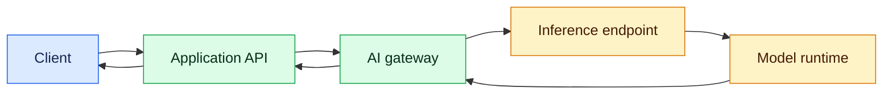
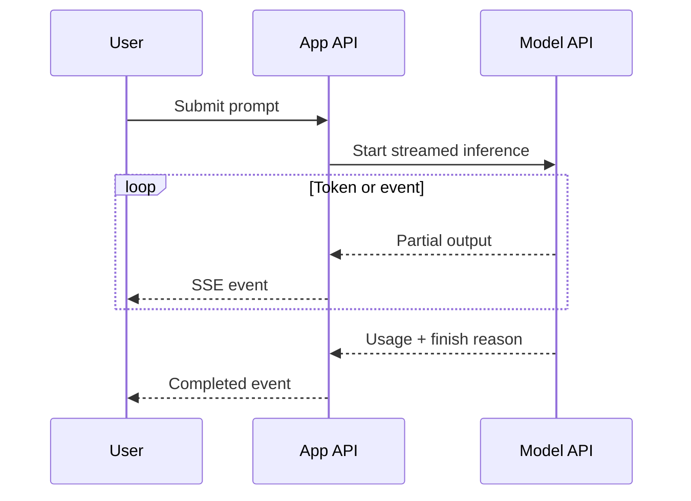

# Inference APIs: Zero to Production

An inference API lets an application send input to an already trained model and receive a prediction or generated result. Training changes model weights; inference uses those weights. For an AI application developer, this API boundary is where prompts, data, model behavior, latency, cost, security and reliability meet.

## Learning outcomes

After this chapter, you should be able to:

- distinguish training, fine-tuning, embedding and inference workloads;
- call text, chat, embedding, image and speech inference endpoints;
- design provider-neutral request and response contracts;
- choose hosted, managed-cloud or self-hosted inference;
- control sampling, output length, structured output and tool calls;
- implement streaming, timeouts, retries, rate limits and fallbacks safely;
- measure latency, throughput, token usage, quality and cost;
- protect secrets, personal data and tenant boundaries;
- explain batching, caching, quantisation and GPU-serving trade-offs.

## 1. Training versus inference

| Workload | Input | Output | Changes weights? | Typical frequency |
|---|---|---|---:|---|
| Training | Large labelled or unlabelled dataset | New model weights | Yes | Infrequent and expensive |
| Fine-tuning | Domain or instruction dataset | Adapted model weights | Yes | Occasional |
| Inference | Prompt, document, image or audio | Prediction or generated content | No | Per application request |
| Embedding inference | Text, image or audio | Numeric vector | No | During ingestion and search |

Inference is not limited to chat. Classification, reranking, embeddings, OCR, transcription, image generation and fraud scoring are all inference.

## 2. The request path



The browser should normally call your backend, not the model provider directly. The backend owns authentication, prompt construction, authorization, redaction, budgets, provider credentials, audit records and safe error handling. An AI gateway can add model routing, quotas, common observability and provider failover.

## 3. Common inference API families

| API | Input | Output | Example use |
|---|---|---|---|
| Text/chat generation | Instructions and conversation | Tokens or structured object | Chatbot, summarisation, extraction |
| Embeddings | Text or multimodal content | Vector | Semantic search and RAG |
| Reranking | Query plus candidates | Relevance scores | Improve retrieved results |
| Classification | Feature or text payload | Label and probability | Intent, risk or moderation |
| Image/vision | Image and optional text | Description, extraction or image | Document AI and generation |
| Speech | Audio or text | Transcript or audio | STT, TTS and voice assistants |
| Custom model | Model-specific tensor/features | Prediction | Forecasting and classical ML |

Do not assume all providers use the same schema. Hide provider-specific fields behind an internal adapter when portability or multi-model routing matters.

## 4. A provider-neutral contract

An application-level request can stay stable even when providers change:

```json
{
  "task": "answer_question",
  "messages": [
    {"role": "system", "content": "Answer from the supplied policy only."},
    {"role": "user", "content": "What is the cancellation period?"}
  ],
  "model_policy": "balanced",
  "max_output_tokens": 400,
  "temperature": 0.2,
  "response_schema": "PolicyAnswerV1",
  "stream": true,
  "metadata": {
    "tenant_id": "tenant-42",
    "request_id": "req-8f31"
  }
}
```

The response should separate content from operational metadata:

```json
{
  "id": "inf-123",
  "model": "provider/model-version",
  "output": {
    "answer": "The cancellation period is 30 days.",
    "citations": ["policy-17"]
  },
  "finish_reason": "stop",
  "usage": {
    "input_tokens": 612,
    "output_tokens": 19
  },
  "latency_ms": 842
}
```

Never trust model-generated JSON merely because it looks structured. Validate it against a schema and apply business authorization after parsing.

## 5. Generation controls

| Parameter | Meaning | Guidance |
|---|---|---|
| Model | Capability, latency and price tier | Select through policy, not scattered literals |
| Temperature | Randomness in token selection | Use low values for extraction and factual workflows |
| Top-p | Probability mass considered | Usually tune either temperature or top-p |
| Max output tokens | Hard output budget | Prevent runaway cost and latency |
| Stop sequence | Text that ends generation | Useful for constrained formats, but not a security boundary |
| Seed | Best-effort repeatability | Does not guarantee identical output across model versions |
| Presence/frequency penalties | Discourage repetition | Apply only after evaluation shows a problem |
| Response schema | Expected output shape | Prefer native structured-output support where available |

A parameter is not universally portable. Verify each provider and model. Quality decisions must come from an evaluation set, not intuition from a few prompts.

## 6. Basic Python client

Keep the provider SDK behind a small adapter. The exact SDK method may differ, but the production concerns do not:

```python
from dataclasses import dataclass
import os

@dataclass(frozen=True)
class InferenceResult:
    text: str
    input_tokens: int
    output_tokens: int
    model: str

class InferenceClient:
    def __init__(self, sdk_client, model: str) -> None:
        self._client = sdk_client
        self._model = model

    def generate(self, messages: list[dict[str, str]]) -> InferenceResult:
        response = self._client.responses.create(
            model=self._model,
            input=messages,
            temperature=0.2,
            max_output_tokens=400,
        )
        return InferenceResult(
            text=response.output_text,
            input_tokens=response.usage.input_tokens,
            output_tokens=response.usage.output_tokens,
            model=response.model,
        )

# Build the SDK client with a server-side environment secret.
# Never ship the provider API key to browser JavaScript.
api_key = os.environ["MODEL_PROVIDER_API_KEY"]
```

Keep provider exceptions inside the adapter and translate them into application errors such as `RateLimited`, `InferenceTimeout`, `InvalidModelOutput` and `ProviderUnavailable`.

## 7. FastAPI boundary with validation

```python
from pydantic import BaseModel, Field
from fastapi import FastAPI, HTTPException

app = FastAPI()

class AskRequest(BaseModel):
    question: str = Field(min_length=1, max_length=2_000)

class AskResponse(BaseModel):
    answer: str
    request_id: str

@app.post("/v1/answers", response_model=AskResponse)
def answer(request: AskRequest) -> AskResponse:
    try:
        result = inference_client.generate([
            {"role": "system", "content": "Answer concisely."},
            {"role": "user", "content": request.question},
        ])
        return AskResponse(answer=result.text, request_id=current_request_id())
    except InferenceTimeout as exc:
        raise HTTPException(status_code=504, detail="Model request timed out") from exc
```

Production code should also authenticate the caller, authorize tenant data, limit request size, redact sensitive log fields and attach trace context.

## 8. Streaming

Without streaming, the user waits for the complete output. With Server-Sent Events or WebSockets, the service forwards partial events as they arrive.



Handle client cancellation: when a user closes the page, cancel upstream inference where supported. Buffering proxies can accidentally defeat streaming. Send typed events such as `delta`, `tool_call`, `usage`, `error` and `completed`, rather than exposing raw provider chunks.

## 9. Structured output and tool calling

Structured output asks the model to produce data that conforms to a schema. Tool calling asks it to propose a function name and arguments.

The model does not execute tools merely by returning a tool call. Your application must:

1. validate the tool name against an allowlist;
2. validate arguments against a strict schema;
3. authorize the action for the current user and tenant;
4. require human approval for high-impact actions;
5. execute with bounded time, network and data access;
6. return a sanitized result to the model;
7. record an audit trail.

Treat model output as untrusted input. Schema validation prevents malformed data; it does not prove that a requested action is safe or permitted.

## 10. Embedding inference

Embedding endpoints return vectors rather than prose.

```python
vectors = embedding_client.embed([
    "Virtual threads are lightweight Java threads.",
    "Kafka consumers track progress with offsets.",
])
```

Important rules:

- use the same embedding model and preprocessing for indexed documents and queries;
- version the embedding model with the index;
- batch ingestion calls within provider limits;
- normalize vectors when the chosen similarity metric requires it;
- never compare dimensions from incompatible models;
- re-embed or maintain parallel indexes during model migration;
- enforce document-level authorization after retrieval as well as during indexing.

## 11. Hosted versus self-hosted inference

| Option | Advantages | Costs and risks |
|---|---|---|
| Public hosted API | Fastest start, managed capacity, strong models | Data policy, vendor dependence, variable latency and usage cost |
| Managed cloud endpoint | IAM, private networking, governance integration | Platform complexity and cloud-specific behavior |
| Dedicated hosted endpoint | Stable capacity and isolation | Pays while idle; scaling still needs design |
| Self-hosted runtime | Maximum control, model choice and data locality | GPU operations, upgrades, scheduling and reliability become your responsibility |
| On-device/edge | Privacy and low network latency | Limited model size, hardware variance and update complexity |

For self-hosting, common serving technologies include vLLM, Hugging Face TGI, NVIDIA Triton and ONNX Runtime. Benchmark with representative prompts and concurrency before choosing.

## 12. Latency, throughput and capacity

Track at least:

- time to first token;
- total response latency;
- input and output tokens;
- tokens per second;
- requests per second;
- concurrent requests and queue time;
- error and rate-limit percentage;
- GPU utilization and memory for self-hosting;
- cost per successful task, not only cost per request.

Long prompts increase prefill time. Long outputs increase generation time. Continuous batching improves GPU utilization but may affect tail latency. Quantisation reduces memory and may increase throughput, but quality and hardware compatibility must be evaluated.

## 13. Reliability patterns

Use a strict end-to-end deadline. A typical call path can consume its budget across queueing, connection setup, first token and generation.

Retry only transient failures such as selected timeouts, connection failures, `429` and `5xx` responses. Use exponential backoff with jitter and a small retry limit. Do not retry validation errors. Retrying a non-idempotent tool workflow can repeat side effects.

Useful protections include:

- concurrency bulkheads per model or tenant;
- token-bucket rate limiting;
- bounded queues and backpressure;
- circuit breakers for sustained provider failure;
- model fallback only when evaluations show acceptable behavior;
- idempotency keys for application operations;
- semantic or exact caching only when authorization and freshness permit;
- graceful degradation to search, templates or asynchronous processing.

A fallback model is not automatically equivalent. It may have a different context window, schema support, safety behavior, tokenizer and price.

## 14. Error model

Map provider failures into a stable internal taxonomy:

| Internal error | Typical cause | Application behavior |
|---|---|---|
| InvalidRequest | Unsupported parameter or oversized input | Return a safe 4xx response |
| AuthenticationFailure | Missing/invalid server credential | Alert; never expose credential detail |
| RateLimited | Provider or tenant quota | Back off, queue or return retry guidance |
| InferenceTimeout | Deadline exceeded | Cancel upstream and degrade safely |
| ProviderUnavailable | Network or provider 5xx | Circuit-break and consider evaluated fallback |
| ContentRejected | Safety policy rejection | Return policy-safe explanation |
| InvalidModelOutput | Schema or semantic validation failure | Repair once or route to review |
| ContextLimitExceeded | Too many tokens | Reduce context with deterministic rules |

Log error classes and request IDs, not raw sensitive prompts.

## 15. Security and privacy

- Store provider keys in a secret manager or workload identity, never source control or browser storage.
- Use least-privilege IAM and separate credentials by environment.
- Encrypt traffic and stored prompts, outputs and embeddings.
- Classify data before sending it to any external provider.
- Redact PII and secrets where policy requires it.
- Do not place confidential information in URLs, metric labels or exception messages.
- Defend against direct and indirect prompt injection.
- Apply tenant and document authorization outside the model.
- Set retention and deletion policies for prompts, traces and provider logs.
- Audit administrative changes, model routing and high-impact tool actions.
- Review provider data-use, residency and training-retention settings.

## 16. Observability and evaluation

A distributed trace should connect the application request to retrieval, model and tool spans. Record:

- model and version;
- prompt/template version;
- trace and request IDs;
- token counts and latency;
- retry, fallback and cache outcomes;
- finish reason and schema-validation result;
- evaluation score or user feedback where appropriate.

Avoid placing full prompts in normal logs. Use restricted, sampled debugging storage when permitted.

Operational metrics answer “Is the service healthy?” Evaluation answers “Is the answer useful and correct?” You need both. A fast, error-free API can still return poor answers.

## 17. Cost controls

Estimate request cost from input tokens, cached input, output tokens and any tool or retrieval expense. Then enforce:

- per-request output limits;
- per-user and per-tenant budgets;
- routing policies for simple versus complex tasks;
- context trimming based on relevance;
- batch APIs for offline workloads;
- caching with tenant-aware keys and freshness rules;
- alerts on cost per successful business task.

Do not downgrade models purely on unit price. A cheaper model that needs more retries or produces lower task success may cost more overall.

## 18. Versioning and change management

Pin a model version when the provider permits it. Treat changes to models, system prompts, tool schemas, retrieval rules and safety policies as deployable changes.

Before promotion:

1. run offline evaluations on representative and adversarial cases;
2. compare quality, latency, safety and cost;
3. canary a small traffic percentage;
4. monitor by model and prompt version;
5. retain a fast rollback path.

Never assume a provider alias will remain behaviorally identical.

## 19. Hands-on lab

Build an `inference-gateway` service for the Enterprise AI Interview Assistant.

### Milestone A — basic generation

- accept a validated question request;
- call one hosted model through an adapter;
- return content, model, usage and request ID;
- keep credentials server-side.

### Milestone B — production controls

- add a total timeout and cancellation;
- implement bounded retry with jitter;
- stream typed SSE events;
- validate a structured `InterviewQuestion` response;
- enforce tenant and token budgets.

### Milestone C — multi-model policy

- configure `fast`, `balanced` and `quality` policies;
- route without exposing provider names to callers;
- add an evaluated fallback;
- measure quality, first-token latency and cost per accepted question.

### Milestone D — failure testing

Test provider timeout, `429`, malformed JSON, context overflow, client disconnect, fallback failure and accidental sensitive-data logging.

## 20. Interview questions

1. What is the difference between training and inference?
2. Why should a browser not call a paid model API directly?
3. What are temperature, top-p and maximum output tokens?
4. How does streaming change the architecture?
5. When is retrying inference safe, and when is it dangerous?
6. What is time to first token?
7. How would you handle provider rate limits?
8. Why is schema-valid model output still untrusted?
9. When would you self-host a model?
10. How do batching, quantisation and KV cache affect inference?
11. How would you migrate an embedding model?
12. How would you design model fallback without silently reducing quality?

## Two-minute interview answer

An inference API exposes a trained model to an application. My backend owns the API credential, authorization, prompt and schema versions, data controls, timeouts, rate limits and observability. I use streaming when time to first token matters, validate structured outputs, and treat tool calls as untrusted requests that still require normal authorization. I measure task quality alongside latency, errors, tokens and cost. For resilience I use bounded retries, bulkheads and circuit breaking; I add model fallback only after evaluation proves that the fallback meets the same business contract. Hosted APIs optimize speed of delivery, while self-hosting trades that convenience for control and GPU operational responsibility.

## Readiness checklist

- [ ] I can explain inference without confusing it with training.
- [ ] I can call generation and embedding endpoints through an adapter.
- [ ] I can validate structured output and secure tool execution.
- [ ] I understand streaming and cancellation.
- [ ] I can implement deadlines, bounded retries, rate limits and circuit breakers.
- [ ] I can compare hosted and self-hosted inference.
- [ ] I can measure quality, latency, throughput and cost.
- [ ] I can protect credentials, PII and tenant data.
- [ ] I can version, evaluate, canary and roll back a model change.

## Next steps

Continue with [LLM APIs, tokens and prompt engineering](../ai-development-zero-to-job-ready/03-llm-apis-prompt-engineering.md), then build the [reliable chatbot](../ai-development-zero-to-job-ready/04-chatbot-development.md). For self-hosted serving, study [MLOps, model serving and cloud AI](../ai-development-zero-to-job-ready/19-mlops-model-serving-cloud-ai.md).
