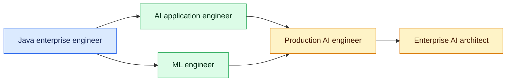
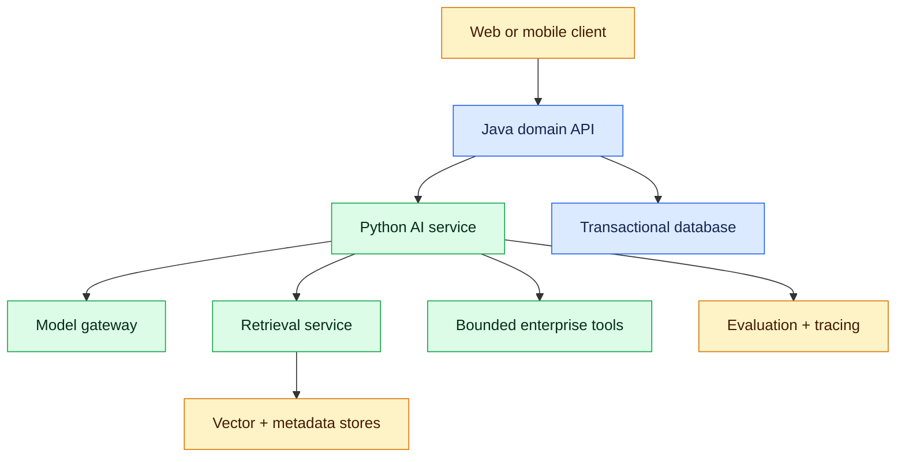
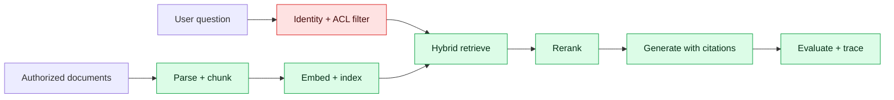

# Java Developer or Architect to AI Developer or AI Architect

> A practical migration guide for experienced Java engineers who want to enter AI without discarding years of enterprise-engineering experience.

## 1. The migration in one sentence

Do **not** restart as a beginner software engineer. Keep your strengths in architecture, APIs, distributed systems, security, delivery and operations; add the AI capabilities required to design, evaluate and operate probabilistic systems.

A senior Java engineer does not need to become a research scientist before building valuable AI products. The most direct transition is usually:



The AI-application route emphasizes model APIs, RAG, agents and integration. The ML-engineering route adds mathematics, data pipelines, training and deeper model work. Both can lead to AI architecture.

## 2. Choose the target role before choosing courses

"AI" contains several different jobs. A migration plan fails when it mixes them without a target.

| Target role | Primary responsibility | Learn first | Existing Java advantage |
|---|---|---|---|
| AI application developer | Build LLM-powered product features | Python, model APIs, prompting, RAG, evaluation | REST, Spring, testing, integration |
| GenAI engineer | Own RAG, agents and LLM reliability | Retrieval, tools, guardrails, tracing, LLMOps | Distributed workflows, resilience |
| ML engineer | Train, serve and monitor predictive models | Statistics, scikit-learn, PyTorch, MLOps | Production services, data pipelines |
| AI platform engineer | Provide shared gateways, serving and governance | Model routing, Kubernetes, GPU serving, policy | Platform architecture, SRE, security |
| AI architect | Convert business goals into safe AI systems | All above at decision depth | Architecture, trade-offs, governance |

For an experienced Java developer or architect, **AI application developer → production AI engineer → AI architect** is normally the fastest credible path. Add the deeper ML track when the target role requires model training.

## 3. What transfers and what changes

### 3.1 Skills that transfer directly

| Java/enterprise capability | AI equivalent |
|---|---|
| Spring REST client | Model or embedding API client |
| DTO and Bean Validation | Pydantic schema and structured model output |
| Hexagonal architecture | Model-provider adapters and tool ports |
| PostgreSQL/JPA | Metadata, conversation and evaluation stores |
| Kafka/event processing | Async inference, ingestion and evaluation jobs |
| Elasticsearch search | Hybrid retrieval plus vector search |
| Resilience4j | Timeouts, retries, rate limits, fallbacks and circuit breakers |
| OAuth2/Keycloak/RBAC | User identity, document ACLs and tool authorization |
| Micrometer/OpenTelemetry | Token, latency, retrieval and tool-call traces |
| JUnit/Testcontainers | pytest, golden datasets and integration evaluation |
| Docker/Kubernetes | Model gateway, vector store and inference deployment |
| ADRs/threat modelling | Model choice, RAG choice and AI risk decisions |

### 3.2 Mental models that must change

Deterministic software asks, "Does the function return the expected value?" AI systems also ask:

- Is the answer grounded in permitted evidence?
- How often does it fail across a representative dataset?
- Is a quality change statistically meaningful?
- Can untrusted text manipulate prompts or tool calls?
- What happens when a provider changes a model?
- What are the latency and cost distributions, not only averages?
- When must the system abstain or ask for human approval?

Treat model output as **untrusted, probabilistic data**. Validate its structure, measure its quality, constrain its authority and preserve evidence.

## 4. Java and Python should coexist

Python dominates experimentation, data tooling, model training and many AI frameworks. Java remains excellent for transactional enterprise services, domain logic and mature platform integration.

A realistic enterprise design uses both:



Use Java when it owns business transactions, established domain logic or high-throughput enterprise integration. Use Python for model-specific orchestration, data science, training and fast-moving AI libraries. Do not split services only by language; split them by ownership, change rate and operational boundary.

## 5. Minimum Python bridge for a Java engineer

You do not need months of Python syntax before building. Learn enough to write reliable services, then deepen knowledge through projects. Complete the companion [Python for AI Development: Minimum Practical Tutorial](python-for-ai-development.md) for runnable Java-to-Python examples, exercises, a 14-day plan and a typed AI-service capstone.

### Week-one essentials

- Types, collections, slicing and comprehensions
- Functions, modules, packages and virtual environments
- Classes, dataclasses, protocols and type hints
- Exceptions and context managers
- Iterators, generators and decorators
- `async`/`await`, concurrency and I/O boundaries
- Pydantic, FastAPI and pytest
- NumPy/pandas basics for data work

### Java-to-Python translation

```java
public record QuestionRequest(String topic, int difficulty) {}

public interface QuestionGenerator {
    Question generate(QuestionRequest request);
}
```

```python
from typing import Protocol
from pydantic import BaseModel, Field

class QuestionRequest(BaseModel):
    topic: str = Field(min_length=2)
    difficulty: int = Field(ge=1, le=5)

class QuestionGenerator(Protocol):
    async def generate(self, request: QuestionRequest) -> dict: ...
```

Do not write Java disguised as Python. Prefer small modules, composition, explicit types at boundaries and Python's standard patterns. Retain Java's discipline around contracts, testing and dependency direction.

## 6. AI foundations you must understand

### 6.1 Mathematics and ML literacy

An AI application developer needs working literacy; an ML engineer needs deeper practice.

- Vectors, matrices, dot product and cosine similarity
- Probability, distributions, sampling and confidence
- Training, validation and test splits
- Regression, classification, clustering and ranking
- Overfitting, underfitting, bias and variance
- Precision, recall, F1, ROC-AUC and confusion matrices
- Gradient descent, loss functions and neural-network basics
- Embeddings, attention and Transformer architecture

The goal is not to reproduce every proof. It is to recognize wrong evaluation, leakage, misleading metrics and unsuitable models.

### 6.2 LLM fundamentals

Understand:

- Tokens, tokenization and context windows
- Embeddings versus generation models
- Temperature, top-p, maximum output and stop conditions
- System/developer/user instruction hierarchy
- Structured output and tool calling
- Hallucination, grounding and abstention
- Encoder, decoder and encoder-decoder models
- Pretraining, instruction tuning, SFT, LoRA/QLoRA and preference tuning
- Hosted versus self-hosted inference

## 7. The production AI application path

### Stage 1 — Native model API

Build with a provider SDK before adding frameworks.

Required evidence:

- Environment-based credentials
- Timeout, cancellation and retry policy
- Streaming response
- Structured JSON schema
- Token/cost logging without sensitive prompt leakage
- Unit tests with a fake provider

### Stage 2 — Reliable chatbot

Add:

- Server-side conversation state
- Context-window management and summarisation
- Content moderation and abuse controls
- Rate limits and quotas
- Feedback capture
- A regression dataset

### Stage 3 — RAG

A production RAG pipeline is more than "put PDFs in a vector database."



Learn ingestion, chunking, metadata, embeddings, vector stores, hybrid search, reranking, query rewriting, citation validation and permission filtering. Measure retrieval separately from generation.

### Stage 4 — Tools and agents

A tool-calling model proposes an action; trusted application code authorizes and executes it.

Use deterministic workflows for stable business processes. Use an agent only when dynamic choice creates measurable value.

Every consequential tool needs:

- JSON-schema input
- Identity and least-privilege authorization
- Allowlisted operations
- Idempotency and bounded retries
- Timeout and resource limits
- Human approval for high-impact actions
- Audit events and compensating behavior

LangChain can reduce integration boilerplate. LangGraph is useful for stateful, resumable workflows with conditional routing and approval. Neither replaces architecture, evaluation or security.

## 8. Evaluation is the new test discipline

JUnit thinking transfers, but exact assertions are insufficient for open-ended output.

Build an evaluation pyramid:

| Layer | Example | Run frequency |
|---|---|---|
| Deterministic unit tests | Schema, ACL, chunking, tool validation | Every commit |
| Component tests | Retriever recall, reranker quality | Every PR |
| Offline AI evaluation | Groundedness, relevance, safety, task success | Every prompt/model change |
| Integration tests | Provider, vector store, identity, tools | CI/nightly |
| Online monitoring | Feedback, latency, cost, refusal and incident rates | Continuous |
| Human review | Ambiguous/high-risk samples | Release gate |

Keep versioned datasets with expected evidence, acceptable answers, adversarial prompts and safety cases. Compare a candidate against a baseline. Do not ship because five manual prompts looked good.

Useful metrics include retrieval recall@k, mean reciprocal rank, groundedness, citation correctness, task success, invalid-structure rate, tool error rate, p95 latency and cost per successful task.

## 9. Architecture decisions an AI architect must own

An AI architect should be able to defend these decisions with evidence:

1. Should the feature use deterministic code, search, ML or an LLM?
2. Prompting, RAG, fine-tuning—or a combination?
3. Hosted provider, cloud-managed model or self-hosted model?
4. One model or routed models with fallbacks?
5. Synchronous, streamed or asynchronous inference?
6. Which data may leave the trust boundary?
7. How are tenant and document permissions enforced before retrieval?
8. What can the model read, decide and execute?
9. Which evaluation gates block release?
10. How are cost, capacity and provider outages handled?
11. How are prompts, models, datasets and indexes versioned?
12. What evidence is retained for audits and incidents?

### Prompting vs RAG vs fine-tuning

| Need | Best starting choice |
|---|---|
| Change instructions or output style | Prompting |
| Answer from current/private facts with citations | RAG |
| Teach stable behavior, format or domain pattern at scale | Fine-tuning |
| Exact policy or arithmetic | Deterministic code/tool |
| Current knowledge plus specialized behavior | RAG + possible fine-tuning |

Fine-tuning is not a database. RAG does not teach a model a completely new stable behavior. Prompting does not solve missing evidence.

## 10. Enterprise reference architecture

A production AI platform commonly contains:

- API gateway and identity enforcement
- Java domain services
- AI orchestration service
- Model gateway for routing, quotas and fallbacks
- Prompt/configuration registry
- Ingestion pipeline and document parser
- Embedding and reranking services
- Vector index plus authoritative metadata store
- Policy-aware tool gateway
- Evaluation datasets and CI gates
- OpenTelemetry traces with AI-specific attributes
- Audit store, feedback pipeline and cost dashboards
- Secret management, egress control and data-loss prevention

### Resilience patterns

- Strict client timeouts and cancellation propagation
- Retry only transient, idempotent operations with jitter
- Circuit breaker per provider/model
- Bulkheads for interactive and batch workloads
- Queue-based long-running jobs
- Model fallback with capability checks
- Semantic cache only where privacy and staleness permit
- Graceful degradation to search or human handling
- Token and budget ceilings
- Provider-outage runbook

## 11. Security and governance

AI adds attack surfaces to familiar application security.

Study:

- Direct and indirect prompt injection
- Untrusted retrieved content
- Tool abuse and excessive agency
- Sensitive-information disclosure
- Cross-tenant retrieval
- Training-data poisoning
- Insecure output handling
- Model and dependency supply chain
- Denial of wallet and resource exhaustion
- Model theft and extraction
- Bias, fairness, explainability and accessibility

Key rule: prompts are not authorization controls. Enforce permissions in trusted code and at the data/tool boundary.

Maintain model cards, data provenance, approved use cases, risk classification, evaluation evidence, change history, rollback plans and human escalation. Architects must connect these controls to business impact, not produce paperwork disconnected from the system.

## 12. Tooling map without tool worship

| Capability | Start with | Add when justified |
|---|---|---|
| Model access | Native SDK | LiteLLM/model gateway |
| API service | FastAPI/Pydantic | Async workers and queues |
| RAG | Plain pipeline + pgvector/FAISS | LlamaIndex or LangChain |
| Stateful workflow | Explicit Python state machine | LangGraph |
| Local models | Transformers pipeline | vLLM, TGI or Triton |
| Fine-tuning | Transformers + Datasets + PEFT | TRL, Accelerate, DeepSpeed |
| Evaluation | pytest + versioned JSONL | RAGAS, DeepEval, custom judges |
| Tracking | OpenTelemetry + metrics | LangSmith, MLflow or W&B |
| Data/model versioning | Git + object storage | DVC and model registry |
| Deployment | Docker | Kubernetes, GPU scheduling, autoscaling |

Frameworks change. Contracts, evaluation, least privilege, data quality and operational reasoning remain valuable.

## 13. Hands-on portfolio: evolve one enterprise system

Build an **Enterprise AI Interview Assistant** instead of disconnected demos.

### Milestone 1 — Model gateway client

Java service calls a Python inference service. Implement streaming, structured output, retry boundaries, metrics and tests.

### Milestone 2 — Evaluated question generator

Create a versioned dataset across Java topics and difficulty levels. Measure correctness, duplication, format validity, safety and cost.

### Milestone 3 — Permission-aware RAG

Ingest interview policies and technical material. Add hybrid retrieval, reranking, citations, tenant filters and retrieval metrics.

### Milestone 4 — Tool-using workflow

Allow scheduling or question-bank lookup through bounded tools. Add checkpoints, idempotency, human approval and an audit trail.

### Milestone 5 — Fine-tuning experiment

Compare prompting, RAG and LoRA against the same baseline. Record dataset provenance, quality, safety, latency and cost. Keep the baseline if tuning does not create measurable value.

### Milestone 6 — Production platform

Deploy with Kubernetes, Keycloak, PostgreSQL/pgvector, Kafka, OpenTelemetry, dashboards, evaluation gates, canary rollout and provider fallback.

### Portfolio evidence

Publish:

- HLD and sequence diagrams
- ADRs with rejected alternatives
- Threat model
- Evaluation dataset and baseline report
- Load and failure-test results
- Cost model
- Observability screenshots
- Incident and rollback runbook
- Short demo showing grounded answers and approval controls

A notebook proves exploration. The artifacts above prove engineering and architecture capability.

## 14. A realistic 90-day transition plan

Assume 10–15 focused hours per week. Increase project depth, not the number of courses.

### Days 1–30 — Build the bridge

- Python, FastAPI, Pydantic, pytest and async I/O
- ML metrics and Transformer/LLM fundamentals
- Native model inference, streaming and structured output
- Deliver Milestones 1 and 2
- Start a learning journal and architectural decision log

Exit criterion: a tested AI API with a repeatable evaluation dataset.

### Days 31–60 — Build grounded intelligence

- Embeddings, vector search, hybrid retrieval and reranking
- RAG evaluation, citations and ACL filtering
- Prompt injection and sensitive-data controls
- LangChain/LlamaIndex only after the plain pipeline works
- Deliver Milestone 3

Exit criterion: demonstrate retrieval and answer quality using metrics, not screenshots.

### Days 61–90 — Build bounded agency and operations

- Tool calling, LangGraph, checkpoints and approval
- LLMOps, tracing, budget controls and provider fallback
- Docker/Kubernetes deployment and failure testing
- Deliver Milestones 4 and 6
- Write an architecture case study and practice interviews

Exit criterion: defend the system's trade-offs, security, evaluation, cost and failure behavior.

## 15. The 180-day architect extension

### Months 4–6

- Deepen statistics, scikit-learn, PyTorch and Transformer internals
- Run one PEFT/LoRA experiment
- Study GPU inference, batching, quantization and autoscaling
- Build model/prompt/index versioning and release gates
- Add multimodal input only with a measurable use case
- Compare AWS Bedrock/SageMaker, Azure AI or Vertex AI
- Lead an AI threat-model and architecture-review exercise
- Create a capacity, cost and disaster-recovery plan

At architect level, implementation remains necessary. You do not need to write every component, but you must have built enough to recognize unrealistic designs and operational gaps.

## 16. Common migration mistakes

1. **Discarding Java:** enterprise AI still needs dependable domain systems.
2. **Learning every framework:** learn primitives, then choose tools.
3. **Calling a chatbot a production AI system:** add evaluation, security and operations.
4. **Starting with multi-agent architecture:** prove that one bounded workflow is insufficient.
5. **Using vector similarity as authorization:** filter with trusted ACL metadata.
6. **Fine-tuning before creating a baseline:** measure prompting and RAG first.
7. **Testing only happy prompts:** include adversarial and malformed inputs.
8. **Logging raw sensitive prompts:** classify, redact and minimize telemetry.
9. **Retrying every failed inference:** respect idempotency, latency and cost.
10. **Claiming AI architect without hands-on evidence:** publish decisions and measured results.

## 17. Readiness matrix

Score each capability from 0 (unknown) to 3 (can design, implement and defend).

| Capability | AI developer target | AI architect target |
|---|---:|---:|
| Python service development | 2 | 2 |
| ML/LLM fundamentals | 2 | 3 |
| Model API integration | 3 | 3 |
| RAG and retrieval evaluation | 2 | 3 |
| Tools and workflow controls | 2 | 3 |
| Offline/online evaluation | 2 | 3 |
| Security and governance | 2 | 3 |
| LLMOps and observability | 2 | 3 |
| Serving, capacity and cost | 1 | 3 |
| Cloud/Kubernetes architecture | 1 | 3 |
| Fine-tuning literacy | 1 | 2 |
| Business and risk framing | 2 | 3 |

A score comes from evidence, not reading. "3" means you can explain trade-offs, implement a representative slice, diagnose failure and guide others.

## 18. Interview preparation

Be ready to answer:

- Why use an LLM here instead of rules or search?
- How would you prevent hallucinated policy answers?
- How do you evaluate a RAG system?
- Where must tenant authorization be applied?
- When would you choose fine-tuning over RAG?
- How do tool calling and an agent differ?
- Why might LangGraph be appropriate—or unnecessary?
- How would you survive a model-provider outage?
- How do you version prompts, models, datasets and indexes?
- What does a safe release gate look like?
- How do you estimate token, GPU and human-review cost?
- Which responsibilities belong in Java versus Python?

### Two-minute transition answer

> I am not replacing my enterprise Java experience; I am extending it. My strengths in APIs, distributed systems, security, Kafka, databases, Kubernetes and production operations remain the foundation. I added Python and the AI-specific stack: model inference, embeddings, evaluated RAG, bounded tool workflows, LLM security, observability and LLMOps. I built an enterprise assistant with versioned evaluations, permission-aware retrieval, human approval, cost controls and provider fallbacks. That lets me contribute as an AI developer immediately and make architect-level decisions using measured quality, risk and operational evidence.

## 19. Final checklist

### AI developer

- [ ] Build typed Python/FastAPI services and tests
- [ ] Integrate model APIs with streaming and resilience
- [ ] Explain tokens, embeddings, attention and hallucination
- [ ] Build and evaluate a permission-aware RAG pipeline
- [ ] Implement structured output and bounded tools
- [ ] Create versioned offline evaluations
- [ ] Trace latency, tokens, retrieval and tool calls
- [ ] Deploy and diagnose the system

### AI architect

- [ ] Select deterministic, ML or LLM approaches deliberately
- [ ] Define trust boundaries and human approvals
- [ ] Defend model, provider, RAG and fine-tuning choices
- [ ] Design multi-tenant data and tool authorization
- [ ] Define evaluation and release gates
- [ ] Plan capacity, resilience, cost, rollback and DR
- [ ] Establish governance and audit evidence
- [ ] Lead implementation through ADRs and measurable outcomes

## 20. Continue learning

Use this guide as the migration map, then follow:

1. [Python for AI Development: Minimum Practical Tutorial](python-for-ai-development.md)
2. [Inference APIs: Zero to Production](inference-apis.md)
3. [AI Development: Zero to Job-Ready](../ai-development-zero-to-job-ready/README.md)
4. [Fine-Tuning: Fundamentals to Production](fine-tuning.md)
5. [AI-Assisted Interview Platform](../ai-assisted-interview-platform.md)

The transition is complete when you can build, measure, secure, deploy and defend an AI system—not when you have memorized the most tool names.
