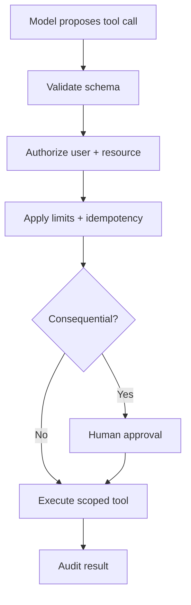

# Phase 3 — Secure AI as an Untrusted Subsystem

## Goal

Apply zero-trust boundaries to users, documents, prompts, model output and tools. Prompt text is not an authorization mechanism.

## Threat model

Identify assets, actors, entry points, trust boundaries and abuse cases. Cover:

- direct and indirect prompt injection;
- cross-tenant/document data leakage;
- insecure output handling and stored XSS;
- excessive tool permissions and confused-deputy attacks;
- secrets/PII leakage through prompts, traces or datasets;
- poisoned documents, embeddings and training data;
- denial of wallet/service through token or tool amplification;
- model/provider supply-chain risk;
- unsafe deserialization, file upload and SSRF;
- audit tampering and repudiation.

Map controls to OWASP LLM guidance plus ordinary API, cloud and software-supply-chain security.

## Identity and authorization

Keycloak issues tokens; the Spring Boot resource server validates issuer, audience, signature, expiry and roles. Internal services authenticate using workload identity or tightly scoped credentials. Preserve user/tenant context without forwarding broad user tokens unnecessarily.

Enforce authorization in deterministic code at:

- API operation;
- interview/assignment object;
- document and chunk retrieval;
- tool registration and invocation;
- human approval action;
- audit/export access.

Use deny-by-default policies and test them with real claims.

## Prompt-injection-resistant RAG

Treat retrieved text as data, not instructions. Separate system policy from context, mark source boundaries, reject unsupported citations, limit document types/sizes, scan uploads, preserve provenance and restrict retrieval before model invocation. Prompt defenses supplement authorization; they do not replace it.

## Safe tool execution

Controls include an allowlist, narrow schemas, resource ownership checks, read-only defaults, monetary/volume limits, timeouts, network egress restrictions, step budgets, idempotency and approval for side effects. Never pass raw model text to shell, SQL, templates or URLs.

## Data and privacy

- classify data before ingestion;
- minimize prompts and retained traces;
- redact secrets/PII using deterministic controls;
- encrypt in transit and at rest with managed keys;
- define retention/deletion for source, chunks, embeddings and logs;
- isolate tenants at query and storage layers;
- document provider data-use/retention settings;
- require provenance, consent and licensing for training data.

Embeddings can reveal sensitive relationships; protect and delete them with the source.

## Secrets and supply chain

Use Vault/AWS Secrets Manager/Kubernetes external secret integration, short-lived credentials and rotation. Pin and scan dependencies/images, generate an SBOM, verify model/dataset licenses and provenance, protect CI identities and sign release artifacts. Do not expose keys in browser bundles or notebooks.

## Red-team suite

Automate cases for instruction override, data exfiltration, hidden document instructions, role confusion, encoded payloads, oversized inputs, unauthorized tool calls, recursive agent loops, malicious URLs/files, tenant swapping and audit suppression. Include expected safe behavior: refusal, sanitization, bounded handling or escalation.

## Incident response

Prepare kill switches for a model, prompt, retriever, tenant, tool and feature. Preserve evidence while avoiding further sensitive logging. Run one tabletop exercise: compromised document causes indirect injection and attempted tool use. Measure detection, containment, credential rotation, reindexing, notification and safe restoration.

## Secure gate

You pass when the threat model is reviewed; cross-tenant and forbidden-tool tests consistently fail closed; secrets scanning/SAST/dependency/image checks run in CI; audit events are attributable; and kill switches plus incident procedures are demonstrated.

## Evidence

Publish the trust-boundary diagram, data-flow inventory, control matrix, red-team report, IAM/role matrix, SBOM/security scan summary and a sanitized incident exercise report.

