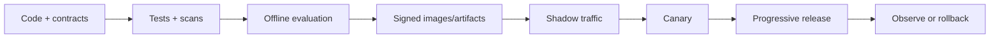

# Phase 4 — Deploy, Observe, Scale and Recover

## Goal

Operate the system predictably across local, Kubernetes and AWS environments while keeping releases reversible and cost visible.

## Packaging

Create minimal, non-root, immutable images with pinned base images, health endpoints and graceful shutdown. Separate database migration jobs from application startup. Use Compose for reproducible local dependencies and Kustomize/Helm for environment overlays without copying manifests.

Kubernetes workloads need:

- readiness, liveness and startup probes;
- requests/limits based on measurements;
- PodDisruptionBudget and topology spread where justified;
- NetworkPolicy and restricted security context;
- autoscaling on meaningful signals;
- controlled job concurrency;
- externalized configuration and secret references;
- migration, rollback and backup procedures.

Do not use CPU alone to scale an I/O-bound AI gateway. Consider inflight requests, queue lag, provider quota, tokens/second and latency.

## AI delivery pipeline

Version and promote compatible sets of application code, prompt, model, adapter, embedding, index, evaluation dataset and policy. A rollback that restores code but leaves an incompatible index is incomplete.

## Observability

Use OpenTelemetry correlation across React, Java, Kafka and Python. Capture:

- request/job success and error class;
- p50/p95/p99 latency by stage;
- provider/model latency, rate limits and fallback;
- prompt/completion tokens and cost;
- retrieval candidates, authorized count and reranker latency;
- schema-valid, grounded, cited and abstained rates;
- tool calls, denials, approvals and step count;
- Kafka lag/retries/DLQ;
- database pool, query and lock health.

Never place raw secrets, tokens, full resumes or sensitive prompts in labels/logs/traces. Use IDs and controlled secure sampling.

## Reliability patterns

Apply deadlines end-to-end, bounded retries with jitter, circuit breakers, bulkheads, rate limits, queues/backpressure, semantic caching only where authorization and staleness permit, and graceful feature degradation. Define behavior for provider outage, vector-store failure, Kafka backlog, database failover and partial streaming.

Example degradation: business APIs remain available; AI generation becomes an accepted asynchronous job; cached non-sensitive policy answers remain available; consequential scoring pauses for human review.

## AWS reference deployment

Choose managed services deliberately:

| Need | AWS option |
|---|---|
| Kubernetes/containers | EKS or ECS/Fargate |
| Managed models | Bedrock |
| training/registry/serving | SageMaker |
| PostgreSQL/pgvector | RDS/Aurora PostgreSQL |
| streaming | MSK |
| documents | S3 with lifecycle controls |
| identity/secrets/keys | IAM, Secrets Manager, KMS |
| telemetry | CloudWatch plus OpenTelemetry |
| edge protection | ALB/API Gateway, WAF |

Use private subnets/endpoints where appropriate, workload roles rather than static keys, encryption, backup/PITR, multi-AZ design and budget alarms. Produce a monthly estimate and the assumptions behind it.

## Load and failure experiments

Test normal, burst and soak workloads. Report throughput, latency, saturation, errors, token usage and cost—not only requests/second. Inject provider 429/500/timeout, slow vector queries, Kafka consumer pause, pod termination, invalid model JSON and database connection exhaustion. Verify alerts, degradation and recovery.

## Runbooks and SLOs

Define service-level indicators and objectives for user-visible workflows. Alerts must link to runbooks. Each runbook contains symptoms, dashboards, safe checks, containment, rollback, escalation, validation and follow-up actions.

## Deploy gate

You pass when CI produces signed, scanned artifacts; a candidate release clears evaluation/security gates; canary and rollback are demonstrated; dashboards/alerts detect injected failures; backups/restores are tested; and cost per successful workflow is reported.

## Final demonstration

Demonstrate one happy path and three failures: provider outage, malicious RAG document and model-quality regression. Show detection, safe behavior, evidence, rollback and the ADR that explains the architecture.

## Evidence

Publish manifests/IaC, pipeline diagram, release manifest, dashboard screenshots, load/failure report, SLOs, runbooks, restore evidence, AWS cost estimate and final architecture review.

