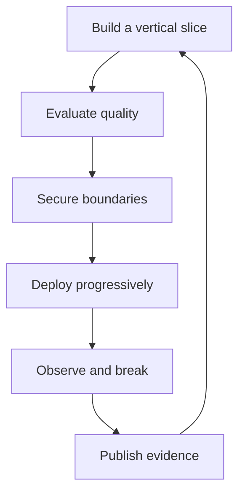
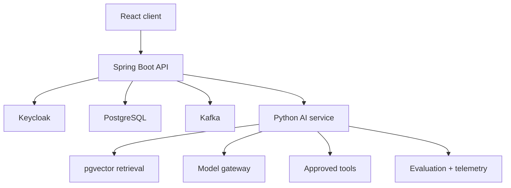

# Java-to-AI Enterprise Capstone: Build, Evaluate, Secure and Deploy

This capstone converts the handbook into evidence that an experienced Java engineer can design and operate a production AI system. The domain is an **Enterprise AI Interview Platform**: Spring Boot owns business workflows; Python owns AI orchestration and evaluation; PostgreSQL/pgvector owns durable data; Kafka carries asynchronous events; Keycloak provides identity; Kubernetes and AWS provide the runtime.

## Outcome

At completion you will have working code, architecture decisions, evaluation reports, a threat model, deployment manifests, dashboards, failure-test evidence and a portfolio-ready demonstration. A chatbot screenshot is not completion.

## Track

1. [Build](01-build.md) — implement the vertical slice and explicit Java/Python boundaries.
2. [Evaluate](02-evaluate.md) — establish golden datasets, retrieval/generation metrics and release gates.
3. [Secure](03-secure.md) — enforce identity, authorization, data isolation, safe tool use and red-team tests.
4. [Deploy](04-deploy.md) — package, release, observe, scale, recover and control cost.



## Reference architecture



### Ownership rules

| Concern | Owner | Rule |
|---|---|---|
| Interviews, assignments, submissions | Spring Boot | AI cannot directly mutate business tables |
| Prompts, retrieval, reranking, model calls | Python AI service | Version every behavior-changing artifact |
| Identity and roles | Keycloak | Propagate verified claims; never trust client-supplied identity |
| Business data | PostgreSQL | Transactions and migrations remain explicit |
| Embeddings | pgvector | Store tenant/document ACL metadata with chunks |
| Asynchronous work | Kafka | Idempotent consumers and retry/DLQ policy required |
| Provider access | Model gateway | Central timeouts, quotas, routing and audit metadata |

## Functional scope

- interviewer creates and publishes an interview definition;
- AI generates structured questions against an approved schema;
- candidate receives an authorized assignment and submits answers;
- grounded policy assistant returns citations only from permitted documents;
- scoring workflow produces evidence, confidence and review flags;
- a human approves consequential results;
- audit events record who requested, generated, approved and released each result.

## Non-functional targets

Record the baseline on your own hardware, then make targets explicit:

| Attribute | Initial gate |
|---|---|
| Availability | graceful degradation when the model provider fails |
| API latency | p95 reported separately for non-AI and AI paths |
| Quality | no release without versioned evaluation comparison |
| Security | zero cross-tenant retrieval in adversarial tests |
| Reliability | idempotent event processing and bounded retries |
| Cost | cost/request and tokens/request visible by feature and tenant |
| Auditability | prompt/model/retrieval/tool versions traceable per response |

## Repository shape

```text
enterprise-ai-interview/
  services/
    interview-orchestrator/   # Java 21, Spring Boot
    ai-service/               # Python, FastAPI
    web-ui/                   # React + TypeScript
  contracts/                  # OpenAPI, AsyncAPI and JSON Schema
  evaluation/
    datasets/ metrics/ reports/
  platform/
    compose/ kubernetes/ terraform/
  security/
    threat-model/ red-team/
  observability/
    dashboards/ alerts/
  docs/
    adr/ runbooks/ evidence/
```

## Twelve-week execution plan

| Weeks | Deliverable | Exit evidence |
|---|---|---|
| 1–2 | contracts, local stack, authenticated vertical slice | sequence diagram, API tests, ADRs |
| 3–4 | structured generation and permission-aware RAG | runnable demo, citations, retrieval tests |
| 5–6 | evaluation harness and regression baseline | dataset card, report, CI gate |
| 7–8 | security controls and bounded workflow | threat model, red-team results, audit trail |
| 9–10 | containers, Kubernetes and observability | manifests, dashboard, load/failure results |
| 11 | AWS design/deployment and cost controls | cloud diagram, IAM matrix, cost estimate |
| 12 | incident drill and portfolio packaging | runbook, rollback evidence, demo narrative |

## Definition of done

- one command starts the local dependencies;
- contracts are versioned and tested between Java and Python;
- golden evaluation data is separate from training/tuning data;
- RAG authorization is applied before context reaches the model;
- model output is schema-validated and treated as untrusted input;
- tool calls are allowlisted, authorized, bounded and auditable;
- secrets never enter source, prompts, logs or browser storage;
- CI blocks quality, security and compatibility regressions;
- deployment supports health checks, canary, rollback and provider outage;
- dashboards expose quality, latency, errors, tokens and cost;
- ADRs explain major choices and rejected alternatives;
- the README links to evidence rather than making unsupported claims.

## Portfolio package

Publish a two-minute demo, architecture diagram, six ADRs, evaluation report, threat model, dashboard screenshot, load-test summary, incident runbook and a concise README. In interviews, explain trade-offs and one failure you diagnosed; do not merely enumerate tools.

