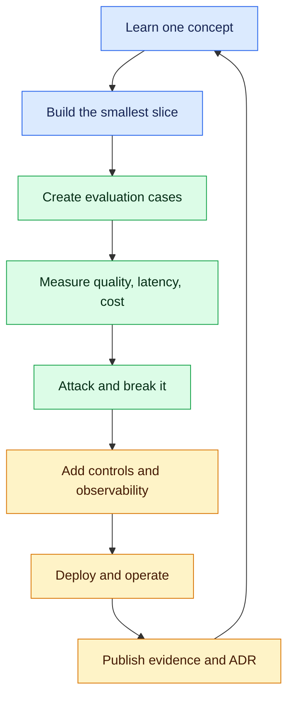

# Practical Java-to-AI Migration Playbook

> The execution companion to the [Java Developer/Architect to AI Migration Guide](java-developer-architect-to-ai-migration-guide.md): tools, laboratories, engineering habits, evidence and release gates required to make the transition real.

## 1. What this page is for

Reading establishes vocabulary. Migration happens when you repeatedly build, measure, diagnose, secure and operate AI capabilities.

This playbook answers:

- What should I install?
- What must I implement myself before using frameworks?
- Which tools should I practise?
- What production failures must I learn to diagnose?
- What evidence proves AI-developer or AI-architect readiness?
- Which mindset changes are essential for probabilistic systems?

The goal is not to abandon Java. Use Java for mature domain services and Python for the AI/data ecosystem, joined through explicit, versioned contracts.

## 2. The migration operating model



Every learning milestone must produce four things:

1. **Working code**
2. **Measured evaluation**
3. **Failure and security evidence**
4. **A short architecture decision record**

A chatbot screenshot is a demo. These four artifacts demonstrate engineering competence.

## 3. Workstation and tool setup

### 3.1 Essential development environment

| Need | Recommended starting tool | What you must know |
|---|---|---|
| Java runtime | JDK 21+ | REST, security, resilience, domain boundaries |
| Python runtime | Python 3.11–3.13 | virtual environments, typing, async, packaging |
| Python environment | `uv` or `venv + pip` | locked, reproducible dependencies |
| Editor | IntelliJ + PyCharm or VS Code | debugging, tests, linting, notebooks |
| API testing | Bruno, Postman or curl | streaming, headers, timeouts, error contracts |
| Containers | Docker/Compose | local model dependencies and reproducible stacks |
| Source control | Git + GitHub CLI | small commits, branches, PR evidence |
| Data notebook | JupyterLab | exploration only; production logic belongs in modules |
| Database | PostgreSQL + pgvector | metadata, ACLs, vectors and evaluation results |
| Cache/queue | Redis; Kafka when justified | caching, jobs, backpressure and retries |
| Identity | Keycloak/OIDC | user identity and tenant/document authorization |
| Observability | OpenTelemetry + Prometheus/Grafana | traces, metrics, logs and cost attribution |

### 3.2 Minimum Python project quality tools

Start with:

- `pyproject.toml` as the project contract
- `ruff` for linting and formatting
- `mypy` or `pyright` for type checking
- `pytest`, `pytest-asyncio` and coverage
- `pydantic` for boundary validation
- `httpx` for model/provider calls
- `FastAPI` for an AI-facing service
- `pre-commit` for repeatable local checks

Required gate:

```bash
ruff check .
ruff format --check .
mypy src
pytest --cov=src --cov-fail-under=80
```

Do not copy API keys into source, notebooks, images, logs or Git history. Use environment injection locally and a secrets manager in deployed environments.

### 3.3 AI and data tool ladder

| Stage | Learn directly first | Add after the primitive is understood |
|---|---|---|
| Model API | Provider SDK or `httpx` | LiteLLM/model gateway |
| Structured output | JSON Schema + Pydantic | framework parsers |
| Embeddings | model API + NumPy | sentence-transformers |
| Retrieval | SQL/pgvector or FAISS | LlamaIndex/LangChain |
| Workflow | plain functions/state object | LangGraph |
| Evaluation | versioned JSONL + pytest | RAGAS, DeepEval, custom judges |
| Tracing | OpenTelemetry | LangSmith or provider platform |
| Training | PyTorch/Transformers | TRL, PEFT, Accelerate, DeepSpeed |
| Experiment tracking | structured files | MLflow or Weights & Biases |
| Serving | FastAPI/provider API | vLLM, TGI, Triton |
| Deployment | Docker Compose | Kubernetes/GPU scheduling |

The rule is simple: learn the contract before adopting abstraction.

## 4. Repository structure to practise

```text
enterprise-ai-assistant/
├── java-domain-api/
├── ai-service/
│   ├── pyproject.toml
│   ├── src/
│   │   ├── api/
│   │   ├── domain/
│   │   ├── providers/
│   │   ├── retrieval/
│   │   ├── workflows/
│   │   ├── evaluation/
│   │   └── observability/
│   └── tests/
├── evals/
│   ├── golden/
│   ├── adversarial/
│   └── reports/
├── infra/
│   ├── compose/
│   └── kubernetes/
├── docs/
│   ├── adr/
│   ├── threat-model/
│   └── runbooks/
└── .github/workflows/
```

Keep provider SDKs behind your own interface. Domain code should not import LangChain, a vendor SDK or a vector-store client everywhere.

## 5. Practical migration stages

## Stage 0 — Baseline yourself

Before studying, score each item 0–3:

- Python service development
- Statistics and ML metrics
- LLM/inference fundamentals
- Prompt and structured-output design
- Embeddings and retrieval
- RAG evaluation
- Tools and agent workflows
- AI security
- Observability and LLMOps
- Serving, cost and capacity
- Cloud/Kubernetes
- Architecture and business-risk framing

For every score above zero, attach evidence. “I watched a course” is not evidence.

Deliverable: a gap matrix and one chosen target role.

## Stage 1 — Translate Java habits into Python

Build the same small API twice: one Spring Boot endpoint and one FastAPI endpoint.

Practise:

- DTO ↔ Pydantic model
- interface ↔ Protocol/ABC
- record ↔ frozen dataclass
- CompletableFuture ↔ `async/await`
- JUnit/Mockito ↔ pytest/fakes
- Resilience4j concepts ↔ explicit timeout/retry/bulkhead policy
- Maven/Gradle dependency control ↔ `pyproject.toml` and lockfile

Exit gate:

- typed code
- deterministic tests
- controlled concurrency
- reproducible environment
- no global mutable model client
- clean error contract

Use the [minimum Python tutorial](python-for-ai-development.md) for the required language details.

## Stage 2 — Build a provider-neutral inference boundary

Implement `ModelClient.generate(request) -> response` and keep the provider adapter replaceable.

Required features:

- timeout and cancellation
- streaming
- structured output validation
- token/cost capture
- request correlation
- retry classification
- rate-limit handling
- model/version metadata
- redacted telemetry
- fake client for tests

Failure drills:

- provider returns 429
- response is invalid JSON
- stream stops halfway
- request exceeds token limit
- request is cancelled by the caller
- fallback model has different capabilities

Exit gate: run the same contract tests against a fake client and two adapters or one adapter plus a local model.

## Stage 3 — Establish evaluation before adding RAG

Create a versioned JSONL dataset containing:

- user input
- expected behavior
- permitted evidence
- forbidden behavior
- category/difficulty
- tenant/user context
- human reference notes

Measure:

- valid-structure rate
- task success
- answer relevance
- safety/refusal correctness
- p50/p95 latency
- input/output tokens
- cost per successful task

Keep model and prompt versions in every report. Compare candidate versus baseline; never report only the candidate score.

Exit gate: CI fails when an agreed quality, safety, latency or cost threshold regresses.

## Stage 4 — Build RAG without hiding the pipeline

Implement explicitly:

1. Load and classify documents.
2. Parse and clean content.
3. Chunk with stable document/chunk IDs.
4. Attach tenant, ACL, source and version metadata.
5. Create embeddings.
6. Index content.
7. Embed/rewrite the query.
8. Apply trusted authorization filters.
9. Retrieve and optionally rerank.
10. Construct bounded context.
11. Generate an answer with citations.
12. Verify citations and record retrieval evidence.

Tools to practise:

- PyMuPDF/Unstructured for documents
- pgvector or FAISS first
- sentence-transformers or embedding API
- BM25/OpenSearch for lexical search
- cross-encoder reranker
- RAGAS/DeepEval plus custom retrieval metrics

Failure drills:

- relevant chunk is absent
- wrong tenant document scores highest
- stale version is retrieved
- retrieved document contains prompt injection
- citation does not support the claim
- oversized context increases cost and reduces quality

Exit gate: demonstrate retrieval recall@k, groundedness, citation correctness and tenant isolation using automated cases.

## Stage 5 — Add bounded tools and workflows

Start with one deterministic tool workflow, not a multi-agent system.

Each tool requires:

- typed input/output
- identity and authorization
- allowlisted operations
- idempotency key
- timeout/resource boundary
- audit event
- safe error message
- approval for high-impact operations

Use LangGraph only when you need durable state, conditional routing, checkpoint/resume or human approval.

Failure drills:

- model invents a tool name
- tool arguments violate policy
- duplicate request repeats a side effect
- approval expires
- workflow resumes after deployment
- downstream system is unavailable

Exit gate: the model can propose an action, but trusted code decides whether it may execute.

## Stage 6 — Productionize the system

Containerize and deploy the Java API, AI service, database/vector store and observability stack.

Required engineering:

- health/readiness endpoints
- CPU/memory limits
- connection and concurrency limits
- horizontal scaling assumptions
- queue for long-running work
- separate interactive and batch bulkheads
- secret injection
- network/egress controls
- immutable images and dependency scans
- canary release and rollback
- backup/restore test
- provider-outage runbook

AI-specific telemetry:

- model/provider/version
- prompt template version
- dataset/index version
- input/output tokens
- time to first token
- end-to-end and provider latency
- retrieval candidates and scores
- tool decisions and results
- policy decisions
- estimated cost
- user/tenant identifiers in safe pseudonymous form

Exit gate: conduct load, failure, security and rollback tests—not only a happy-path deployment.

## Stage 7 — Run one fine-tuning experiment correctly

Fine-tune only after a baseline exists.

Practical sequence:

1. Define the behavior that prompting/RAG did not solve.
2. Establish dataset ownership and licensing.
3. Split by semantic group to reduce leakage.
4. Train a small LoRA/QLoRA adapter.
5. Track configuration and artifacts in MLflow/W&B.
6. Compare against the unchanged baseline.
7. Run quality, memorization and safety evaluations.
8. Serve the adapter behind the same inference contract.
9. Shadow/canary before promotion.
10. retain immediate rollback.

Exit gate: recommend **against** fine-tuning if measured value does not justify risk and operational cost. That is an architecturally strong result.

## 6. The production AI mindset

### 6.1 Replace “correct or incorrect” with distributions

AI quality is measured over representative cases. Track averages, percentiles, worst categories and confidence intervals where appropriate.

### 6.2 Separate capability from authority

A model may understand a request without being authorized to access data or perform an action. Authorization lives in trusted services.

### 6.3 Data is part of the executable system

Prompts, evaluation cases, documents, embeddings, indexes and fine-tuning datasets must be versioned and traceable like code.

### 6.4 Prefer evidence over framework claims

Say “recall@5 improved from 0.78 to 0.89” rather than “we used advanced RAG.”

### 6.5 Design abstention and human escalation

A safe system knows when to refuse, ask a clarifying question, fall back to search or route to a person.

### 6.6 Optimize successful-task cost

A cheaper request is not cheaper if it fails twice and needs human correction. Track cost per accepted outcome.

### 6.7 Assume change outside your deployment

Providers alter models, quotas and behavior. Pin what can be pinned, evaluate continuously and maintain fallbacks.

### 6.8 Resist unnecessary agency

Use deterministic workflows where the sequence is known. Add agent autonomy only where dynamic planning creates measurable benefit.

## 7. Debugging discipline

When an AI answer is poor, isolate the layer:

| Symptom | Inspect first |
|---|---|
| Wrong facts | source evidence and retrieval |
| Correct chunks, wrong answer | prompt/context construction and model |
| Missing result | ingestion, chunking, metadata filters |
| Cross-tenant evidence | authorization boundary—treat as incident |
| Invalid JSON | schema, constrained decoding, repair policy |
| High latency | queue, retrieval, reranker, provider TTFT |
| High cost | prompt size, retrieval count, output cap, retries |
| Repeated side effect | idempotency and workflow checkpoint |
| Quality changed after deploy | model/prompt/index/dataset versions |
| Offline score good, users unhappy | dataset representativeness and product UX |

Create a trace that lets you reconstruct one request without logging sensitive raw content by default.

## 8. Security work you must perform

Create a threat model covering:

- direct and indirect prompt injection
- sensitive-data disclosure
- cross-tenant retrieval
- insecure output rendering
- excessive tool permissions
- denial of wallet
- poisoned documents/datasets
- vulnerable model and package supply chain
- secret leakage
- audit and retention risk

Run adversarial tests. Include malicious documents, encoded instructions, oversized inputs, malformed tool arguments and attempts to access another tenant.

Controls must exist in code, identity, data filtering, network policy and tool gateways—not only in a system prompt.

## 9. CI/CD and release evidence

A credible AI pipeline includes:

```mermaid
flowchart LR
  A["Code + prompt + data change"] --> B["Unit and contract tests"]
  B --> C["Offline quality + safety eval"]
  C --> D["Security and dependency scan"]
  D --> E["Build immutable artifact"]
  E --> F["Shadow or canary"]
  F --> G["Online monitoring"]
  G --> H["Promote or rollback"]
  classDef gate fill:#dbeafe,stroke:#2563eb,color:#172554
  classDef release fill:#dcfce7,stroke:#16a34a,color:#052e16
  classDef decision fill:#fef3c7,stroke:#d97706,color:#451a03
  class A,B,C,D gate
  class E,F,G release
  class H decision
```



Version together:

- application image
- model/provider configuration
- prompt templates
- evaluation dataset
- retrieval index
- embedding model
- reranker
- adapters
- policy rules

A rollback must restore a compatible set, not only the application image.

## 10. Portfolio evidence checklist

Publish sanitized evidence for one end-to-end system:

- [ ] Business problem and non-AI baseline
- [ ] HLD, sequence and trust-boundary diagrams
- [ ] Java/Python responsibility ADR
- [ ] Model/provider decision ADR
- [ ] Prompting vs RAG vs fine-tuning ADR
- [ ] Versioned evaluation dataset
- [ ] Baseline and candidate evaluation report
- [ ] RAG retrieval and citation metrics
- [ ] Threat model and adversarial results
- [ ] Load test and capacity assumptions
- [ ] Cost-per-successful-task model
- [ ] OpenTelemetry trace and dashboards
- [ ] Failure experiment report
- [ ] Canary and rollback evidence
- [ ] Incident/provider-outage runbook
- [ ] Five-minute architecture demo

Never publish proprietary documents, real PII, secrets or employer code.

## 11. What you must know by role

### AI developer

You must be able to:

- build typed Python/FastAPI services
- integrate inference APIs reliably
- explain tokens, embeddings, attention and hallucination
- build and evaluate RAG
- use structured output and bounded tools
- write deterministic and evaluation tests
- trace, deploy and debug the service
- protect data and enforce authorization

### Production AI engineer

Add:

- model gateway and provider fallback
- queues, rate limits, caching and bulkheads
- prompt/model/index versioning
- evaluation-driven CI/CD
- serving, batching and quantization basics
- Kubernetes deployment and observability
- online monitoring, incident response and cost control

### AI architect

Add the ability to:

- decide whether AI is justified
- map business risk to quality and safety gates
- define trust boundaries and human approvals
- choose hosted versus self-hosted models
- design multi-tenant RAG and tool authorization
- estimate capacity, GPU/token cost and failure domains
- govern model, data and prompt lifecycle
- lead threat modelling, ADRs and rollout/rollback
- explain rejected alternatives using evidence

## 12. Suggested 12-week practical schedule

| Weeks | Build | Evidence |
|---|---|---|
| 1–2 | Python bridge + typed FastAPI | tests, type/lint gates |
| 3 | provider-neutral inference API | contract tests, latency/cost report |
| 4 | evaluation harness | baseline report and CI gate |
| 5–6 | permission-aware RAG | recall, groundedness, ACL tests |
| 7 | reranking and citations | comparative evaluation |
| 8 | bounded tool workflow | approval, idempotency, audit tests |
| 9 | observability and failure drills | traces, dashboards, incident notes |
| 10 | Docker/Kubernetes deployment | load, security and rollback report |
| 11 | LoRA experiment or cloud-AI comparison | ADR and measured recommendation |
| 12 | architecture case study and interviews | portfolio demo and readiness review |

With your Java, Kafka, security and Kubernetes background, spend less time relearning general software engineering and more time on Python fluency, data/evaluation, retrieval behavior, AI security and measurable production quality.

## 13. Final migration gate

You are ready to claim practical AI-development experience when you can answer “yes” with evidence:

- Can I reproduce the environment from a clean checkout?
- Can I swap the model provider behind a stable contract?
- Can I measure quality over a versioned dataset?
- Can I explain why retrieval failed for a specific request?
- Can I prevent cross-tenant retrieval and unsafe tool execution?
- Can I trace latency, tokens, cost and tool decisions?
- Can I survive rate limits, malformed output and provider outage?
- Can I deploy, canary, monitor and roll back safely?
- Can I defend prompting, RAG and fine-tuning choices?
- Can I show code, metrics, diagrams, ADRs and failure evidence?

## 14. Continue learning

1. [Java Developer/Architect to AI Migration Guide](java-developer-architect-to-ai-migration-guide.md)
2. [Python for AI Development: Minimum Practical Tutorial](python-for-ai-development.md)
3. [Inference APIs: Zero to Production](inference-apis.md)
4. [AI Development: Zero to Job-Ready](../ai-development-zero-to-job-ready/README.md)
5. [Fine-Tuning: Fundamentals to Production](fine-tuning.md)

The migration mindset is: **build a thin slice, evaluate it, attack it, operate it, and preserve evidence**. Tools will change; this discipline will not.
