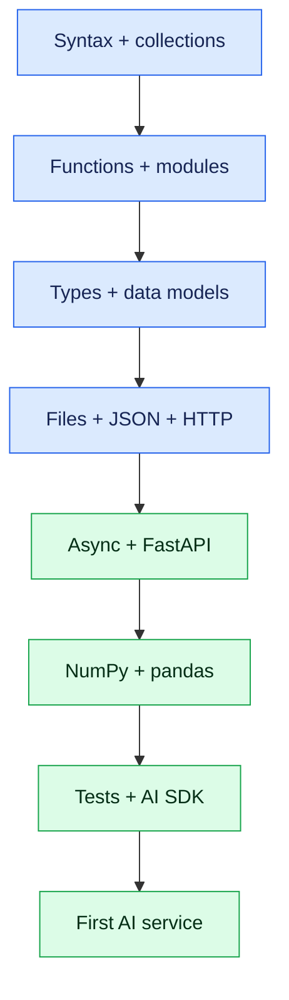

# Python for AI Development: Minimum Practical Tutorial

> A focused Python bridge for developers—especially experienced Java engineers—who need enough Python to build, test and operate AI applications without first completing a general-purpose language course.

## 1. What “minimum required” means

For AI development, Python is the working language around model SDKs, data preparation, notebooks, evaluation, RAG, agents, training and serving. You do **not** need to master every Python feature before starting AI.

You are ready to move into AI development when you can:

- create an isolated project and manage dependencies;
- model typed request and response contracts;
- transform lists, dictionaries, JSON and text safely;
- call an HTTP/model API with timeouts and error handling;
- write synchronous and asynchronous functions;
- use NumPy and pandas for small data/evaluation tasks;
- build a FastAPI endpoint;
- write pytest tests with a fake model client;
- read library documentation and debug a traceback;
- keep credentials out of source code.

This page teaches that boundary. It is deliberately smaller than a complete Python-backend curriculum.

## 2. Learning route



Do the sections in order. Type and run each example; passive reading does not create fluency.

## 3. Setup: Python, environment and project

Use a supported Python 3 release and isolate every project.

```bash
python --version
python -m venv .venv
```

Activate it:

```powershell
.\.venv\Scripts\Activate.ps1
```

```bash
source .venv/bin/activate
```

Install only what the first lab needs:

```bash
python -m pip install fastapi uvicorn httpx pydantic pytest pytest-asyncio numpy pandas
python -m pip freeze
```

A minimal layout:

```text
ai-python-lab/
├── app/
│   ├── __init__.py
│   ├── main.py
│   ├── models.py
│   └── service.py
├── tests/
│   └── test_service.py
├── .env.example
├── .gitignore
└── pyproject.toml
```

Never commit `.venv/`, API keys or a real `.env`. Prefer `pyproject.toml` and a lockfile-producing tool such as uv, Poetry or pip-tools in production; understand standard `venv` and `pip` first.

## 4. Python mental model for Java developers

| Java idea | Python equivalent | Important difference |
|---|---|---|
| `String name` | `name: str` | Type hints are checked by tools, not normally enforced at runtime |
| `null` | `None` | Use `is None`, not `== None` |
| `List<T>` | `list[T]` | Built-in generic syntax in modern Python |
| `Map<K,V>` | `dict[K, V]` | Dictionaries are central to JSON/data work |
| `record` | `@dataclass` or Pydantic model | Pydantic also validates external data |
| interface | `Protocol` or abstract base class | Duck typing is common |
| checked exception | no checked exceptions | Catch only errors you can handle |
| `try-with-resources` | `with` context manager | Deterministic resource cleanup |
| `CompletableFuture` | coroutine/task with `asyncio` | Best suited to I/O concurrency |
| Stream API | comprehensions/generators | Prefer readable comprehensions |
| Maven/Gradle module | package/module | A `.py` file is a module |
| JUnit | pytest | Plain functions and fixtures are common |
| Jackson DTO | Pydantic model | Parsing, validation and JSON schema together |

Python uses indentation as syntax. Follow PEP 8, use four spaces, and let a formatter such as Ruff format enforce consistency.

## 5. Values, variables and control flow

```python
topic: str = "Java concurrency"
difficulty: int = 3
temperature: float = 0.2
include_answer: bool = False
model_name: str | None = None

if difficulty < 1 or difficulty > 5:
    raise ValueError("difficulty must be between 1 and 5")

label = "advanced" if difficulty >= 4 else "standard"

for attempt in range(3):
    print(attempt, topic, label)
```

Key points:

- assignment does not declare a runtime type;
- `==` compares values; `is` checks identity;
- truthy/falsy values are convenient, but distinguish `None` from valid empty data;
- f-strings are the normal formatting choice: `f"{topic}: {difficulty}"`;
- avoid mutable global state in services.

### Exercise

Write `validate_temperature(value: float) -> float` that accepts values from 0 through 2 and raises `ValueError` otherwise.

## 6. Collections used constantly in AI code

```python
topics: list[str] = ["Java", "Kafka", "Kubernetes"]
scores: dict[str, float] = {"groundedness": 0.91, "relevance": 0.88}
unique_tags: set[str] = {"rag", "security", "rag"}
point: tuple[int, int] = (10, 20)

first_two = topics[:2]
normalized = [topic.lower() for topic in topics]
strong_metrics = {
    name: score
    for name, score in scores.items()
    if score >= 0.90
}
```

Use:

- `list` for ordered mutable sequences;
- `tuple` for fixed lightweight groupings;
- `dict` for keyed data and JSON-like structures;
- `set` for uniqueness and membership tests.

Do not alter a collection while iterating over it unless the behavior is deliberate. Avoid dense nested comprehensions; readable loops are better than clever code.

### Safe lookup and unpacking

```python
model = scores.get("model", 0.0)
request = {"topic": "RAG", "difficulty": 3}
topic = request["topic"]
difficulty = request.get("difficulty", 1)

name, score = next(iter(scores.items()))
```

## 7. Functions: the main unit of design

```python
def build_prompt(topic: str, difficulty: int = 2) -> str:
    """Create a bounded interview-question instruction."""
    clean_topic = topic.strip()
    if not clean_topic:
        raise ValueError("topic is required")
    return (
        f"Create one difficulty-{difficulty} interview question "
        f"about {clean_topic}. Return JSON."
    )
```

Prefer:

- small functions with explicit inputs and outputs;
- keyword arguments when calls would otherwise be ambiguous;
- pure transformations for chunking, prompt construction and evaluation;
- dependency injection rather than importing a global model client everywhere.

Avoid mutable default arguments:

```python
def add_tag(tag: str, tags: list[str] | None = None) -> list[str]:
    result = [] if tags is None else list(tags)
    result.append(tag)
    return result
```

### `*args` and `**kwargs`

Understand them because libraries use them, but do not hide important contracts behind them.

```python
def trace(event: str, **attributes: str | int | float) -> None:
    print(event, attributes)
```

## 8. Modules, imports and packages

`app/prompts.py`:

```python
SYSTEM_PROMPT = "Answer only from supplied evidence."

def make_user_prompt(question: str, context: str) -> str:
    return f"Context:\n{context}\n\nQuestion:\n{question}"
```

Import it:

```python
from app.prompts import SYSTEM_PROMPT, make_user_prompt
```

Rules:

- use absolute imports inside application code;
- do not name files `json.py`, `typing.py` or `httpx.py`, which shadow libraries;
- protect executable script entry points with `if __name__ == "__main__":`;
- keep model-provider code behind an application-owned interface.

## 9. Data classes, Pydantic and typing

Use a dataclass for trusted internal data:

```python
from dataclasses import dataclass

@dataclass(frozen=True, slots=True)
class RetrievedChunk:
    document_id: str
    text: str
    score: float
```

Use Pydantic at untrusted boundaries:

```python
from pydantic import BaseModel, Field

class GenerateRequest(BaseModel):
    topic: str = Field(min_length=2, max_length=100)
    difficulty: int = Field(ge=1, le=5)

class GeneratedQuestion(BaseModel):
    question: str
    expected_points: list[str]
```

Model behavior with a protocol:

```python
from typing import Protocol

class ModelClient(Protocol):
    async def generate(self, prompt: str) -> GeneratedQuestion:
        ...
```

This is the Python equivalent of coding against a Java interface. Run a static checker such as mypy or Pyright in serious projects, but remember that data from HTTP, files and models still needs runtime validation.

## 10. Exceptions, cleanup and tracebacks

```python
class ModelUnavailableError(RuntimeError):
    pass

def parse_difficulty(raw: str) -> int:
    try:
        value = int(raw)
    except ValueError as exc:
        raise ValueError("difficulty must be an integer") from exc
    if not 1 <= value <= 5:
        raise ValueError("difficulty must be between 1 and 5")
    return value
```

Catch specific exceptions. Preserve the original cause with `raise ... from exc`. Do not use `except Exception: pass`.

Use context managers:

```python
from pathlib import Path
import json

path = Path("data/evaluation.json")
with path.open(encoding="utf-8") as file:
    cases = json.load(file)
```

Read a traceback from the bottom upward: the final line is the exception; frames above show how execution reached it.

## 11. Files, JSON and environment configuration

```python
import json
import os
from pathlib import Path

api_key = os.environ["MODEL_API_KEY"]

payload = {
    "model": "example-model",
    "messages": [{"role": "user", "content": "Explain embeddings"}],
}

Path("out").mkdir(exist_ok=True)
Path("out/request.json").write_text(
    json.dumps(payload, indent=2),
    encoding="utf-8",
)
```

For JSON Lines evaluation data:

```python
def read_jsonl(path: Path) -> list[dict]:
    rows: list[dict] = []
    with path.open(encoding="utf-8") as file:
        for line_number, line in enumerate(file, start=1):
            if line.strip():
                try:
                    rows.append(json.loads(line))
                except json.JSONDecodeError as exc:
                    raise ValueError(f"invalid JSON at line {line_number}") from exc
    return rows
```

Secrets belong in environment variables or a secret manager. An `.env` file is a local convenience, not a production secret store.

## 12. HTTP and model API fundamentals

Use one long-lived asynchronous client rather than creating a connection pool per request.

```python
import httpx

class HostedModelClient:
    def __init__(self, base_url: str, api_key: str) -> None:
        self._client = httpx.AsyncClient(
            base_url=base_url,
            headers={"Authorization": f"Bearer {api_key}"},
            timeout=httpx.Timeout(20.0, connect=5.0),
        )

    async def close(self) -> None:
        await self._client.aclose()

    async def generate(self, prompt: str) -> dict:
        response = await self._client.post(
            "/v1/generate",
            json={"prompt": prompt, "max_output_tokens": 300},
        )
        response.raise_for_status()
        return response.json()
```

Production requirements:

- connection and total timeouts;
- cancellation propagation;
- bounded retry with jitter only for transient/idempotent work;
- response schema validation;
- request correlation;
- rate and cost limits;
- redacted logging;
- explicit client shutdown.

Never assume a successful HTTP status means a model response is semantically correct.

## 13. Async Python without confusion

`async def` returns a coroutine. It executes when awaited.

```python
import asyncio

async def fetch_embedding(text: str) -> list[float]:
    await asyncio.sleep(0.01)  # represents non-blocking network I/O
    return [0.1, 0.2, 0.3]

async def main() -> None:
    vectors = await asyncio.gather(
        fetch_embedding("Java"),
        fetch_embedding("Python"),
    )
    print(vectors)

if __name__ == "__main__":
    asyncio.run(main())
```

Use async for concurrent I/O: model APIs, databases and network calls. It does not make CPU-heavy tokenization, parsing or model inference faster. Move CPU-bound work to processes, workers or specialized serving infrastructure.

Avoid:

- calling blocking libraries inside the event loop;
- unbounded `gather` over thousands of items;
- fire-and-forget tasks without ownership;
- mixing sync and async clients casually.

Bound concurrency with a semaphore or worker queue.

## 14. Iterators and generators for AI data pipelines

Generators process streams without loading everything into memory.

```python
from collections.abc import Iterator

def batches(items: list[str], size: int) -> Iterator[list[str]]:
    if size <= 0:
        raise ValueError("size must be positive")
    for start in range(0, len(items), size):
        yield items[start:start + size]
```

This pattern is useful for document chunks, embeddings and evaluation cases. Keep batch size configurable and measure throughput, memory and provider limits.

## 15. NumPy essentials

NumPy provides dense numerical arrays and vector operations.

```python
import numpy as np

query = np.array([0.2, 0.4, 0.8], dtype=np.float32)
document = np.array([0.1, 0.5, 0.7], dtype=np.float32)

def cosine_similarity(a: np.ndarray, b: np.ndarray) -> float:
    denominator = np.linalg.norm(a) * np.linalg.norm(b)
    if denominator == 0:
        return 0.0
    return float(np.dot(a, b) / denominator)

print(cosine_similarity(query, document))
```

Minimum concepts:

- array shape and `dtype`;
- vectorized operations instead of Python loops;
- indexing, slicing and boolean masks;
- broadcasting;
- dot product and norms;
- reproducible random generators.

For production vector search, use a vector database or optimized index; this example teaches the mathematics and API shape.

## 16. pandas essentials for datasets and evaluation

```python
import pandas as pd

results = pd.DataFrame(
    [
        {"case_id": "c1", "grounded": True, "latency_ms": 820},
        {"case_id": "c2", "grounded": False, "latency_ms": 1250},
    ]
)

grounded_rate = results["grounded"].mean()
p95_latency = results["latency_ms"].quantile(0.95)
failed = results.loc[~results["grounded"], ["case_id", "latency_ms"]]

print(grounded_rate, p95_latency)
print(failed)
```

Learn:

- `DataFrame` and `Series`;
- loading CSV/JSONL;
- selecting with `.loc`;
- missing values;
- `groupby` and aggregation;
- joins/merges;
- avoiding chained assignment;
- validating columns before training or evaluation.

Do not use pandas as an application database. It is an analysis/transformation tool.

## 17. FastAPI and Pydantic mini-service

`app/main.py`:

```python
from fastapi import Depends, FastAPI, HTTPException
from pydantic import BaseModel, Field

app = FastAPI()

class GenerateRequest(BaseModel):
    topic: str = Field(min_length=2, max_length=100)
    difficulty: int = Field(ge=1, le=5)

class GenerateResponse(BaseModel):
    question: str
    expected_points: list[str]

class QuestionService:
    async def generate(self, request: GenerateRequest) -> GenerateResponse:
        return GenerateResponse(
            question=f"Explain {request.topic} at level {request.difficulty}.",
            expected_points=["definition", "trade-off", "production example"],
        )

def get_service() -> QuestionService:
    return QuestionService()

@app.post("/v1/questions", response_model=GenerateResponse)
async def generate_question(
    request: GenerateRequest,
    service: QuestionService = Depends(get_service),
) -> GenerateResponse:
    try:
        return await service.generate(request)
    except TimeoutError as exc:
        raise HTTPException(status_code=504, detail="model timed out") from exc
```

Run:

```bash
uvicorn app.main:app --reload
```

This establishes contracts, dependency injection and an async boundary. Replace the fake generation with a provider adapter only after this slice is tested.

## 18. Testing with pytest

```python
import pytest

from app.main import GenerateRequest, QuestionService

@pytest.mark.asyncio
async def test_generates_typed_question() -> None:
    service = QuestionService()

    result = await service.generate(
        GenerateRequest(topic="virtual threads", difficulty=4)
    )

    assert "virtual threads" in result.question
    assert len(result.expected_points) >= 1

def test_rejects_invalid_difficulty() -> None:
    from pydantic import ValidationError

    with pytest.raises(ValidationError):
        GenerateRequest(topic="RAG", difficulty=9)
```

For a real SDK, inject a fake:

```python
class FakeModelClient:
    async def generate(self, prompt: str) -> GeneratedQuestion:
        return GeneratedQuestion(
            question="What problem does RAG solve?",
            expected_points=["grounding", "fresh knowledge"],
        )
```

Tests must not call a paid or nondeterministic provider by default. Separate unit tests, provider contract tests and offline evaluation.

## 19. Notebooks versus application code

Jupyter is excellent for exploring data, testing model behavior and visualizing evaluation. It is poor as the only source of production logic.

Use this workflow:

1. explore in a notebook;
2. move reusable code into typed modules;
3. test modules with pytest;
4. keep the notebook as a reproducible experiment/report;
5. record dependencies, seed, data version, model and parameters.

Restart the kernel and run all cells before sharing. Hidden state creates false reproducibility.

## 20. First inference example: provider-neutral boundary

Keep vendor-specific SDK objects outside the domain layer.

```python
from typing import Protocol
from pydantic import BaseModel

class Answer(BaseModel):
    text: str
    citations: list[str]

class InferenceClient(Protocol):
    async def answer(self, question: str, context: list[str]) -> Answer:
        ...

class AnswerService:
    def __init__(self, client: InferenceClient) -> None:
        self._client = client

    async def answer(self, question: str, context: list[str]) -> Answer:
        if not context:
            return Answer(text="I do not have enough evidence.", citations=[])
        result = await self._client.answer(question, context)
        return Answer.model_validate(result)
```

The provider adapter may use OpenAI, Bedrock, Azure, a Hugging Face endpoint or a self-hosted model. Your application contract remains stable.

## 21. Minimal data-science and ML extension

Before scikit-learn or PyTorch, understand the standard experiment shape:

```python
from sklearn.metrics import classification_report
from sklearn.model_selection import train_test_split

X_train, X_test, y_train, y_test = train_test_split(
    features,
    labels,
    test_size=0.2,
    random_state=42,
    stratify=labels,
)

model.fit(X_train, y_train)
predictions = model.predict(X_test)
print(classification_report(y_test, predictions))
```

Required concepts are train/validation/test separation, leakage, baselines, suitable metrics and reproducibility. Do not optimize on the test set.

For deep learning, add tensors, datasets/data loaders, a training loop, loss, optimizer, device movement and checkpointing only when the role requires training.

## 22. Tooling that matters

| Need | Minimum tool | Production option |
|---|---|---|
| Environment | `venv` + pip | uv/Poetry/pip-tools |
| Formatting/lint | Ruff | Ruff in CI |
| Type checking | Pyright or mypy | strict boundary checks in CI |
| Validation | Pydantic | versioned schemas |
| API | FastAPI | workers, gateway and observability |
| HTTP | httpx | pooled clients, retries and tracing |
| Tests | pytest | coverage, contract tests, eval gates |
| Data | NumPy/pandas | Polars/Spark when scale justifies it |
| Notebook | Jupyter | versioned experiment reports |
| ML | scikit-learn | MLflow/model registry |
| Deep learning | PyTorch | Accelerate/DeepSpeed |
| Model SDK | native provider SDK | gateway/provider adapters |
| Configuration | environment | secret manager and typed settings |

Do not learn every tool simultaneously. Add it when the project exposes the need.

## 23. Python mistakes Java developers commonly make

1. Building deep inheritance hierarchies instead of composing small objects.
2. Treating type hints as runtime validation.
3. Creating a new HTTP client for every request.
4. Using mutable default arguments.
5. Catching every exception and losing the cause.
6. Blocking inside an async endpoint.
7. Putting business logic in notebooks.
8. Passing unvalidated dictionaries through every layer.
9. Logging prompts, credentials or private retrieved text.
10. Depending directly on one provider throughout the codebase.
11. Assuming the GIL makes every shared mutation safe.
12. Using `requirements.txt` without a reproducible version strategy.
13. Installing packages globally.
14. Calling live LLMs from unit tests.
15. Rewriting mature Java domain services in Python without a business reason.

## 24. What can wait

These are useful later but not prerequisites for your first AI application:

- metaclasses and descriptors;
- advanced decorator authoring;
- CPython bytecode and interpreter internals;
- C extensions;
- desktop GUI frameworks;
- web scraping;
- advanced multiprocessing internals;
- obscure functional-programming tricks;
- competitive-programming puzzles;
- every Python web framework.

For ML engineering, later deepen statistics, scikit-learn, PyTorch, GPU computing, distributed training and data engineering.

## 25. Fourteen-day practical plan

Assume 90–120 focused minutes daily.

| Day | Focus | Evidence |
|---:|---|---|
| 1 | environment, values, conditions, loops | runnable script |
| 2 | lists, dictionaries, sets, comprehensions | JSON transformation exercise |
| 3 | functions, modules, imports | prompt-builder module |
| 4 | typing, dataclasses, Pydantic | validated AI contracts |
| 5 | exceptions, files, JSONL | robust evaluation loader |
| 6 | httpx and environment configuration | fake inference API call |
| 7 | async/await and bounded concurrency | concurrent embedding simulation |
| 8 | NumPy and cosine similarity | ranked vector examples |
| 9 | pandas and metrics | evaluation report |
| 10 | FastAPI | typed inference endpoint |
| 11 | pytest, fixtures and fakes | deterministic test suite |
| 12 | native model SDK behind adapter | real or mocked model response |
| 13 | mini RAG flow | retrieve, answer, cite |
| 14 | hardening and explanation | README, tests, threat notes |

If a day is difficult, repeat it. The target is executable evidence, not calendar speed.

## 26. Capstone: typed AI interview-question service

Build a service with:

- `POST /v1/questions`;
- Pydantic input/output schemas;
- an application-owned `ModelClient` protocol;
- fake and hosted-model adapters;
- environment-based secrets;
- timeouts and bounded errors;
- structured model output;
- JSONL evaluation cases;
- pytest unit and API tests;
- latency and token/cost fields;
- a Dockerfile;
- a short threat model.

Suggested milestones:

1. Return a deterministic fake response.
2. Add validation and error mapping.
3. Add the model adapter.
4. Parse structured output.
5. Add tests and evaluation cases.
6. Measure failures, latency and cost.
7. Document why Java owns domain workflow while Python owns AI orchestration.

Completion criterion: another developer can clone, configure, test and run it without editing source code.

## 27. Readiness check

You are ready for the AI curriculum when you can answer “yes” to these:

- [ ] I can create and activate an isolated environment.
- [ ] I understand list, dict, set, tuple and comprehensions.
- [ ] I can design typed functions and modules.
- [ ] I know when to use dataclass versus Pydantic.
- [ ] I can parse JSON/JSONL and report useful errors.
- [ ] I can call an API with timeout and response validation.
- [ ] I can explain `async`/ `await` and avoid blocking the event loop.
- [ ] I can use NumPy for vector math and pandas for evaluation summaries.
- [ ] I can build and test a FastAPI endpoint.
- [ ] I can inject a fake model client into unit tests.
- [ ] I can keep secrets and sensitive data out of code/logs.
- [ ] I can read a traceback and isolate a failing layer.

If two or three boxes remain, continue AI learning and repair those gaps through the project. Do not delay until Python feels “perfect.”

## 28. Continue learning

Continue in this order:

1. [Java Developer or Architect to AI Developer or AI Architect](java-developer-architect-to-ai-migration-guide.md)
2. [Inference APIs: Zero to Production](inference-apis.md)
3. [AI Development: Zero to Job-Ready](../ai-development-zero-to-job-ready/README.md)
4. [Fine-Tuning: Fundamentals to Production](fine-tuning.md)
5. [Full Python Backend: Zero to Job-Ready](../../02-backend-java-python/python/zero-to-job-ready/README.md) when deeper backend mastery is needed.

The goal is not to become “a Python developer first and an AI developer later.” Learn the minimum reliable Python foundation, then deepen it while building evaluated AI systems.
