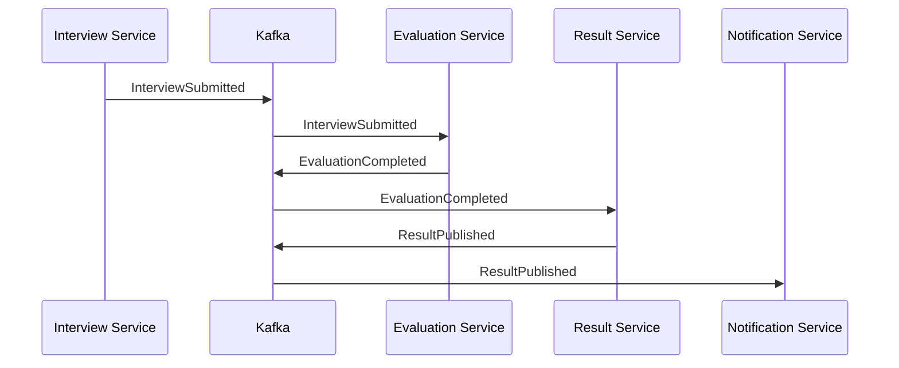
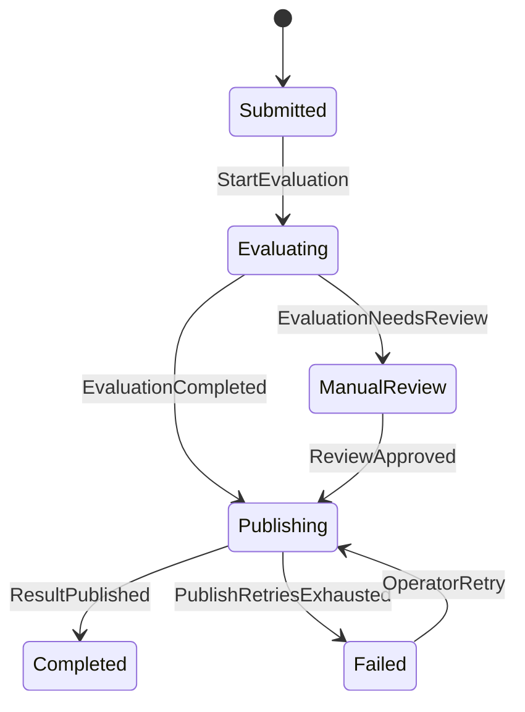

# Saga and Transactional Outbox

Distributed business operations cannot rely on one ACID transaction spanning multiple independently owned databases and message brokers. This guide explains how to preserve business correctness using **local transactions**, **Saga coordination**, **transactional outbox**, and **idempotent consumers**.

The central principle is:

> Commit business state and the intent to publish an event in the same local database transaction. Coordinate cross-service progress through explicit states and compensating actions.

## 1. Problem statement

Consider an interview submission workflow:

1. Interview Service accepts a candidate submission.
2. Evaluation Service calculates objective and AI-assisted scores.
3. Result Service publishes the result.
4. Notification Service informs the candidate.

Each service owns its data. A failure can occur between any two steps. If the application updates PostgreSQL and then publishes directly to Kafka, it creates a dual-write problem:

- database commit succeeds but Kafka publish fails;
- Kafka publish succeeds but the database transaction rolls back;
- the producer times out even though Kafka accepted the record;
- a consumer processes an event but crashes before committing its offset.

Retries help availability, but without idempotency they can create duplicate evaluations, results, refunds, or notifications.

## 2. Required guarantees

Define guarantees in business language before choosing technology.

| Concern | Required behaviour |
|---|---|
| Submission acceptance | A confirmed submission is never silently lost |
| Event publication | Every committed submission eventually produces an event |
| Duplicate delivery | Reprocessing does not create duplicate business effects |
| Ordering | Events for one interview attempt are processed in version order |
| Partial failure | The workflow reaches a valid completed, compensated, or manual-review state |
| Auditability | Every transition, retry, and compensation is traceable |
| Recovery | Operators can safely replay or resume stalled work |

The normal target is **at-least-once delivery with effectively-once business effects**, not a universal exactly-once guarantee.

## 3. Transactional outbox

### 3.1 Atomic local write

The service writes the business aggregate and an outbox record in one PostgreSQL transaction.

```sql
begin;

update interview_attempt
set status = 'SUBMITTED',
    submitted_at = now(),
    version = version + 1
where id = :attempt_id
  and status = 'IN_PROGRESS';

insert into outbox_event (
    event_id,
    aggregate_type,
    aggregate_id,
    aggregate_version,
    event_type,
    payload,
    occurred_at,
    status
) values (
    :event_id,
    'InterviewAttempt',
    :attempt_id,
    :aggregate_version,
    'InterviewSubmitted.v1',
    cast(:payload as jsonb),
    now(),
    'PENDING'
);

commit;
```

If either statement fails, both roll back. This closes the database-to-broker dual-write gap.

### 3.2 Recommended schema

```sql
create table outbox_event (
    event_id uuid primary key,
    aggregate_type varchar(100) not null,
    aggregate_id uuid not null,
    aggregate_version bigint not null,
    event_type varchar(200) not null,
    payload jsonb not null,
    trace_id varchar(64),
    occurred_at timestamptz not null,
    published_at timestamptz,
    status varchar(20) not null default 'PENDING',
    retry_count integer not null default 0,
    last_error text,
    unique (aggregate_type, aggregate_id, aggregate_version, event_type)
);

create index outbox_pending_idx
    on outbox_event (occurred_at)
    where status = 'PENDING';
```

Do not put secrets, access tokens, or unnecessary personal data in the event payload. Prefer stable identifiers and let authorized consumers retrieve sensitive details through controlled APIs when needed.

## 4. Publishing strategies

### 4.1 Polling publisher

A Spring Boot worker claims pending rows, publishes them, and marks them published.

Use PostgreSQL `FOR UPDATE SKIP LOCKED` so multiple publisher instances can work safely without claiming the same row concurrently.

```sql
select *
from outbox_event
where status = 'PENDING'
order by occurred_at
for update skip locked
limit 100;
```

Advantages:

- simple operational model;
- no separate CDC infrastructure;
- application controls batching, headers, and retry policy.

Trade-offs:

- adds polling load and publication latency;
- cleanup and backpressure must be managed;
- marking a row published is still separate from Kafka acknowledgement, so duplicates remain possible.

### 4.2 Change Data Capture

Debezium reads the PostgreSQL write-ahead log and publishes outbox changes to Kafka.

Advantages:

- low-latency streaming;
- avoids frequent polling queries;
- scales well for high event volume.

Trade-offs:

- requires connector, replication-slot, offset, and schema operations;
- careless WAL retention can exhaust storage;
- connector recovery and topic routing require monitoring;
- duplicates are still possible during recovery.

Choose polling first for moderate workloads and simpler operations. Adopt CDC when latency, throughput, or organizational platform maturity justifies it.

## 5. Idempotent consumers

Every consumer must assume an event can arrive more than once.

A robust consumer records the event ID and the business update in the same local transaction:

```sql
begin;

insert into processed_event (consumer_name, event_id, processed_at)
values (:consumer, :event_id, now())
on conflict do nothing;

-- Continue only when the insert affected one row.
update evaluation
set status = 'QUEUED'
where attempt_id = :attempt_id
  and status = 'PENDING';

commit;
```

Useful idempotency controls include:

- unique constraint on `(consumer_name, event_id)`;
- unique business keys such as `attempt_id`;
- compare-and-set state transitions;
- aggregate version checks;
- idempotency keys for external payment or notification APIs;
- deterministic result identifiers.

A cache-only deduplication key is insufficient for critical workflows because expiry or cache loss re-enables duplicate effects.

## 6. Saga pattern

A Saga is a sequence of local transactions. Each successful step emits an event or command that triggers the next step. When a later step fails, the system performs a compensating action where the business permits one.

A compensation is not a database rollback. It is a new, auditable business action.

### 6.1 Choreography

Services react to events without a central coordinator.



Use choreography when:

- the flow is short and naturally event-driven;
- each service needs minimal knowledge of the complete workflow;
- adding or removing independent reactions is common.

Risks:

- the end-to-end flow becomes difficult to discover;
- cyclic event dependencies can emerge;
- timeout and compensation ownership becomes unclear;
- debugging requires strong correlation and tracing.

### 6.2 Orchestration

A Saga orchestrator stores workflow state and sends explicit commands.



Use orchestration when:

- the workflow has many dependent steps;
- timeout, retry, and compensation rules are significant;
- business stakeholders need a visible workflow status;
- manual intervention is part of normal recovery.

The orchestrator coordinates; it must not become the owner of every service's domain data.

## 7. Choosing choreography or orchestration

| Decision factor | Choreography | Orchestration |
|---|---|---|
| Number of steps | Few | Many or branching |
| Workflow visibility | Distributed | Central state model |
| Coupling | Event contracts | Command and state contracts |
| Compensation | Simple/local | Complex/coordinated |
| Timeouts | Independently handled | Centrally supervised |
| Best fit | Independent reactions | Business process workflow |

A hybrid is common: orchestration for the critical business process and choreography for analytics, audit, search indexing, and notifications.

## 8. Failure handling

| Failure | Expected handling |
|---|---|
| DB commit fails | No aggregate change and no outbox record |
| Publisher crashes before send | Pending record is reclaimed |
| Publisher crashes after Kafka ack but before marking published | Event may be republished; consumer deduplicates |
| Consumer crashes before DB commit | Kafka record is retried |
| Consumer commits DB but not offset | Record is redelivered; consumer deduplicates |
| Poison event | Bounded retries, then quarantine/DLQ with alert |
| Dependency unavailable | Exponential backoff with jitter and a retry budget |
| Saga step times out | Query status when possible, then retry, compensate, or escalate |
| Compensation fails | Retry independently and expose manual recovery state |

Do not send directly to a DLQ after one transient failure. Separate retriable infrastructure failures from invalid data and permanent business rejection.

## 9. Kafka contract and ordering

Use the aggregate ID, such as `attempt_id`, as the Kafka record key when per-attempt ordering is required. Kafka preserves order only within a partition.

Recommended event envelope:

```json
{
  "eventId": "26f4a536-ff22-4a23-9e65-436a56d96c32",
  "eventType": "InterviewSubmitted.v1",
  "aggregateType": "InterviewAttempt",
  "aggregateId": "e533e13a-dbe1-4190-93ff-fc79ca1deeea",
  "aggregateVersion": 4,
  "occurredAt": "2026-08-01T04:30:00Z",
  "traceId": "a5f8c34e60...",
  "data": {
    "definitionId": "7f4d4b13-0269-4a94-a7e6-00869e29b8c7"
  }
}
```

Govern contracts with backward-compatible schema evolution. Treat event names and meaning as public APIs. Never silently repurpose an existing event field.

## 10. Spring Boot transaction boundary

The domain change and outbox insert must run through the same `DataSource` and transaction manager.

```java
@Transactional
public SubmissionResult submit(SubmitInterview command) {
    InterviewAttempt attempt = attempts.getForUpdate(command.attemptId());
    attempt.submit(command.answers(), clock.instant());

    attempts.save(attempt);
    outbox.append(InterviewSubmitted.from(attempt));

    return SubmissionResult.accepted(attempt.id(), attempt.version());
}
```

Keep Kafka publication outside this method. Publishing inside `@Transactional` does not make PostgreSQL and Kafka one atomic transaction.

For modular monoliths, module events plus an outbox offer reliable decoupling without immediately creating network boundaries. When a module is later extracted, the event contract and idempotency model already exist.

## 11. Saga state model

Persist explicit workflow state rather than reconstructing it only from logs.

Suggested fields:

- `saga_id` and `saga_type`;
- business correlation ID;
- current state and version;
- step attempts and deadlines;
- last command/event ID;
- failure category and reason;
- compensation status;
- created, updated, and completed timestamps.

Use optimistic locking or compare-and-set updates so two event deliveries cannot advance the same Saga concurrently.

## 12. Observability and operations

### Metrics

- oldest pending outbox age;
- pending and failed outbox row count;
- publish rate and failure rate;
- consumer lag by group and partition;
- duplicate-event count;
- Saga duration by outcome;
- stalled Saga count;
- retry and DLQ rates;
- compensation success and failure count.

### Tracing and logs

Propagate `traceparent` or an equivalent trace context in Kafka headers. Log `eventId`, `aggregateId`, `sagaId`, event type, and attempt number as structured fields. Do not log answer content, tokens, or personal data by default.

### Runbooks

Operators need documented procedures to:

1. identify a stalled aggregate or Saga;
2. inspect its state and event history;
3. distinguish safe replay from duplicate side effects;
4. retry or compensate with authorization;
5. record the operator action for audit.

## 13. Retention and cleanup

Outbox tables grow continuously. Define:

- a retention period for published rows;
- batched deletion or partition dropping;
- archival requirements for audit;
- maximum pending age alerts;
- protection against deleting unpublished rows.

For high volumes, partition the outbox table by time. Cleanup must be observable and must not create long locks or excessive database bloat.

## 14. Security

- authorize the original business command before starting the Saga;
- authenticate and encrypt broker connections;
- apply topic-level ACLs and least privilege;
- validate event schemas and size limits;
- keep secrets and bearer tokens out of payloads;
- encrypt sensitive fields where propagation is unavoidable;
- protect replay, compensation, and manual-recovery endpoints as privileged operations;
- retain an immutable audit trail for security-sensitive transitions.

## 15. Anti-patterns

Avoid:

- updating PostgreSQL and publishing to Kafka as unrelated writes;
- assuming Kafka exactly-once semantics cover external databases or APIs;
- treating compensation as technical rollback;
- making every event consumer call back synchronously to the producer;
- infinite retries with no alert or retry budget;
- using a DLQ as permanent storage;
- relying on event timestamps alone for ordering;
- sharing one database table across independently owned microservices;
- deleting outbox rows before publication is durably confirmed;
- placing large domain objects or secrets in events.

## 16. Decision guide

Use this sequence:

1. Keep a single ACID transaction when all data belongs to one service or module.
2. When an external event must reflect that commit, add a transactional outbox.
3. Make all consumers idempotent before enabling retries.
4. Use choreography for a small number of independent reactions.
5. Use orchestration for long-running, branching, compensated business workflows.
6. Add CDC only when scale and operational maturity justify it.
7. Validate recovery through failure injection, not diagrams alone.

## 17. Validation plan

Test at least these scenarios:

- kill the publisher before and after Kafka acknowledgement;
- restart consumers before and after database commit;
- deliver the same event repeatedly and concurrently;
- delay or reorder different aggregate events;
- exhaust retry budgets;
- make the compensation dependency unavailable;
- pause a Kafka partition and observe lag alerts;
- corrupt a payload and verify quarantine;
- replay retained events into a clean consumer state;
- measure outbox growth, cleanup impact, and end-to-end latency.

The architecture is successful only when these failures preserve business invariants and leave operators with a safe recovery path.

## 18. Recommended use in Java_AI_MCP

For the online interview platform:

- PostgreSQL remains the authoritative system of record.
- Interview submission and `InterviewSubmitted.v1` outbox insertion share one transaction.
- Kafka uses `attemptId` as the partition key.
- Evaluation consumers deduplicate by `eventId`.
- AI evaluation can transition to `MANUAL_REVIEW` rather than inventing a score when confidence or policy checks fail.
- An orchestrated Saga tracks evaluation, review, result publication, and notification.
- Analytics and audit consumers remain choreographed and do not block the critical path.

This design connects transactional correctness, Kafka reliability, and observable business recovery without requiring distributed two-phase commit.
