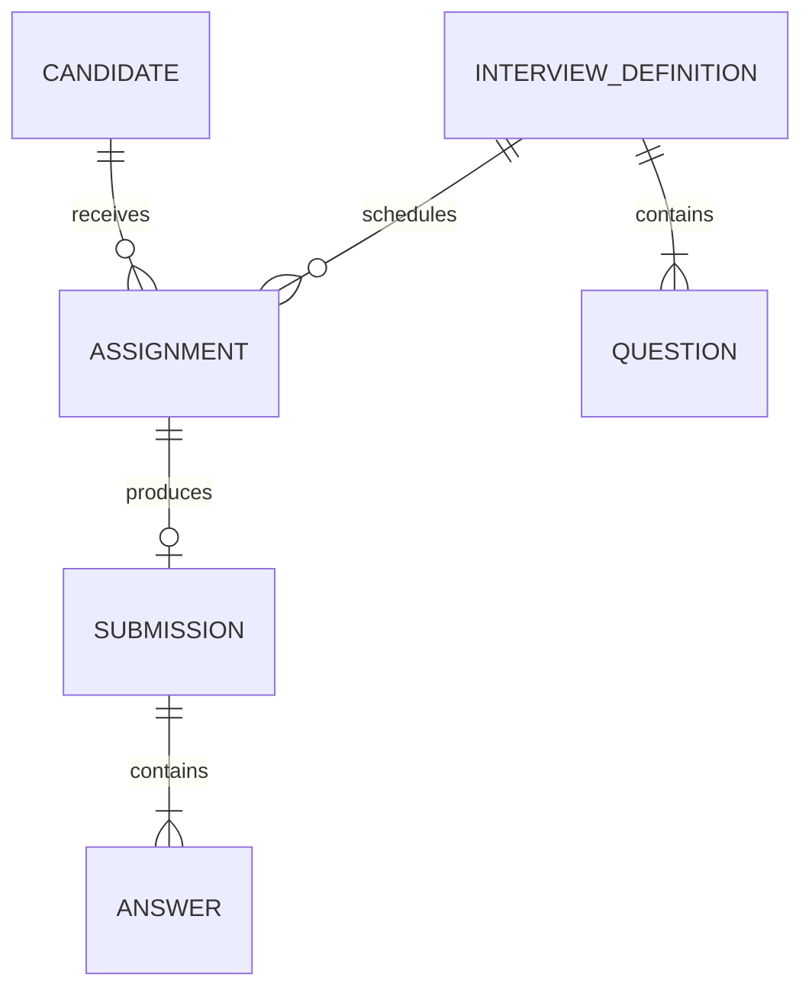

# 3. Data Modelling and Normalization

Good modelling captures business meaning and makes illegal states difficult to store.

## From domain to schema

Identify entities, value objects, lifecycle states, ownership and invariants. Choose stable surrogate keys for references while preserving meaningful business identifiers with unique constraints.

## Normal forms

- 1NF: atomic values and no repeating groups.
- 2NF: non-key attributes depend on the whole candidate key.
- 3NF: non-key attributes do not depend transitively on another non-key attribute.
- BCNF: every determinant is a candidate key.

Normalization reduces update anomalies. Denormalization is a deliberate read optimization with an owner and refresh strategy—not a shortcut around modelling.

## Temporal and audit modelling

Decide whether you need current state, event history or both. Store timestamps with time zones and define business timezone separately. For audit records capture actor, action, target, correlation ID and safe before/after evidence.

## Lab

Produce a conceptual model, logical relational model and physical PostgreSQL schema for the interview platform. Document cardinalities, deletion behavior, lifecycle constraints and five rejected alternatives.

## Expert test

Can the database itself prevent duplicate active assignments, answers to the wrong question, invalid state transitions or orphan records? If not, decide explicitly whether enforcement belongs in constraints, transactions or application logic.
