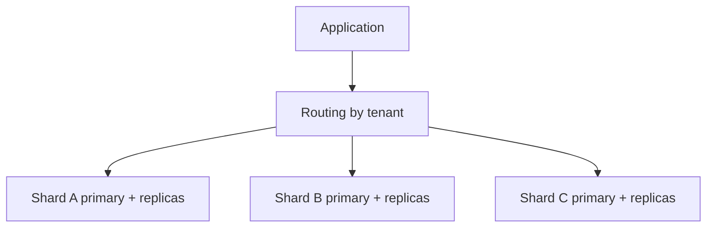

# 9. Replication, Partitioning, Sharding and High Availability

These mechanisms solve different problems: replication improves availability/read capacity, partitioning manages one logical table, and sharding distributes data across independent database groups.

## Replication and HA

PostgreSQL physical streaming replication replays WAL. Synchronous replication reduces data-loss risk but adds latency/availability trade-offs; asynchronous replication can lose recent commits on failover. Read replicas may be stale, so read-after-write routing matters.

An HA design needs failure detection, leader election, fencing, client reconnection, DNS/service discovery and tested failover—not merely a replica.

## Partitioning

Partition by range, list or hash when pruning, retention, maintenance or very large indexes justify it. Every query and unique constraint implication must be understood. Too many partitions create planning and operational overhead.

## Sharding

Choose a key that distributes load and aligns with access patterns, often tenant ID. Cross-shard joins, global uniqueness, transactions, resharding and hot tenants become application/platform problems.

## Lab

Partition audit events monthly and prove pruning. Configure or study a primary/replica lab, measure replay lag and document read consistency. Design a tenant-sharding plan including hot-tenant handling and resharding.

## Expert questions

What exact failure is tolerated? What are RPO/RTO? How is split brain prevented? Which reads may be stale? How will backup, restore, schema migration and observability work across every shard?
