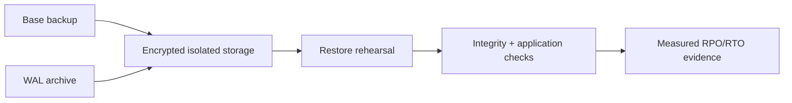

# 11. Security, Backup, Recovery and Observability

A database is production-ready only when access is controlled, sensitive data is protected, and recovery is proven.

## Security controls

- Separate admin, migration, runtime and read-only roles.
- Grant least privilege and rotate credentials through a secret manager.
- Require TLS and verify server identity.
- Encrypt disks/backups; use column/token protection where threat models require it.
- Protect PII with minimization, retention, masking and audited access.
- Parameterize queries and validate identifiers that cannot be parameters.
- Apply row-level security only with tests and operational understanding.

## Backup and recovery

A backup job succeeding is not proof of recovery. Define RPO/RTO, use base backups plus WAL archiving for point-in-time recovery when needed, encrypt and isolate copies, test restore regularly and verify application-level consistency.

## Observe the database

Monitor availability, errors, latency percentiles, throughput, active/idle connections, pool wait, locks, deadlocks, transaction age, cache hit, disk/IOPS, WAL, checkpoint behavior, replication lag, vacuum health, table/index growth and expensive queries.

Logs and traces must not leak query parameters containing secrets or PII.

## Lab

Create least-privileged roles, enable safe query statistics, build a dashboard and alerts, take a backup, delete test data, restore to a separate instance and measure actual RPO/RTO. Write a runbook and record evidence.

## Incident rule

Preserve evidence, reduce blast radius and choose reversible actions. Do not restart or fail over blindly when the root problem may be load, disk, network, locks or bad queries.
