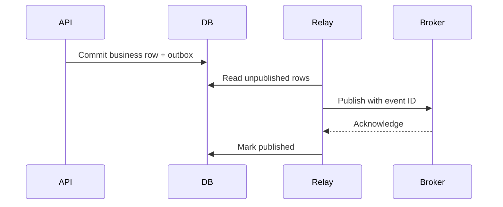

# 12. Distributed-Data Patterns, System Design and Interviews

Distributed systems cannot atomically update independent services and brokers with a normal local transaction. Design for explicit consistency, retries and repair.

## Patterns

- Transactional outbox: store business change and event in one local transaction.
- Inbox/idempotent consumer: record processed message identity with the side effect.
- Saga: coordinate or choreograph local transactions with compensations.
- Change data capture: publish committed database changes with operational controls.
- CQRS: separate models only when different read/write needs justify the complexity.
- Event sourcing: events are the source of truth; requires mature evolution and replay discipline.

Duplicates remain possible; consumers must be idempotent. Ordering is scoped, usually by aggregate key—not global.

## System-design method

State workload, invariants, consistency, data lifecycle, access patterns, capacity, security, availability and RPO/RTO. Draw ownership boundaries, justify the primary store, design schemas/indexes, then cover scale, failure, recovery, observability and migrations.

## Capstone

Design the complete Online Interview data platform:

- PostgreSQL system of record and migration strategy
- Transaction boundaries for start, answer and submit
- Outbox events to Kafka and idempotent consumers
- Redis cache with tenant-safe keys and fallback
- Reporting/read-model strategy
- Partitioning/retention for audit data
- HA, backup/PITR, security and load-test evidence

## Senior interview scenarios

Explain: preventing double submission; diagnosing a sudden p99 increase; choosing optimistic versus pessimistic locking; handling replica lag; evolving a billion-row table; designing tenant sharding; proving restore; and deciding whether MongoDB adds value.

**Expert answer structure:** requirements → invariant/workload → options → selected design → failure modes → evidence/metrics → migration and rollback.
