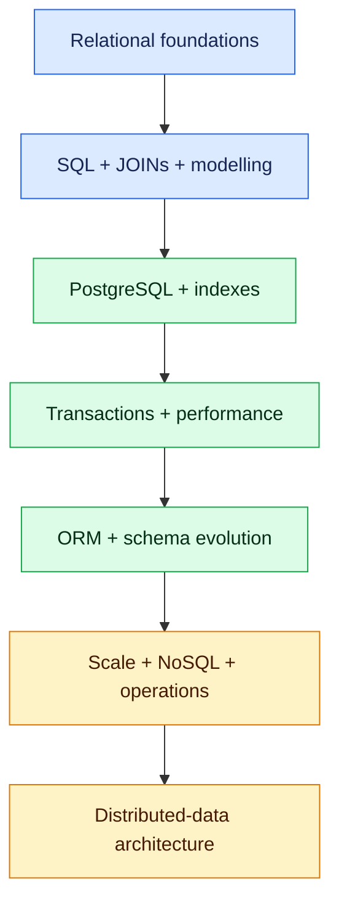

# Database: Zero to Expert

A production-oriented learning path from first database concepts to senior architecture decisions. It is suitable for backend developers, database engineers and architects who want hands-on SQL, PostgreSQL, NoSQL and distributed-data skills.

## Learning path

1. [Database fundamentals and selection](01-database-fundamentals-selection.md)
2. [SQL from basic to advanced](02-sql-basic-to-advanced.md)
3. [Data modelling and normalization](03-data-modelling-normalization.md)
4. [PostgreSQL hands-on](04-postgresql-hands-on.md)
5. [Indexes and query execution plans](05-indexes-query-plans.md)
6. [Transactions, isolation and locking](06-transactions-isolation-locking.md)
7. [Performance tuning and connection pooling](07-performance-tuning-pooling.md)
8. [ORMs, migrations and schema evolution](08-orm-migrations-schema-evolution.md)
9. [Replication, partitioning, sharding and HA](09-replication-partitioning-sharding-ha.md)
10. [MongoDB, Redis and SQL-vs-NoSQL decisions](10-mongodb-redis-sql-nosql.md)
11. [Security, backup, recovery and observability](11-security-backup-recovery-observability.md)
12. [Distributed-data patterns, system design and interviews](12-distributed-data-system-design.md)
13. [SQL JOINs: Zero to Expert](13-sql-joins-zero-to-expert.md)

> Study Chapter 13 immediately after Chapter 2 when learning sequentially. It is numbered as a follow-up chapter to preserve the existing published chapter links.

## Capability milestones

| Stage | Expected capability |
|---|---|
| Foundation | Write correct SQL, model entities, explain keys and constraints, and choose join semantics |
| Practitioner | Use PostgreSQL, transactions, indexes, migrations and query plans |
| Senior | Diagnose join cardinality and contention, tune workloads, design HA and choose SQL/NoSQL deliberately |
| Expert | Own consistency, partitioning, recovery, security and distributed-data trade-offs |

## Portfolio lab

Build the database layer for an Online Interview Platform: candidates, interview definitions, assignments, questions, submissions, reviews and audit events. Begin with PostgreSQL, add migrations and realistic data, test joins, concurrency and failure, introduce Redis only for justified caching, and evaluate MongoDB only for a clearly documented access pattern.

Every design decision must include workload assumptions, alternatives, evidence, failure modes and a recovery test.
